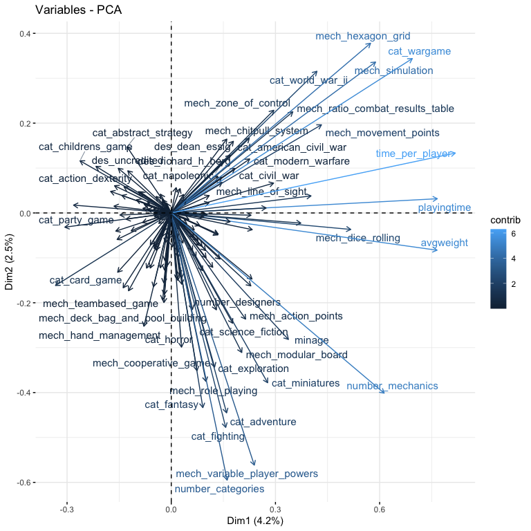
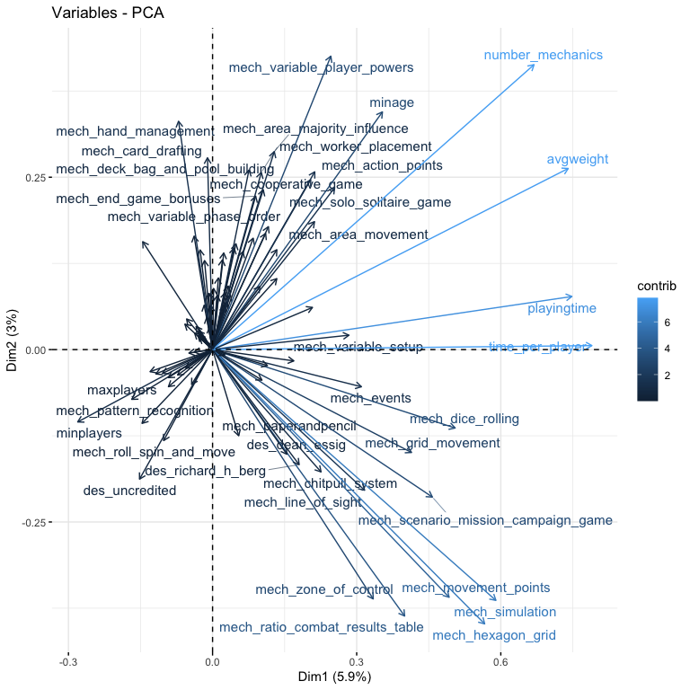
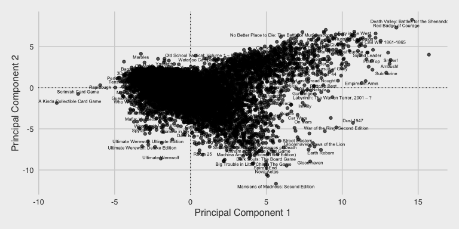
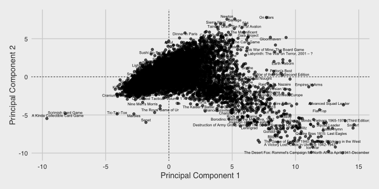
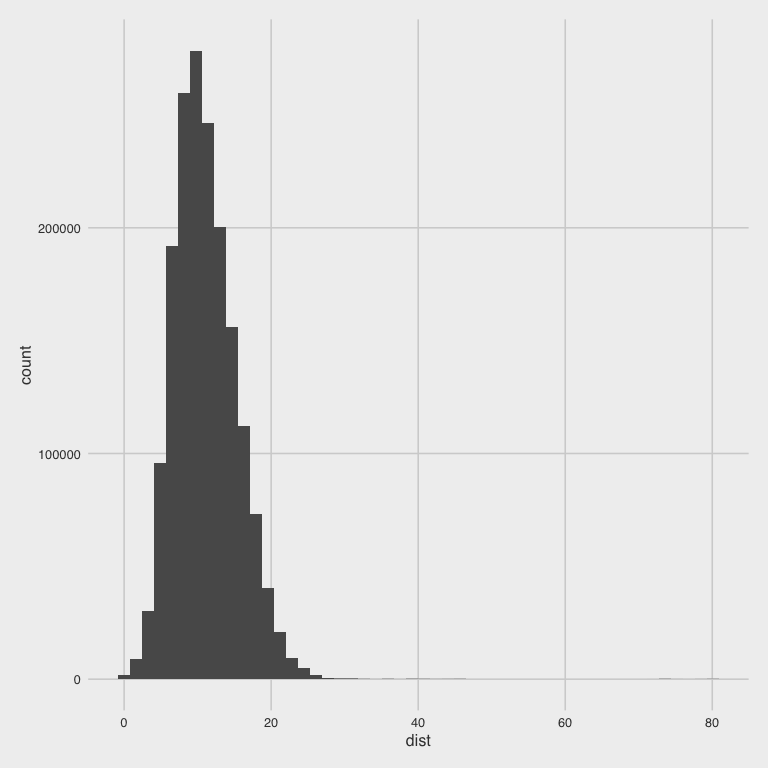
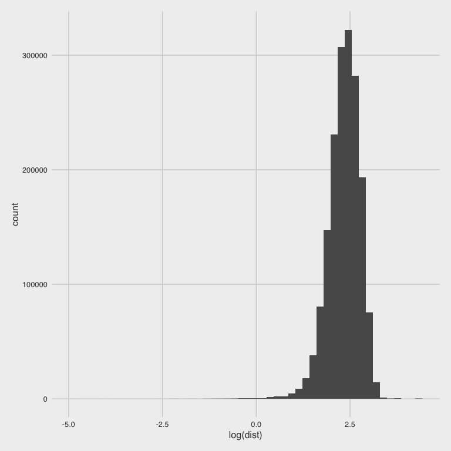
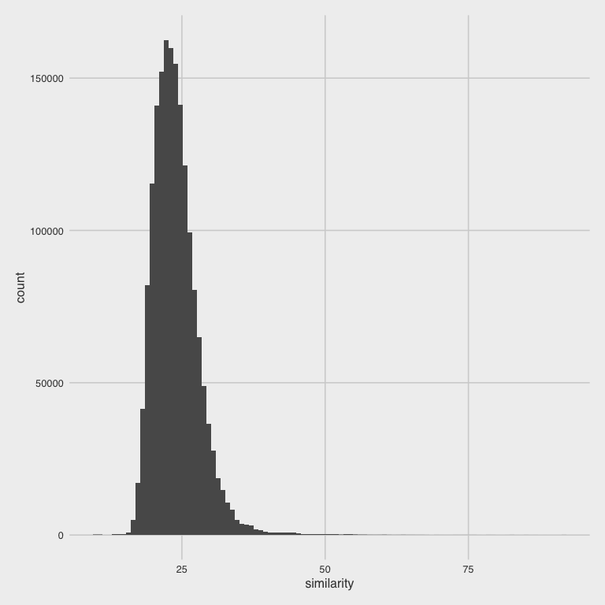
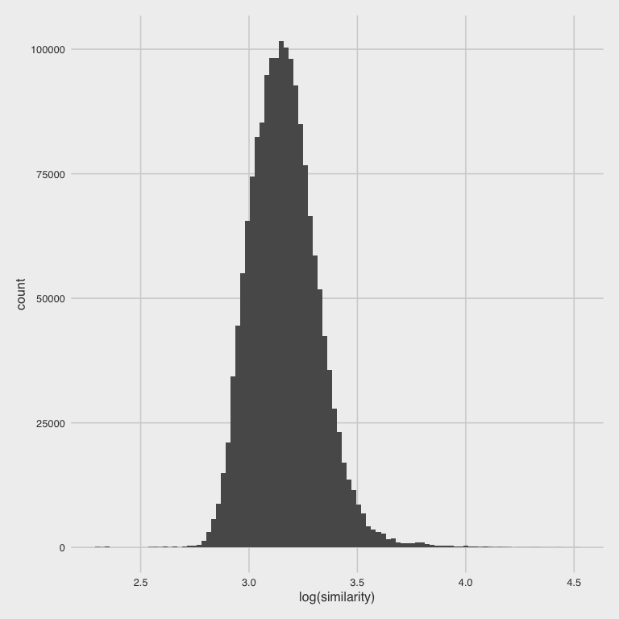
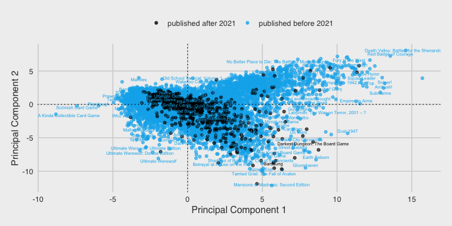
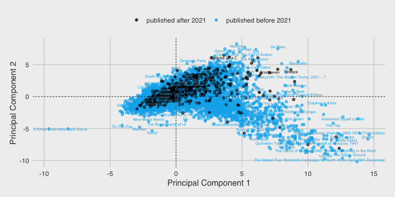

This notebook is for finding similar games and recommending games based on a selected preference.


## Connect to Big Query

### Active Game Rankings

We'll first connect to the most recent day of BGG data that we have in our database. These are the active rankings of games - where they stand in the BGG database as of the most recent load, which I usually update once a week.


```
## Warning: package 'bigrquery' was built under R version 4.1.1
```


```
## ! Using an auto-discovered, cached token.
```

```
##   To suppress this message, modify your code or options to clearly consent to
##   the use of a cached token.
```

```
##   See gargle's "Non-interactive auth" vignette for more details:
```

```
##   <https://gargle.r-lib.org/articles/non-interactive-auth.html>
```

```
## ℹ The bigrquery package is using a cached token for 'phil.henrickson@aebs.com'.
```

```
## Auto-refreshing stale OAuth token.
```


### Additional Game Information

We also want to pull down other tables containing the information that we know about games.


## Which Games are Similar to Each Other?

We can use some unsupervised techniques to identify games that are similar to each other. We'll start by building a dataset with the information available to use about a game at the time of its release: playtime, player count, categories, mechanics, and designers. We'll use all games published before 2021.

### Build Dataset


### Build Recipes


### PCA

What features should we include when running PCA? It depends on what we're trying to do. If we're looking for games that are similar to each other mechanically without respect to theme, then we shouldn't include dimensions about the game's theme/category. If we're trying to find games that are the most similar to each other on every dimension, then we will include categories.

We'll set up two datasets, one with categories and one without, in order to fit a PCA to both.


Now fit pca on each of these.


We can inspect the results of each of these.


Plot variable contributions


```
## [[1]]
```

<!-- -->

```
## [[1]]
```

<!-- -->
Plot individual games


```
## [[1]]
```

<!-- -->

```
## [[1]]
```

<!-- -->
We can now get the distance matrix to calculate nearest nearest neighbors.


#### Nearest Neighbors

Let's join this up with the games info so we can then filter on rating, that sort of thing.


```
## Joining, by = c("neighbor_game_id", "neighbor_name")
```

```{=html}
<template id="de1a1fa8-d77e-4a97-a3f5-b04ce2e367d3"><style>
.tabwid table{
  border-collapse:collapse;
  line-height:1;
  margin-left:auto;
  margin-right:auto;
  border-width: 0;
  display: table;
  margin-top: 1.275em;
  margin-bottom: 1.275em;
  border-spacing: 0;
  border-color: transparent;
}
.tabwid_left table{
  margin-left:0;
}
.tabwid_right table{
  margin-right:0;
}
.tabwid td {
    padding: 0;
}
.tabwid a {
  text-decoration: none;
}
.tabwid thead {
    background-color: transparent;
}
.tabwid tfoot {
    background-color: transparent;
}
.tabwid table tr {
background-color: transparent;
}
</style><div class="tabwid"><style>.cl-94aa9856{border-collapse:collapse;}.cl-94a44992{font-family:'Helvetica';font-size:11pt;font-weight:normal;font-style:normal;text-decoration:none;color:rgba(0, 0, 0, 1.00);background-color:transparent;}.cl-94a457e8{margin:0;text-align:left;border-bottom: 0 solid rgba(0, 0, 0, 1.00);border-top: 0 solid rgba(0, 0, 0, 1.00);border-left: 0 solid rgba(0, 0, 0, 1.00);border-right: 0 solid rgba(0, 0, 0, 1.00);padding-bottom:5pt;padding-top:5pt;padding-left:5pt;padding-right:5pt;line-height: 1;background-color:transparent;}.cl-94a457f2{margin:0;text-align:right;border-bottom: 0 solid rgba(0, 0, 0, 1.00);border-top: 0 solid rgba(0, 0, 0, 1.00);border-left: 0 solid rgba(0, 0, 0, 1.00);border-right: 0 solid rgba(0, 0, 0, 1.00);padding-bottom:5pt;padding-top:5pt;padding-left:5pt;padding-right:5pt;line-height: 1;background-color:transparent;}.cl-94a4cac0{width:63.3pt;background-color:transparent;vertical-align: middle;border-bottom: 0 solid rgba(0, 0, 0, 1.00);border-top: 0 solid rgba(0, 0, 0, 1.00);border-left: 0 solid rgba(0, 0, 0, 1.00);border-right: 0 solid rgba(0, 0, 0, 1.00);margin-bottom:0;margin-top:0;margin-left:0;margin-right:0;}.cl-94a4caca{width:48.1pt;background-color:transparent;vertical-align: middle;border-bottom: 0 solid rgba(0, 0, 0, 1.00);border-top: 0 solid rgba(0, 0, 0, 1.00);border-left: 0 solid rgba(0, 0, 0, 1.00);border-right: 0 solid rgba(0, 0, 0, 1.00);margin-bottom:0;margin-top:0;margin-left:0;margin-right:0;}.cl-94a4caf2{width:41.9pt;background-color:transparent;vertical-align: middle;border-bottom: 0 solid rgba(0, 0, 0, 1.00);border-top: 0 solid rgba(0, 0, 0, 1.00);border-left: 0 solid rgba(0, 0, 0, 1.00);border-right: 0 solid rgba(0, 0, 0, 1.00);margin-bottom:0;margin-top:0;margin-left:0;margin-right:0;}.cl-94a4cafc{width:89pt;background-color:transparent;vertical-align: middle;border-bottom: 0 solid rgba(0, 0, 0, 1.00);border-top: 0 solid rgba(0, 0, 0, 1.00);border-left: 0 solid rgba(0, 0, 0, 1.00);border-right: 0 solid rgba(0, 0, 0, 1.00);margin-bottom:0;margin-top:0;margin-left:0;margin-right:0;}.cl-94a4cb06{width:111.7pt;background-color:transparent;vertical-align: middle;border-bottom: 0 solid rgba(0, 0, 0, 1.00);border-top: 0 solid rgba(0, 0, 0, 1.00);border-left: 0 solid rgba(0, 0, 0, 1.00);border-right: 0 solid rgba(0, 0, 0, 1.00);margin-bottom:0;margin-top:0;margin-left:0;margin-right:0;}.cl-94a4cb07{width:393.5pt;background-color:transparent;vertical-align: middle;border-bottom: 0 solid rgba(0, 0, 0, 1.00);border-top: 0 solid rgba(0, 0, 0, 1.00);border-left: 0 solid rgba(0, 0, 0, 1.00);border-right: 0 solid rgba(0, 0, 0, 1.00);margin-bottom:0;margin-top:0;margin-left:0;margin-right:0;}.cl-94a4cb10{width:62.7pt;background-color:transparent;vertical-align: middle;border-bottom: 0 solid rgba(0, 0, 0, 1.00);border-top: 0 solid rgba(0, 0, 0, 1.00);border-left: 0 solid rgba(0, 0, 0, 1.00);border-right: 0 solid rgba(0, 0, 0, 1.00);margin-bottom:0;margin-top:0;margin-left:0;margin-right:0;}.cl-94a4cb11{width:207.6pt;background-color:transparent;vertical-align: middle;border-bottom: 0 solid rgba(0, 0, 0, 1.00);border-top: 0 solid rgba(0, 0, 0, 1.00);border-left: 0 solid rgba(0, 0, 0, 1.00);border-right: 0 solid rgba(0, 0, 0, 1.00);margin-bottom:0;margin-top:0;margin-left:0;margin-right:0;}.cl-94a4cb2e{width:60.3pt;background-color:transparent;vertical-align: middle;border-bottom: 0 solid rgba(0, 0, 0, 1.00);border-top: 0 solid rgba(0, 0, 0, 1.00);border-left: 0 solid rgba(0, 0, 0, 1.00);border-right: 0 solid rgba(0, 0, 0, 1.00);margin-bottom:0;margin-top:0;margin-left:0;margin-right:0;}.cl-94a4cb2f{width:66.4pt;background-color:transparent;vertical-align: middle;border-bottom: 0 solid rgba(0, 0, 0, 1.00);border-top: 0 solid rgba(0, 0, 0, 1.00);border-left: 0 solid rgba(0, 0, 0, 1.00);border-right: 0 solid rgba(0, 0, 0, 1.00);margin-bottom:0;margin-top:0;margin-left:0;margin-right:0;}.cl-94a4cb4c{width:207.6pt;background-color:transparent;vertical-align: middle;border-bottom: 0 solid rgba(0, 0, 0, 1.00);border-top: 0 solid rgba(0, 0, 0, 1.00);border-left: 0 solid rgba(0, 0, 0, 1.00);border-right: 0 solid rgba(0, 0, 0, 1.00);margin-bottom:0;margin-top:0;margin-left:0;margin-right:0;}.cl-94a4cb74{width:48.1pt;background-color:transparent;vertical-align: middle;border-bottom: 0 solid rgba(0, 0, 0, 1.00);border-top: 0 solid rgba(0, 0, 0, 1.00);border-left: 0 solid rgba(0, 0, 0, 1.00);border-right: 0 solid rgba(0, 0, 0, 1.00);margin-bottom:0;margin-top:0;margin-left:0;margin-right:0;}.cl-94a4cb88{width:60.3pt;background-color:transparent;vertical-align: middle;border-bottom: 0 solid rgba(0, 0, 0, 1.00);border-top: 0 solid rgba(0, 0, 0, 1.00);border-left: 0 solid rgba(0, 0, 0, 1.00);border-right: 0 solid rgba(0, 0, 0, 1.00);margin-bottom:0;margin-top:0;margin-left:0;margin-right:0;}.cl-94a4cb92{width:393.5pt;background-color:transparent;vertical-align: middle;border-bottom: 0 solid rgba(0, 0, 0, 1.00);border-top: 0 solid rgba(0, 0, 0, 1.00);border-left: 0 solid rgba(0, 0, 0, 1.00);border-right: 0 solid rgba(0, 0, 0, 1.00);margin-bottom:0;margin-top:0;margin-left:0;margin-right:0;}.cl-94a4cb9c{width:111.7pt;background-color:transparent;vertical-align: middle;border-bottom: 0 solid rgba(0, 0, 0, 1.00);border-top: 0 solid rgba(0, 0, 0, 1.00);border-left: 0 solid rgba(0, 0, 0, 1.00);border-right: 0 solid rgba(0, 0, 0, 1.00);margin-bottom:0;margin-top:0;margin-left:0;margin-right:0;}.cl-94a4cb9d{width:63.3pt;background-color:transparent;vertical-align: middle;border-bottom: 0 solid rgba(0, 0, 0, 1.00);border-top: 0 solid rgba(0, 0, 0, 1.00);border-left: 0 solid rgba(0, 0, 0, 1.00);border-right: 0 solid rgba(0, 0, 0, 1.00);margin-bottom:0;margin-top:0;margin-left:0;margin-right:0;}.cl-94a4cbba{width:66.4pt;background-color:transparent;vertical-align: middle;border-bottom: 0 solid rgba(0, 0, 0, 1.00);border-top: 0 solid rgba(0, 0, 0, 1.00);border-left: 0 solid rgba(0, 0, 0, 1.00);border-right: 0 solid rgba(0, 0, 0, 1.00);margin-bottom:0;margin-top:0;margin-left:0;margin-right:0;}.cl-94a4cbc4{width:41.9pt;background-color:transparent;vertical-align: middle;border-bottom: 0 solid rgba(0, 0, 0, 1.00);border-top: 0 solid rgba(0, 0, 0, 1.00);border-left: 0 solid rgba(0, 0, 0, 1.00);border-right: 0 solid rgba(0, 0, 0, 1.00);margin-bottom:0;margin-top:0;margin-left:0;margin-right:0;}.cl-94a4cbc5{width:62.7pt;background-color:transparent;vertical-align: middle;border-bottom: 0 solid rgba(0, 0, 0, 1.00);border-top: 0 solid rgba(0, 0, 0, 1.00);border-left: 0 solid rgba(0, 0, 0, 1.00);border-right: 0 solid rgba(0, 0, 0, 1.00);margin-bottom:0;margin-top:0;margin-left:0;margin-right:0;}.cl-94a4cbe2{width:89pt;background-color:transparent;vertical-align: middle;border-bottom: 0 solid rgba(0, 0, 0, 1.00);border-top: 0 solid rgba(0, 0, 0, 1.00);border-left: 0 solid rgba(0, 0, 0, 1.00);border-right: 0 solid rgba(0, 0, 0, 1.00);margin-bottom:0;margin-top:0;margin-left:0;margin-right:0;}.cl-94a4cbe3{width:111.7pt;background-color:transparent;vertical-align: middle;border-bottom: 0 solid rgba(0, 0, 0, 1.00);border-top: 0 solid rgba(0, 0, 0, 1.00);border-left: 0 solid rgba(0, 0, 0, 1.00);border-right: 0 solid rgba(0, 0, 0, 1.00);margin-bottom:0;margin-top:0;margin-left:0;margin-right:0;}.cl-94a4cc00{width:393.5pt;background-color:transparent;vertical-align: middle;border-bottom: 0 solid rgba(0, 0, 0, 1.00);border-top: 0 solid rgba(0, 0, 0, 1.00);border-left: 0 solid rgba(0, 0, 0, 1.00);border-right: 0 solid rgba(0, 0, 0, 1.00);margin-bottom:0;margin-top:0;margin-left:0;margin-right:0;}.cl-94a4cc0a{width:41.9pt;background-color:transparent;vertical-align: middle;border-bottom: 0 solid rgba(0, 0, 0, 1.00);border-top: 0 solid rgba(0, 0, 0, 1.00);border-left: 0 solid rgba(0, 0, 0, 1.00);border-right: 0 solid rgba(0, 0, 0, 1.00);margin-bottom:0;margin-top:0;margin-left:0;margin-right:0;}.cl-94a4cc14{width:89pt;background-color:transparent;vertical-align: middle;border-bottom: 0 solid rgba(0, 0, 0, 1.00);border-top: 0 solid rgba(0, 0, 0, 1.00);border-left: 0 solid rgba(0, 0, 0, 1.00);border-right: 0 solid rgba(0, 0, 0, 1.00);margin-bottom:0;margin-top:0;margin-left:0;margin-right:0;}.cl-94a4cc28{width:48.1pt;background-color:transparent;vertical-align: middle;border-bottom: 0 solid rgba(0, 0, 0, 1.00);border-top: 0 solid rgba(0, 0, 0, 1.00);border-left: 0 solid rgba(0, 0, 0, 1.00);border-right: 0 solid rgba(0, 0, 0, 1.00);margin-bottom:0;margin-top:0;margin-left:0;margin-right:0;}.cl-94a4cc29{width:66.4pt;background-color:transparent;vertical-align: middle;border-bottom: 0 solid rgba(0, 0, 0, 1.00);border-top: 0 solid rgba(0, 0, 0, 1.00);border-left: 0 solid rgba(0, 0, 0, 1.00);border-right: 0 solid rgba(0, 0, 0, 1.00);margin-bottom:0;margin-top:0;margin-left:0;margin-right:0;}.cl-94a4cc32{width:60.3pt;background-color:transparent;vertical-align: middle;border-bottom: 0 solid rgba(0, 0, 0, 1.00);border-top: 0 solid rgba(0, 0, 0, 1.00);border-left: 0 solid rgba(0, 0, 0, 1.00);border-right: 0 solid rgba(0, 0, 0, 1.00);margin-bottom:0;margin-top:0;margin-left:0;margin-right:0;}.cl-94a4cc46{width:62.7pt;background-color:transparent;vertical-align: middle;border-bottom: 0 solid rgba(0, 0, 0, 1.00);border-top: 0 solid rgba(0, 0, 0, 1.00);border-left: 0 solid rgba(0, 0, 0, 1.00);border-right: 0 solid rgba(0, 0, 0, 1.00);margin-bottom:0;margin-top:0;margin-left:0;margin-right:0;}.cl-94a4cc50{width:63.3pt;background-color:transparent;vertical-align: middle;border-bottom: 0 solid rgba(0, 0, 0, 1.00);border-top: 0 solid rgba(0, 0, 0, 1.00);border-left: 0 solid rgba(0, 0, 0, 1.00);border-right: 0 solid rgba(0, 0, 0, 1.00);margin-bottom:0;margin-top:0;margin-left:0;margin-right:0;}.cl-94a4cc5a{width:207.6pt;background-color:transparent;vertical-align: middle;border-bottom: 0 solid rgba(0, 0, 0, 1.00);border-top: 0 solid rgba(0, 0, 0, 1.00);border-left: 0 solid rgba(0, 0, 0, 1.00);border-right: 0 solid rgba(0, 0, 0, 1.00);margin-bottom:0;margin-top:0;margin-left:0;margin-right:0;}.cl-94a4cc64{width:41.9pt;background-color:transparent;vertical-align: middle;border-bottom: 2pt solid rgba(102, 102, 102, 1.00);border-top: 0 solid rgba(0, 0, 0, 1.00);border-left: 0 solid rgba(0, 0, 0, 1.00);border-right: 0 solid rgba(0, 0, 0, 1.00);margin-bottom:0;margin-top:0;margin-left:0;margin-right:0;}.cl-94a4cc6e{width:66.4pt;background-color:transparent;vertical-align: middle;border-bottom: 2pt solid rgba(102, 102, 102, 1.00);border-top: 0 solid rgba(0, 0, 0, 1.00);border-left: 0 solid rgba(0, 0, 0, 1.00);border-right: 0 solid rgba(0, 0, 0, 1.00);margin-bottom:0;margin-top:0;margin-left:0;margin-right:0;}.cl-94a4cc78{width:62.7pt;background-color:transparent;vertical-align: middle;border-bottom: 2pt solid rgba(102, 102, 102, 1.00);border-top: 0 solid rgba(0, 0, 0, 1.00);border-left: 0 solid rgba(0, 0, 0, 1.00);border-right: 0 solid rgba(0, 0, 0, 1.00);margin-bottom:0;margin-top:0;margin-left:0;margin-right:0;}.cl-94a4cc79{width:393.5pt;background-color:transparent;vertical-align: middle;border-bottom: 2pt solid rgba(102, 102, 102, 1.00);border-top: 0 solid rgba(0, 0, 0, 1.00);border-left: 0 solid rgba(0, 0, 0, 1.00);border-right: 0 solid rgba(0, 0, 0, 1.00);margin-bottom:0;margin-top:0;margin-left:0;margin-right:0;}.cl-94a4cc82{width:48.1pt;background-color:transparent;vertical-align: middle;border-bottom: 2pt solid rgba(102, 102, 102, 1.00);border-top: 0 solid rgba(0, 0, 0, 1.00);border-left: 0 solid rgba(0, 0, 0, 1.00);border-right: 0 solid rgba(0, 0, 0, 1.00);margin-bottom:0;margin-top:0;margin-left:0;margin-right:0;}.cl-94a4cc83{width:89pt;background-color:transparent;vertical-align: middle;border-bottom: 2pt solid rgba(102, 102, 102, 1.00);border-top: 0 solid rgba(0, 0, 0, 1.00);border-left: 0 solid rgba(0, 0, 0, 1.00);border-right: 0 solid rgba(0, 0, 0, 1.00);margin-bottom:0;margin-top:0;margin-left:0;margin-right:0;}.cl-94a4cc8c{width:111.7pt;background-color:transparent;vertical-align: middle;border-bottom: 2pt solid rgba(102, 102, 102, 1.00);border-top: 0 solid rgba(0, 0, 0, 1.00);border-left: 0 solid rgba(0, 0, 0, 1.00);border-right: 0 solid rgba(0, 0, 0, 1.00);margin-bottom:0;margin-top:0;margin-left:0;margin-right:0;}.cl-94a4cc96{width:63.3pt;background-color:transparent;vertical-align: middle;border-bottom: 2pt solid rgba(102, 102, 102, 1.00);border-top: 0 solid rgba(0, 0, 0, 1.00);border-left: 0 solid rgba(0, 0, 0, 1.00);border-right: 0 solid rgba(0, 0, 0, 1.00);margin-bottom:0;margin-top:0;margin-left:0;margin-right:0;}.cl-94a4cc97{width:60.3pt;background-color:transparent;vertical-align: middle;border-bottom: 2pt solid rgba(102, 102, 102, 1.00);border-top: 0 solid rgba(0, 0, 0, 1.00);border-left: 0 solid rgba(0, 0, 0, 1.00);border-right: 0 solid rgba(0, 0, 0, 1.00);margin-bottom:0;margin-top:0;margin-left:0;margin-right:0;}.cl-94a4cca0{width:207.6pt;background-color:transparent;vertical-align: middle;border-bottom: 2pt solid rgba(102, 102, 102, 1.00);border-top: 0 solid rgba(0, 0, 0, 1.00);border-left: 0 solid rgba(0, 0, 0, 1.00);border-right: 0 solid rgba(0, 0, 0, 1.00);margin-bottom:0;margin-top:0;margin-left:0;margin-right:0;}.cl-94a4cca1{width:207.6pt;background-color:transparent;vertical-align: middle;border-bottom: 2pt solid rgba(102, 102, 102, 1.00);border-top: 2pt solid rgba(102, 102, 102, 1.00);border-left: 0 solid rgba(0, 0, 0, 1.00);border-right: 0 solid rgba(0, 0, 0, 1.00);margin-bottom:0;margin-top:0;margin-left:0;margin-right:0;}.cl-94a4ccaa{width:48.1pt;background-color:transparent;vertical-align: middle;border-bottom: 2pt solid rgba(102, 102, 102, 1.00);border-top: 2pt solid rgba(102, 102, 102, 1.00);border-left: 0 solid rgba(0, 0, 0, 1.00);border-right: 0 solid rgba(0, 0, 0, 1.00);margin-bottom:0;margin-top:0;margin-left:0;margin-right:0;}.cl-94a4ccab{width:62.7pt;background-color:transparent;vertical-align: middle;border-bottom: 2pt solid rgba(102, 102, 102, 1.00);border-top: 2pt solid rgba(102, 102, 102, 1.00);border-left: 0 solid rgba(0, 0, 0, 1.00);border-right: 0 solid rgba(0, 0, 0, 1.00);margin-bottom:0;margin-top:0;margin-left:0;margin-right:0;}.cl-94a4ccc8{width:63.3pt;background-color:transparent;vertical-align: middle;border-bottom: 2pt solid rgba(102, 102, 102, 1.00);border-top: 2pt solid rgba(102, 102, 102, 1.00);border-left: 0 solid rgba(0, 0, 0, 1.00);border-right: 0 solid rgba(0, 0, 0, 1.00);margin-bottom:0;margin-top:0;margin-left:0;margin-right:0;}.cl-94a4ccc9{width:393.5pt;background-color:transparent;vertical-align: middle;border-bottom: 2pt solid rgba(102, 102, 102, 1.00);border-top: 2pt solid rgba(102, 102, 102, 1.00);border-left: 0 solid rgba(0, 0, 0, 1.00);border-right: 0 solid rgba(0, 0, 0, 1.00);margin-bottom:0;margin-top:0;margin-left:0;margin-right:0;}.cl-94a4ccd2{width:111.7pt;background-color:transparent;vertical-align: middle;border-bottom: 2pt solid rgba(102, 102, 102, 1.00);border-top: 2pt solid rgba(102, 102, 102, 1.00);border-left: 0 solid rgba(0, 0, 0, 1.00);border-right: 0 solid rgba(0, 0, 0, 1.00);margin-bottom:0;margin-top:0;margin-left:0;margin-right:0;}.cl-94a4ccd3{width:66.4pt;background-color:transparent;vertical-align: middle;border-bottom: 2pt solid rgba(102, 102, 102, 1.00);border-top: 2pt solid rgba(102, 102, 102, 1.00);border-left: 0 solid rgba(0, 0, 0, 1.00);border-right: 0 solid rgba(0, 0, 0, 1.00);margin-bottom:0;margin-top:0;margin-left:0;margin-right:0;}.cl-94a4ccdc{width:41.9pt;background-color:transparent;vertical-align: middle;border-bottom: 2pt solid rgba(102, 102, 102, 1.00);border-top: 2pt solid rgba(102, 102, 102, 1.00);border-left: 0 solid rgba(0, 0, 0, 1.00);border-right: 0 solid rgba(0, 0, 0, 1.00);margin-bottom:0;margin-top:0;margin-left:0;margin-right:0;}.cl-94a4ccfa{width:60.3pt;background-color:transparent;vertical-align: middle;border-bottom: 2pt solid rgba(102, 102, 102, 1.00);border-top: 2pt solid rgba(102, 102, 102, 1.00);border-left: 0 solid rgba(0, 0, 0, 1.00);border-right: 0 solid rgba(0, 0, 0, 1.00);margin-bottom:0;margin-top:0;margin-left:0;margin-right:0;}.cl-94a4cd04{width:89pt;background-color:transparent;vertical-align: middle;border-bottom: 2pt solid rgba(102, 102, 102, 1.00);border-top: 2pt solid rgba(102, 102, 102, 1.00);border-left: 0 solid rgba(0, 0, 0, 1.00);border-right: 0 solid rgba(0, 0, 0, 1.00);margin-bottom:0;margin-top:0;margin-left:0;margin-right:0;}</style><table class='cl-94aa9856'><thead><tr style="overflow-wrap:break-word;"><td class="cl-94a4cca1"><p class="cl-94a457e8"><span class="cl-94a44992">dataset</span></p></td><td class="cl-94a4ccab"><p class="cl-94a457e8"><span class="cl-94a44992">game_id</span></p></td><td class="cl-94a4ccc9"><p class="cl-94a457e8"><span class="cl-94a44992">name</span></p></td><td class="cl-94a4ccd2"><p class="cl-94a457e8"><span class="cl-94a44992">neighbor_game_id</span></p></td><td class="cl-94a4ccc9"><p class="cl-94a457e8"><span class="cl-94a44992">neighbor_name</span></p></td><td class="cl-94a4ccc8"><p class="cl-94a457f2"><span class="cl-94a44992">similarity</span></p></td><td class="cl-94a4ccdc"><p class="cl-94a457f2"><span class="cl-94a44992">dist</span></p></td><td class="cl-94a4cd04"><p class="cl-94a457e8"><span class="cl-94a44992">yearpublished</span></p></td><td class="cl-94a4ccaa"><p class="cl-94a457f2"><span class="cl-94a44992">rank</span></p></td><td class="cl-94a4ccfa"><p class="cl-94a457f2"><span class="cl-94a44992">average</span></p></td><td class="cl-94a4ccd3"><p class="cl-94a457f2"><span class="cl-94a44992">baverage</span></p></td></tr></thead><tbody><tr style="overflow-wrap:break-word;"><td class="cl-94a4cb11"><p class="cl-94a457e8"><span class="cl-94a44992">info, categories, mechanics, designers</span></p></td><td class="cl-94a4cb10"><p class="cl-94a457e8"><span class="cl-94a44992">195709</span></p></td><td class="cl-94a4cb07"><p class="cl-94a457e8"><span class="cl-94a44992">Monikers: Something Something</span></p></td><td class="cl-94a4cb06"><p class="cl-94a457e8"><span class="cl-94a44992">221248</span></p></td><td class="cl-94a4cb07"><p class="cl-94a457e8"><span class="cl-94a44992">Monikers: The Shut Up &amp; Sit Down Nonsense Box</span></p></td><td class="cl-94a4cac0"><p class="cl-94a457f2"><span class="cl-94a44992">91.80</span></p></td><td class="cl-94a4caf2"><p class="cl-94a457f2"><span class="cl-94a44992">0.01</span></p></td><td class="cl-94a4cafc"><p class="cl-94a457e8"><span class="cl-94a44992">2017</span></p></td><td class="cl-94a4caca"><p class="cl-94a457f2"><span class="cl-94a44992">2,819</span></p></td><td class="cl-94a4cb2e"><p class="cl-94a457f2"><span class="cl-94a44992">8.12</span></p></td><td class="cl-94a4cb2f"><p class="cl-94a457f2"><span class="cl-94a44992">5.94</span></p></td></tr><tr style="overflow-wrap:break-word;"><td class="cl-94a4cb11"><p class="cl-94a457e8"><span class="cl-94a44992">info, categories, mechanics, designers</span></p></td><td class="cl-94a4cb10"><p class="cl-94a457e8"><span class="cl-94a44992">221248</span></p></td><td class="cl-94a4cb07"><p class="cl-94a457e8"><span class="cl-94a44992">Monikers: The Shut Up &amp; Sit Down Nonsense Box</span></p></td><td class="cl-94a4cb06"><p class="cl-94a457e8"><span class="cl-94a44992">195709</span></p></td><td class="cl-94a4cb07"><p class="cl-94a457e8"><span class="cl-94a44992">Monikers: Something Something</span></p></td><td class="cl-94a4cac0"><p class="cl-94a457f2"><span class="cl-94a44992">91.80</span></p></td><td class="cl-94a4caf2"><p class="cl-94a457f2"><span class="cl-94a44992">0.01</span></p></td><td class="cl-94a4cafc"><p class="cl-94a457e8"><span class="cl-94a44992">2016</span></p></td><td class="cl-94a4caca"><p class="cl-94a457f2"><span class="cl-94a44992">3,764</span></p></td><td class="cl-94a4cb2e"><p class="cl-94a457f2"><span class="cl-94a44992">8.10</span></p></td><td class="cl-94a4cb2f"><p class="cl-94a457f2"><span class="cl-94a44992">5.80</span></p></td></tr><tr style="overflow-wrap:break-word;"><td class="cl-94a4cb4c"><p class="cl-94a457e8"><span class="cl-94a44992">info, categories, mechanics, designers</span></p></td><td class="cl-94a4cbc5"><p class="cl-94a457e8"><span class="cl-94a44992">168998</span></p></td><td class="cl-94a4cb92"><p class="cl-94a457e8"><span class="cl-94a44992">Marvel Dice Masters: Age of Ultron</span></p></td><td class="cl-94a4cb9c"><p class="cl-94a457e8"><span class="cl-94a44992">182770</span></p></td><td class="cl-94a4cb92"><p class="cl-94a457e8"><span class="cl-94a44992">DC Comics Dice Masters: World's Finest</span></p></td><td class="cl-94a4cb9d"><p class="cl-94a457f2"><span class="cl-94a44992">91.80</span></p></td><td class="cl-94a4cbc4"><p class="cl-94a457f2"><span class="cl-94a44992">0.01</span></p></td><td class="cl-94a4cbe2"><p class="cl-94a457e8"><span class="cl-94a44992">2016</span></p></td><td class="cl-94a4cb74"><p class="cl-94a457f2"><span class="cl-94a44992">3,319</span></p></td><td class="cl-94a4cb88"><p class="cl-94a457f2"><span class="cl-94a44992">7.43</span></p></td><td class="cl-94a4cbba"><p class="cl-94a457f2"><span class="cl-94a44992">5.86</span></p></td></tr><tr style="overflow-wrap:break-word;"><td class="cl-94a4cb4c"><p class="cl-94a457e8"><span class="cl-94a44992">info, categories, mechanics, designers</span></p></td><td class="cl-94a4cbc5"><p class="cl-94a457e8"><span class="cl-94a44992">182770</span></p></td><td class="cl-94a4cb92"><p class="cl-94a457e8"><span class="cl-94a44992">DC Comics Dice Masters: World's Finest</span></p></td><td class="cl-94a4cb9c"><p class="cl-94a457e8"><span class="cl-94a44992">168998</span></p></td><td class="cl-94a4cb92"><p class="cl-94a457e8"><span class="cl-94a44992">Marvel Dice Masters: Age of Ultron</span></p></td><td class="cl-94a4cb9d"><p class="cl-94a457f2"><span class="cl-94a44992">91.80</span></p></td><td class="cl-94a4cbc4"><p class="cl-94a457f2"><span class="cl-94a44992">0.01</span></p></td><td class="cl-94a4cbe2"><p class="cl-94a457e8"><span class="cl-94a44992">2015</span></p></td><td class="cl-94a4cb74"><p class="cl-94a457f2"><span class="cl-94a44992">1,566</span></p></td><td class="cl-94a4cb88"><p class="cl-94a457f2"><span class="cl-94a44992">7.26</span></p></td><td class="cl-94a4cbba"><p class="cl-94a457f2"><span class="cl-94a44992">6.26</span></p></td></tr><tr style="overflow-wrap:break-word;"><td class="cl-94a4cb4c"><p class="cl-94a457e8"><span class="cl-94a44992">info, categories, mechanics, designers</span></p></td><td class="cl-94a4cbc5"><p class="cl-94a457e8"><span class="cl-94a44992">163377</span></p></td><td class="cl-94a4cb92"><p class="cl-94a457e8"><span class="cl-94a44992">Rolling Japan</span></p></td><td class="cl-94a4cb9c"><p class="cl-94a457e8"><span class="cl-94a44992">180198</span></p></td><td class="cl-94a4cb92"><p class="cl-94a457e8"><span class="cl-94a44992">Rolling America</span></p></td><td class="cl-94a4cb9d"><p class="cl-94a457f2"><span class="cl-94a44992">91.80</span></p></td><td class="cl-94a4cbc4"><p class="cl-94a457f2"><span class="cl-94a44992">0.01</span></p></td><td class="cl-94a4cbe2"><p class="cl-94a457e8"><span class="cl-94a44992">2015</span></p></td><td class="cl-94a4cb74"><p class="cl-94a457f2"><span class="cl-94a44992">2,880</span></p></td><td class="cl-94a4cb88"><p class="cl-94a457f2"><span class="cl-94a44992">6.38</span></p></td><td class="cl-94a4cbba"><p class="cl-94a457f2"><span class="cl-94a44992">5.93</span></p></td></tr><tr style="overflow-wrap:break-word;"><td class="cl-94a4cb11"><p class="cl-94a457e8"><span class="cl-94a44992">info, categories, mechanics, designers</span></p></td><td class="cl-94a4cb10"><p class="cl-94a457e8"><span class="cl-94a44992">226170</span></p></td><td class="cl-94a4cb07"><p class="cl-94a457e8"><span class="cl-94a44992">Advanced Guildhall Fantasy: The Gathering</span></p></td><td class="cl-94a4cb06"><p class="cl-94a457e8"><span class="cl-94a44992">202755</span></p></td><td class="cl-94a4cb07"><p class="cl-94a457e8"><span class="cl-94a44992">Guildhall Fantasy: Fellowship</span></p></td><td class="cl-94a4cac0"><p class="cl-94a457f2"><span class="cl-94a44992">91.80</span></p></td><td class="cl-94a4caf2"><p class="cl-94a457f2"><span class="cl-94a44992">0.01</span></p></td><td class="cl-94a4cafc"><p class="cl-94a457e8"><span class="cl-94a44992">2016</span></p></td><td class="cl-94a4caca"><p class="cl-94a457f2"><span class="cl-94a44992">2,918</span></p></td><td class="cl-94a4cb2e"><p class="cl-94a457f2"><span class="cl-94a44992">7.13</span></p></td><td class="cl-94a4cb2f"><p class="cl-94a457f2"><span class="cl-94a44992">5.92</span></p></td></tr><tr style="overflow-wrap:break-word;"><td class="cl-94a4cb11"><p class="cl-94a457e8"><span class="cl-94a44992">info, categories, mechanics, designers</span></p></td><td class="cl-94a4cb10"><p class="cl-94a457e8"><span class="cl-94a44992">179448</span></p></td><td class="cl-94a4cb07"><p class="cl-94a457e8"><span class="cl-94a44992">Monikers: Shmonikers</span></p></td><td class="cl-94a4cb06"><p class="cl-94a457e8"><span class="cl-94a44992">195709</span></p></td><td class="cl-94a4cb07"><p class="cl-94a457e8"><span class="cl-94a44992">Monikers: Something Something</span></p></td><td class="cl-94a4cac0"><p class="cl-94a457f2"><span class="cl-94a44992">91.80</span></p></td><td class="cl-94a4caf2"><p class="cl-94a457f2"><span class="cl-94a44992">0.01</span></p></td><td class="cl-94a4cafc"><p class="cl-94a457e8"><span class="cl-94a44992">2016</span></p></td><td class="cl-94a4caca"><p class="cl-94a457f2"><span class="cl-94a44992">3,764</span></p></td><td class="cl-94a4cb2e"><p class="cl-94a457f2"><span class="cl-94a44992">8.10</span></p></td><td class="cl-94a4cb2f"><p class="cl-94a457f2"><span class="cl-94a44992">5.80</span></p></td></tr><tr style="overflow-wrap:break-word;"><td class="cl-94a4cb11"><p class="cl-94a457e8"><span class="cl-94a44992">info, categories, mechanics, designers</span></p></td><td class="cl-94a4cb10"><p class="cl-94a457e8"><span class="cl-94a44992">195709</span></p></td><td class="cl-94a4cb07"><p class="cl-94a457e8"><span class="cl-94a44992">Monikers: Something Something</span></p></td><td class="cl-94a4cb06"><p class="cl-94a457e8"><span class="cl-94a44992">179448</span></p></td><td class="cl-94a4cb07"><p class="cl-94a457e8"><span class="cl-94a44992">Monikers: Shmonikers</span></p></td><td class="cl-94a4cac0"><p class="cl-94a457f2"><span class="cl-94a44992">91.80</span></p></td><td class="cl-94a4caf2"><p class="cl-94a457f2"><span class="cl-94a44992">0.01</span></p></td><td class="cl-94a4cafc"><p class="cl-94a457e8"><span class="cl-94a44992">2015</span></p></td><td class="cl-94a4caca"><p class="cl-94a457f2"><span class="cl-94a44992">3,162</span></p></td><td class="cl-94a4cb2e"><p class="cl-94a457f2"><span class="cl-94a44992">8.05</span></p></td><td class="cl-94a4cb2f"><p class="cl-94a457f2"><span class="cl-94a44992">5.88</span></p></td></tr><tr style="overflow-wrap:break-word;"><td class="cl-94a4cb4c"><p class="cl-94a457e8"><span class="cl-94a44992">info, categories, mechanics, designers</span></p></td><td class="cl-94a4cbc5"><p class="cl-94a457e8"><span class="cl-94a44992">296986</span></p></td><td class="cl-94a4cb92"><p class="cl-94a457e8"><span class="cl-94a44992">Sherlock: Entre tumbas</span></p></td><td class="cl-94a4cb9c"><p class="cl-94a457e8"><span class="cl-94a44992">250780</span></p></td><td class="cl-94a4cb92"><p class="cl-94a457e8"><span class="cl-94a44992">Sherlock: Last Call</span></p></td><td class="cl-94a4cb9d"><p class="cl-94a457f2"><span class="cl-94a44992">91.80</span></p></td><td class="cl-94a4cbc4"><p class="cl-94a457f2"><span class="cl-94a44992">0.01</span></p></td><td class="cl-94a4cbe2"><p class="cl-94a457e8"><span class="cl-94a44992">2018</span></p></td><td class="cl-94a4cb74"><p class="cl-94a457f2"><span class="cl-94a44992">2,517</span></p></td><td class="cl-94a4cb88"><p class="cl-94a457f2"><span class="cl-94a44992">6.79</span></p></td><td class="cl-94a4cbba"><p class="cl-94a457f2"><span class="cl-94a44992">6.00</span></p></td></tr><tr style="overflow-wrap:break-word;"><td class="cl-94a4cb4c"><p class="cl-94a457e8"><span class="cl-94a44992">info, categories, mechanics, designers</span></p></td><td class="cl-94a4cbc5"><p class="cl-94a457e8"><span class="cl-94a44992">179448</span></p></td><td class="cl-94a4cb92"><p class="cl-94a457e8"><span class="cl-94a44992">Monikers: Shmonikers</span></p></td><td class="cl-94a4cb9c"><p class="cl-94a457e8"><span class="cl-94a44992">221248</span></p></td><td class="cl-94a4cb92"><p class="cl-94a457e8"><span class="cl-94a44992">Monikers: The Shut Up &amp; Sit Down Nonsense Box</span></p></td><td class="cl-94a4cb9d"><p class="cl-94a457f2"><span class="cl-94a44992">88.78</span></p></td><td class="cl-94a4cbc4"><p class="cl-94a457f2"><span class="cl-94a44992">0.02</span></p></td><td class="cl-94a4cbe2"><p class="cl-94a457e8"><span class="cl-94a44992">2017</span></p></td><td class="cl-94a4cb74"><p class="cl-94a457f2"><span class="cl-94a44992">2,819</span></p></td><td class="cl-94a4cb88"><p class="cl-94a457f2"><span class="cl-94a44992">8.12</span></p></td><td class="cl-94a4cbba"><p class="cl-94a457f2"><span class="cl-94a44992">5.94</span></p></td></tr><tr style="overflow-wrap:break-word;"><td class="cl-94a4cb4c"><p class="cl-94a457e8"><span class="cl-94a44992">info, categories, mechanics, designers</span></p></td><td class="cl-94a4cbc5"><p class="cl-94a457e8"><span class="cl-94a44992">221248</span></p></td><td class="cl-94a4cb92"><p class="cl-94a457e8"><span class="cl-94a44992">Monikers: The Shut Up &amp; Sit Down Nonsense Box</span></p></td><td class="cl-94a4cb9c"><p class="cl-94a457e8"><span class="cl-94a44992">179448</span></p></td><td class="cl-94a4cb92"><p class="cl-94a457e8"><span class="cl-94a44992">Monikers: Shmonikers</span></p></td><td class="cl-94a4cb9d"><p class="cl-94a457f2"><span class="cl-94a44992">88.78</span></p></td><td class="cl-94a4cbc4"><p class="cl-94a457f2"><span class="cl-94a44992">0.02</span></p></td><td class="cl-94a4cbe2"><p class="cl-94a457e8"><span class="cl-94a44992">2015</span></p></td><td class="cl-94a4cb74"><p class="cl-94a457f2"><span class="cl-94a44992">3,162</span></p></td><td class="cl-94a4cb88"><p class="cl-94a457f2"><span class="cl-94a44992">8.05</span></p></td><td class="cl-94a4cbba"><p class="cl-94a457f2"><span class="cl-94a44992">5.88</span></p></td></tr><tr style="overflow-wrap:break-word;"><td class="cl-94a4cb11"><p class="cl-94a457e8"><span class="cl-94a44992">info, categories, mechanics, designers</span></p></td><td class="cl-94a4cb10"><p class="cl-94a457e8"><span class="cl-94a44992">228668</span></p></td><td class="cl-94a4cb07"><p class="cl-94a457e8"><span class="cl-94a44992">Dungeons &amp; Dragons: Tomb of Annihilation Board Game</span></p></td><td class="cl-94a4cb06"><p class="cl-94a457e8"><span class="cl-94a44992">264196</span></p></td><td class="cl-94a4cb07"><p class="cl-94a457e8"><span class="cl-94a44992">Dungeons &amp; Dragons: Waterdeep – Dungeon of the Mad Mage Board Game</span></p></td><td class="cl-94a4cac0"><p class="cl-94a457f2"><span class="cl-94a44992">88.53</span></p></td><td class="cl-94a4caf2"><p class="cl-94a457f2"><span class="cl-94a44992">0.02</span></p></td><td class="cl-94a4cafc"><p class="cl-94a457e8"><span class="cl-94a44992">2019</span></p></td><td class="cl-94a4caca"><p class="cl-94a457f2"><span class="cl-94a44992">2,761</span></p></td><td class="cl-94a4cb2e"><p class="cl-94a457f2"><span class="cl-94a44992">7.84</span></p></td><td class="cl-94a4cb2f"><p class="cl-94a457f2"><span class="cl-94a44992">5.95</span></p></td></tr><tr style="overflow-wrap:break-word;"><td class="cl-94a4cb11"><p class="cl-94a457e8"><span class="cl-94a44992">info, categories, mechanics, designers</span></p></td><td class="cl-94a4cb10"><p class="cl-94a457e8"><span class="cl-94a44992">264196</span></p></td><td class="cl-94a4cb07"><p class="cl-94a457e8"><span class="cl-94a44992">Dungeons &amp; Dragons: Waterdeep – Dungeon of the Mad Mage Board Game</span></p></td><td class="cl-94a4cb06"><p class="cl-94a457e8"><span class="cl-94a44992">228668</span></p></td><td class="cl-94a4cb07"><p class="cl-94a457e8"><span class="cl-94a44992">Dungeons &amp; Dragons: Tomb of Annihilation Board Game</span></p></td><td class="cl-94a4cac0"><p class="cl-94a457f2"><span class="cl-94a44992">88.53</span></p></td><td class="cl-94a4caf2"><p class="cl-94a457f2"><span class="cl-94a44992">0.02</span></p></td><td class="cl-94a4cafc"><p class="cl-94a457e8"><span class="cl-94a44992">2017</span></p></td><td class="cl-94a4caca"><p class="cl-94a457f2"><span class="cl-94a44992">2,483</span></p></td><td class="cl-94a4cb2e"><p class="cl-94a457f2"><span class="cl-94a44992">7.71</span></p></td><td class="cl-94a4cb2f"><p class="cl-94a457f2"><span class="cl-94a44992">6.00</span></p></td></tr><tr style="overflow-wrap:break-word;"><td class="cl-94a4cb4c"><p class="cl-94a457e8"><span class="cl-94a44992">info, categories, mechanics, designers</span></p></td><td class="cl-94a4cbc5"><p class="cl-94a457e8"><span class="cl-94a44992">128664</span></p></td><td class="cl-94a4cb92"><p class="cl-94a457e8"><span class="cl-94a44992">Timeline</span></p></td><td class="cl-94a4cb9c"><p class="cl-94a457e8"><span class="cl-94a44992">161546</span></p></td><td class="cl-94a4cb92"><p class="cl-94a457e8"><span class="cl-94a44992">Timeline: American History</span></p></td><td class="cl-94a4cb9d"><p class="cl-94a457f2"><span class="cl-94a44992">88.45</span></p></td><td class="cl-94a4cbc4"><p class="cl-94a457f2"><span class="cl-94a44992">0.02</span></p></td><td class="cl-94a4cbe2"><p class="cl-94a457e8"><span class="cl-94a44992">2014</span></p></td><td class="cl-94a4cb74"><p class="cl-94a457f2"><span class="cl-94a44992">2,810</span></p></td><td class="cl-94a4cb88"><p class="cl-94a457f2"><span class="cl-94a44992">6.70</span></p></td><td class="cl-94a4cbba"><p class="cl-94a457f2"><span class="cl-94a44992">5.94</span></p></td></tr><tr style="overflow-wrap:break-word;"><td class="cl-94a4cb4c"><p class="cl-94a457e8"><span class="cl-94a44992">info, categories, mechanics, designers</span></p></td><td class="cl-94a4cbc5"><p class="cl-94a457e8"><span class="cl-94a44992">161546</span></p></td><td class="cl-94a4cb92"><p class="cl-94a457e8"><span class="cl-94a44992">Timeline: American History</span></p></td><td class="cl-94a4cb9c"><p class="cl-94a457e8"><span class="cl-94a44992">128664</span></p></td><td class="cl-94a4cb92"><p class="cl-94a457e8"><span class="cl-94a44992">Timeline</span></p></td><td class="cl-94a4cb9d"><p class="cl-94a457f2"><span class="cl-94a44992">88.45</span></p></td><td class="cl-94a4cbc4"><p class="cl-94a457f2"><span class="cl-94a44992">0.02</span></p></td><td class="cl-94a4cbe2"><p class="cl-94a457e8"><span class="cl-94a44992">2012</span></p></td><td class="cl-94a4cb74"><p class="cl-94a457f2"><span class="cl-94a44992">2,623</span></p></td><td class="cl-94a4cb88"><p class="cl-94a457f2"><span class="cl-94a44992">6.46</span></p></td><td class="cl-94a4cbba"><p class="cl-94a457f2"><span class="cl-94a44992">5.97</span></p></td></tr><tr style="overflow-wrap:break-word;"><td class="cl-94a4cb11"><p class="cl-94a457e8"><span class="cl-94a44992">info, categories, mechanics, designers</span></p></td><td class="cl-94a4cb10"><p class="cl-94a457e8"><span class="cl-94a44992">122588</span></p></td><td class="cl-94a4cb07"><p class="cl-94a457e8"><span class="cl-94a44992">Dungeon Command: Sting of Lolth</span></p></td><td class="cl-94a4cb06"><p class="cl-94a457e8"><span class="cl-94a44992">124965</span></p></td><td class="cl-94a4cb07"><p class="cl-94a457e8"><span class="cl-94a44992">Dungeon Command: Heart of Cormyr</span></p></td><td class="cl-94a4cac0"><p class="cl-94a457f2"><span class="cl-94a44992">87.71</span></p></td><td class="cl-94a4caf2"><p class="cl-94a457f2"><span class="cl-94a44992">0.02</span></p></td><td class="cl-94a4cafc"><p class="cl-94a457e8"><span class="cl-94a44992">2012</span></p></td><td class="cl-94a4caca"><p class="cl-94a457f2"><span class="cl-94a44992">2,092</span></p></td><td class="cl-94a4cb2e"><p class="cl-94a457f2"><span class="cl-94a44992">7.39</span></p></td><td class="cl-94a4cb2f"><p class="cl-94a457f2"><span class="cl-94a44992">6.10</span></p></td></tr><tr style="overflow-wrap:break-word;"><td class="cl-94a4cb11"><p class="cl-94a457e8"><span class="cl-94a44992">info, categories, mechanics, designers</span></p></td><td class="cl-94a4cb10"><p class="cl-94a457e8"><span class="cl-94a44992">124965</span></p></td><td class="cl-94a4cb07"><p class="cl-94a457e8"><span class="cl-94a44992">Dungeon Command: Heart of Cormyr</span></p></td><td class="cl-94a4cb06"><p class="cl-94a457e8"><span class="cl-94a44992">122588</span></p></td><td class="cl-94a4cb07"><p class="cl-94a457e8"><span class="cl-94a44992">Dungeon Command: Sting of Lolth</span></p></td><td class="cl-94a4cac0"><p class="cl-94a457f2"><span class="cl-94a44992">87.71</span></p></td><td class="cl-94a4caf2"><p class="cl-94a457f2"><span class="cl-94a44992">0.02</span></p></td><td class="cl-94a4cafc"><p class="cl-94a457e8"><span class="cl-94a44992">2012</span></p></td><td class="cl-94a4caca"><p class="cl-94a457f2"><span class="cl-94a44992">2,161</span></p></td><td class="cl-94a4cb2e"><p class="cl-94a457f2"><span class="cl-94a44992">7.31</span></p></td><td class="cl-94a4cb2f"><p class="cl-94a457f2"><span class="cl-94a44992">6.08</span></p></td></tr><tr style="overflow-wrap:break-word;"><td class="cl-94a4cc5a"><p class="cl-94a457e8"><span class="cl-94a44992">info, categories, mechanics, designers</span></p></td><td class="cl-94a4cc46"><p class="cl-94a457e8"><span class="cl-94a44992">196305</span></p></td><td class="cl-94a4cc00"><p class="cl-94a457e8"><span class="cl-94a44992">Guildhall Fantasy: Alliance</span></p></td><td class="cl-94a4cbe3"><p class="cl-94a457e8"><span class="cl-94a44992">196306</span></p></td><td class="cl-94a4cc00"><p class="cl-94a457e8"><span class="cl-94a44992">Guildhall Fantasy: Coalition</span></p></td><td class="cl-94a4cc50"><p class="cl-94a457f2"><span class="cl-94a44992">86.95</span></p></td><td class="cl-94a4cc0a"><p class="cl-94a457f2"><span class="cl-94a44992">0.02</span></p></td><td class="cl-94a4cc14"><p class="cl-94a457e8"><span class="cl-94a44992">2016</span></p></td><td class="cl-94a4cc28"><p class="cl-94a457f2"><span class="cl-94a44992">3,894</span></p></td><td class="cl-94a4cc32"><p class="cl-94a457f2"><span class="cl-94a44992">7.17</span></p></td><td class="cl-94a4cc29"><p class="cl-94a457f2"><span class="cl-94a44992">5.79</span></p></td></tr><tr style="overflow-wrap:break-word;"><td class="cl-94a4cc5a"><p class="cl-94a457e8"><span class="cl-94a44992">info, categories, mechanics, designers</span></p></td><td class="cl-94a4cc46"><p class="cl-94a457e8"><span class="cl-94a44992">196306</span></p></td><td class="cl-94a4cc00"><p class="cl-94a457e8"><span class="cl-94a44992">Guildhall Fantasy: Coalition</span></p></td><td class="cl-94a4cbe3"><p class="cl-94a457e8"><span class="cl-94a44992">196305</span></p></td><td class="cl-94a4cc00"><p class="cl-94a457e8"><span class="cl-94a44992">Guildhall Fantasy: Alliance</span></p></td><td class="cl-94a4cc50"><p class="cl-94a457f2"><span class="cl-94a44992">86.95</span></p></td><td class="cl-94a4cc0a"><p class="cl-94a457f2"><span class="cl-94a44992">0.02</span></p></td><td class="cl-94a4cc14"><p class="cl-94a457e8"><span class="cl-94a44992">2016</span></p></td><td class="cl-94a4cc28"><p class="cl-94a457f2"><span class="cl-94a44992">3,734</span></p></td><td class="cl-94a4cc32"><p class="cl-94a457f2"><span class="cl-94a44992">7.17</span></p></td><td class="cl-94a4cc29"><p class="cl-94a457f2"><span class="cl-94a44992">5.81</span></p></td></tr><tr style="overflow-wrap:break-word;"><td class="cl-94a4cb4c"><p class="cl-94a457e8"><span class="cl-94a44992">info, categories, mechanics, designers</span></p></td><td class="cl-94a4cbc5"><p class="cl-94a457e8"><span class="cl-94a44992">163277</span></p></td><td class="cl-94a4cb92"><p class="cl-94a457e8"><span class="cl-94a44992">Cardline: Dinosaurs</span></p></td><td class="cl-94a4cb9c"><p class="cl-94a457e8"><span class="cl-94a44992">130882</span></p></td><td class="cl-94a4cb92"><p class="cl-94a457e8"><span class="cl-94a44992">Cardline: Animals</span></p></td><td class="cl-94a4cb9d"><p class="cl-94a457f2"><span class="cl-94a44992">86.89</span></p></td><td class="cl-94a4cbc4"><p class="cl-94a457f2"><span class="cl-94a44992">0.02</span></p></td><td class="cl-94a4cbe2"><p class="cl-94a457e8"><span class="cl-94a44992">2012</span></p></td><td class="cl-94a4cb74"><p class="cl-94a457f2"><span class="cl-94a44992">2,249</span></p></td><td class="cl-94a4cb88"><p class="cl-94a457f2"><span class="cl-94a44992">6.57</span></p></td><td class="cl-94a4cbba"><p class="cl-94a457f2"><span class="cl-94a44992">6.05</span></p></td></tr><tr style="overflow-wrap:break-word;"><td class="cl-94a4cb4c"><p class="cl-94a457e8"><span class="cl-94a44992">info, categories, mechanics, designers</span></p></td><td class="cl-94a4cbc5"><p class="cl-94a457e8"><span class="cl-94a44992">69130</span></p></td><td class="cl-94a4cb92"><p class="cl-94a457e8"><span class="cl-94a44992">Next War: Korea</span></p></td><td class="cl-94a4cb9c"><p class="cl-94a457e8"><span class="cl-94a44992">135796</span></p></td><td class="cl-94a4cb92"><p class="cl-94a457e8"><span class="cl-94a44992">Next War: Taiwan</span></p></td><td class="cl-94a4cb9d"><p class="cl-94a457f2"><span class="cl-94a44992">86.32</span></p></td><td class="cl-94a4cbc4"><p class="cl-94a457f2"><span class="cl-94a44992">0.03</span></p></td><td class="cl-94a4cbe2"><p class="cl-94a457e8"><span class="cl-94a44992">2014</span></p></td><td class="cl-94a4cb74"><p class="cl-94a457f2"><span class="cl-94a44992">4,809</span></p></td><td class="cl-94a4cb88"><p class="cl-94a457f2"><span class="cl-94a44992">7.98</span></p></td><td class="cl-94a4cbba"><p class="cl-94a457f2"><span class="cl-94a44992">5.71</span></p></td></tr><tr style="overflow-wrap:break-word;"><td class="cl-94a4cb4c"><p class="cl-94a457e8"><span class="cl-94a44992">info, categories, mechanics, designers</span></p></td><td class="cl-94a4cbc5"><p class="cl-94a457e8"><span class="cl-94a44992">135796</span></p></td><td class="cl-94a4cb92"><p class="cl-94a457e8"><span class="cl-94a44992">Next War: Taiwan</span></p></td><td class="cl-94a4cb9c"><p class="cl-94a457e8"><span class="cl-94a44992">69130</span></p></td><td class="cl-94a4cb92"><p class="cl-94a457e8"><span class="cl-94a44992">Next War: Korea</span></p></td><td class="cl-94a4cb9d"><p class="cl-94a457f2"><span class="cl-94a44992">86.32</span></p></td><td class="cl-94a4cbc4"><p class="cl-94a457f2"><span class="cl-94a44992">0.03</span></p></td><td class="cl-94a4cbe2"><p class="cl-94a457e8"><span class="cl-94a44992">2012</span></p></td><td class="cl-94a4cb74"><p class="cl-94a457f2"><span class="cl-94a44992">3,538</span></p></td><td class="cl-94a4cb88"><p class="cl-94a457f2"><span class="cl-94a44992">8.14</span></p></td><td class="cl-94a4cbba"><p class="cl-94a457f2"><span class="cl-94a44992">5.83</span></p></td></tr><tr style="overflow-wrap:break-word;"><td class="cl-94a4cb4c"><p class="cl-94a457e8"><span class="cl-94a44992">info, categories, mechanics, designers</span></p></td><td class="cl-94a4cbc5"><p class="cl-94a457e8"><span class="cl-94a44992">99975</span></p></td><td class="cl-94a4cb92"><p class="cl-94a457e8"><span class="cl-94a44992">Timeline: Discoveries</span></p></td><td class="cl-94a4cb9c"><p class="cl-94a457e8"><span class="cl-94a44992">128664</span></p></td><td class="cl-94a4cb92"><p class="cl-94a457e8"><span class="cl-94a44992">Timeline</span></p></td><td class="cl-94a4cb9d"><p class="cl-94a457f2"><span class="cl-94a44992">86.24</span></p></td><td class="cl-94a4cbc4"><p class="cl-94a457f2"><span class="cl-94a44992">0.03</span></p></td><td class="cl-94a4cbe2"><p class="cl-94a457e8"><span class="cl-94a44992">2012</span></p></td><td class="cl-94a4cb74"><p class="cl-94a457f2"><span class="cl-94a44992">2,623</span></p></td><td class="cl-94a4cb88"><p class="cl-94a457f2"><span class="cl-94a44992">6.46</span></p></td><td class="cl-94a4cbba"><p class="cl-94a457f2"><span class="cl-94a44992">5.97</span></p></td></tr><tr style="overflow-wrap:break-word;"><td class="cl-94a4cb4c"><p class="cl-94a457e8"><span class="cl-94a44992">info, categories, mechanics, designers</span></p></td><td class="cl-94a4cbc5"><p class="cl-94a457e8"><span class="cl-94a44992">128664</span></p></td><td class="cl-94a4cb92"><p class="cl-94a457e8"><span class="cl-94a44992">Timeline</span></p></td><td class="cl-94a4cb9c"><p class="cl-94a457e8"><span class="cl-94a44992">99975</span></p></td><td class="cl-94a4cb92"><p class="cl-94a457e8"><span class="cl-94a44992">Timeline: Discoveries</span></p></td><td class="cl-94a4cb9d"><p class="cl-94a457f2"><span class="cl-94a44992">86.24</span></p></td><td class="cl-94a4cbc4"><p class="cl-94a457f2"><span class="cl-94a44992">0.03</span></p></td><td class="cl-94a4cbe2"><p class="cl-94a457e8"><span class="cl-94a44992">2011</span></p></td><td class="cl-94a4cb74"><p class="cl-94a457f2"><span class="cl-94a44992">1,425</span></p></td><td class="cl-94a4cb88"><p class="cl-94a457f2"><span class="cl-94a44992">6.73</span></p></td><td class="cl-94a4cbba"><p class="cl-94a457f2"><span class="cl-94a44992">6.32</span></p></td></tr><tr style="overflow-wrap:break-word;"><td class="cl-94a4cc5a"><p class="cl-94a457e8"><span class="cl-94a44992">info, categories, mechanics, designers</span></p></td><td class="cl-94a4cc46"><p class="cl-94a457e8"><span class="cl-94a44992">7865</span></p></td><td class="cl-94a4cc00"><p class="cl-94a457e8"><span class="cl-94a44992">10 Days in Africa</span></p></td><td class="cl-94a4cbe3"><p class="cl-94a457e8"><span class="cl-94a44992">7866</span></p></td><td class="cl-94a4cc00"><p class="cl-94a457e8"><span class="cl-94a44992">10 Days in the USA</span></p></td><td class="cl-94a4cc50"><p class="cl-94a457f2"><span class="cl-94a44992">86.04</span></p></td><td class="cl-94a4cc0a"><p class="cl-94a457f2"><span class="cl-94a44992">0.03</span></p></td><td class="cl-94a4cc14"><p class="cl-94a457e8"><span class="cl-94a44992">2003</span></p></td><td class="cl-94a4cc28"><p class="cl-94a457f2"><span class="cl-94a44992">2,284</span></p></td><td class="cl-94a4cc32"><p class="cl-94a457f2"><span class="cl-94a44992">6.49</span></p></td><td class="cl-94a4cc29"><p class="cl-94a457f2"><span class="cl-94a44992">6.04</span></p></td></tr><tr style="overflow-wrap:break-word;"><td class="cl-94a4cc5a"><p class="cl-94a457e8"><span class="cl-94a44992">info, categories, mechanics, designers</span></p></td><td class="cl-94a4cc46"><p class="cl-94a457e8"><span class="cl-94a44992">7866</span></p></td><td class="cl-94a4cc00"><p class="cl-94a457e8"><span class="cl-94a44992">10 Days in the USA</span></p></td><td class="cl-94a4cbe3"><p class="cl-94a457e8"><span class="cl-94a44992">7865</span></p></td><td class="cl-94a4cc00"><p class="cl-94a457e8"><span class="cl-94a44992">10 Days in Africa</span></p></td><td class="cl-94a4cc50"><p class="cl-94a457f2"><span class="cl-94a44992">86.04</span></p></td><td class="cl-94a4cc0a"><p class="cl-94a457f2"><span class="cl-94a44992">0.03</span></p></td><td class="cl-94a4cc14"><p class="cl-94a457e8"><span class="cl-94a44992">2003</span></p></td><td class="cl-94a4cc28"><p class="cl-94a457f2"><span class="cl-94a44992">2,273</span></p></td><td class="cl-94a4cc32"><p class="cl-94a457f2"><span class="cl-94a44992">6.56</span></p></td><td class="cl-94a4cc29"><p class="cl-94a457f2"><span class="cl-94a44992">6.05</span></p></td></tr><tr style="overflow-wrap:break-word;"><td class="cl-94a4cb11"><p class="cl-94a457e8"><span class="cl-94a44992">info, categories, mechanics, designers</span></p></td><td class="cl-94a4cb10"><p class="cl-94a457e8"><span class="cl-94a44992">292032</span></p></td><td class="cl-94a4cb07"><p class="cl-94a457e8"><span class="cl-94a44992">Funkoverse Strategy Game: Harry Potter 100</span></p></td><td class="cl-94a4cb06"><p class="cl-94a457e8"><span class="cl-94a44992">292034</span></p></td><td class="cl-94a4cb07"><p class="cl-94a457e8"><span class="cl-94a44992">Funkoverse Strategy Game: DC Comics 100</span></p></td><td class="cl-94a4cac0"><p class="cl-94a457f2"><span class="cl-94a44992">85.68</span></p></td><td class="cl-94a4caf2"><p class="cl-94a457f2"><span class="cl-94a44992">0.03</span></p></td><td class="cl-94a4cafc"><p class="cl-94a457e8"><span class="cl-94a44992">2019</span></p></td><td class="cl-94a4caca"><p class="cl-94a457f2"><span class="cl-94a44992">3,128</span></p></td><td class="cl-94a4cb2e"><p class="cl-94a457f2"><span class="cl-94a44992">7.01</span></p></td><td class="cl-94a4cb2f"><p class="cl-94a457f2"><span class="cl-94a44992">5.88</span></p></td></tr><tr style="overflow-wrap:break-word;"><td class="cl-94a4cb11"><p class="cl-94a457e8"><span class="cl-94a44992">info, categories, mechanics, designers</span></p></td><td class="cl-94a4cb10"><p class="cl-94a457e8"><span class="cl-94a44992">292034</span></p></td><td class="cl-94a4cb07"><p class="cl-94a457e8"><span class="cl-94a44992">Funkoverse Strategy Game: DC Comics 100</span></p></td><td class="cl-94a4cb06"><p class="cl-94a457e8"><span class="cl-94a44992">292032</span></p></td><td class="cl-94a4cb07"><p class="cl-94a457e8"><span class="cl-94a44992">Funkoverse Strategy Game: Harry Potter 100</span></p></td><td class="cl-94a4cac0"><p class="cl-94a457f2"><span class="cl-94a44992">85.68</span></p></td><td class="cl-94a4caf2"><p class="cl-94a457f2"><span class="cl-94a44992">0.03</span></p></td><td class="cl-94a4cafc"><p class="cl-94a457e8"><span class="cl-94a44992">2019</span></p></td><td class="cl-94a4caca"><p class="cl-94a457f2"><span class="cl-94a44992">3,027</span></p></td><td class="cl-94a4cb2e"><p class="cl-94a457f2"><span class="cl-94a44992">6.87</span></p></td><td class="cl-94a4cb2f"><p class="cl-94a457f2"><span class="cl-94a44992">5.90</span></p></td></tr><tr style="overflow-wrap:break-word;"><td class="cl-94a4cb11"><p class="cl-94a457e8"><span class="cl-94a44992">info, categories, mechanics, designers</span></p></td><td class="cl-94a4cb10"><p class="cl-94a457e8"><span class="cl-94a44992">247436</span></p></td><td class="cl-94a4cb07"><p class="cl-94a457e8"><span class="cl-94a44992">Sherlock: The Tomb of the Archaeologist</span></p></td><td class="cl-94a4cb06"><p class="cl-94a457e8"><span class="cl-94a44992">250780</span></p></td><td class="cl-94a4cb07"><p class="cl-94a457e8"><span class="cl-94a44992">Sherlock: Last Call</span></p></td><td class="cl-94a4cac0"><p class="cl-94a457f2"><span class="cl-94a44992">85.24</span></p></td><td class="cl-94a4caf2"><p class="cl-94a457f2"><span class="cl-94a44992">0.03</span></p></td><td class="cl-94a4cafc"><p class="cl-94a457e8"><span class="cl-94a44992">2018</span></p></td><td class="cl-94a4caca"><p class="cl-94a457f2"><span class="cl-94a44992">2,517</span></p></td><td class="cl-94a4cb2e"><p class="cl-94a457f2"><span class="cl-94a44992">6.79</span></p></td><td class="cl-94a4cb2f"><p class="cl-94a457f2"><span class="cl-94a44992">6.00</span></p></td></tr><tr style="overflow-wrap:break-word;"><td class="cl-94a4cb11"><p class="cl-94a457e8"><span class="cl-94a44992">info, categories, mechanics, designers</span></p></td><td class="cl-94a4cb10"><p class="cl-94a457e8"><span class="cl-94a44992">250780</span></p></td><td class="cl-94a4cb07"><p class="cl-94a457e8"><span class="cl-94a44992">Sherlock: Last Call</span></p></td><td class="cl-94a4cb06"><p class="cl-94a457e8"><span class="cl-94a44992">247436</span></p></td><td class="cl-94a4cb07"><p class="cl-94a457e8"><span class="cl-94a44992">Sherlock: The Tomb of the Archaeologist</span></p></td><td class="cl-94a4cac0"><p class="cl-94a457f2"><span class="cl-94a44992">85.24</span></p></td><td class="cl-94a4caf2"><p class="cl-94a457f2"><span class="cl-94a44992">0.03</span></p></td><td class="cl-94a4cafc"><p class="cl-94a457e8"><span class="cl-94a44992">2018</span></p></td><td class="cl-94a4caca"><p class="cl-94a457f2"><span class="cl-94a44992">2,874</span></p></td><td class="cl-94a4cb2e"><p class="cl-94a457f2"><span class="cl-94a44992">6.73</span></p></td><td class="cl-94a4cb2f"><p class="cl-94a457f2"><span class="cl-94a44992">5.93</span></p></td></tr><tr style="overflow-wrap:break-word;"><td class="cl-94a4cb4c"><p class="cl-94a457e8"><span class="cl-94a44992">info, categories, mechanics, designers</span></p></td><td class="cl-94a4cbc5"><p class="cl-94a457e8"><span class="cl-94a44992">17923</span></p></td><td class="cl-94a4cb92"><p class="cl-94a457e8"><span class="cl-94a44992">Anno Domini: Flopps</span></p></td><td class="cl-94a4cb9c"><p class="cl-94a457e8"><span class="cl-94a44992">17997</span></p></td><td class="cl-94a4cb92"><p class="cl-94a457e8"><span class="cl-94a44992">Anno Domini: Sex &amp; Crime</span></p></td><td class="cl-94a4cb9d"><p class="cl-94a457f2"><span class="cl-94a44992">85.21</span></p></td><td class="cl-94a4cbc4"><p class="cl-94a457f2"><span class="cl-94a44992">0.03</span></p></td><td class="cl-94a4cbe2"><p class="cl-94a457e8"><span class="cl-94a44992">1998</span></p></td><td class="cl-94a4cb74"><p class="cl-94a457f2"><span class="cl-94a44992">4,480</span></p></td><td class="cl-94a4cb88"><p class="cl-94a457f2"><span class="cl-94a44992">6.73</span></p></td><td class="cl-94a4cbba"><p class="cl-94a457f2"><span class="cl-94a44992">5.74</span></p></td></tr><tr style="overflow-wrap:break-word;"><td class="cl-94a4cb4c"><p class="cl-94a457e8"><span class="cl-94a44992">info, categories, mechanics, designers</span></p></td><td class="cl-94a4cbc5"><p class="cl-94a457e8"><span class="cl-94a44992">17997</span></p></td><td class="cl-94a4cb92"><p class="cl-94a457e8"><span class="cl-94a44992">Anno Domini: Sex &amp; Crime</span></p></td><td class="cl-94a4cb9c"><p class="cl-94a457e8"><span class="cl-94a44992">17923</span></p></td><td class="cl-94a4cb92"><p class="cl-94a457e8"><span class="cl-94a44992">Anno Domini: Flopps</span></p></td><td class="cl-94a4cb9d"><p class="cl-94a457f2"><span class="cl-94a44992">85.21</span></p></td><td class="cl-94a4cbc4"><p class="cl-94a457f2"><span class="cl-94a44992">0.03</span></p></td><td class="cl-94a4cbe2"><p class="cl-94a457e8"><span class="cl-94a44992">2001</span></p></td><td class="cl-94a4cb74"><p class="cl-94a457f2"><span class="cl-94a44992">4,292</span></p></td><td class="cl-94a4cb88"><p class="cl-94a457f2"><span class="cl-94a44992">6.85</span></p></td><td class="cl-94a4cbba"><p class="cl-94a457f2"><span class="cl-94a44992">5.75</span></p></td></tr><tr style="overflow-wrap:break-word;"><td class="cl-94a4cb4c"><p class="cl-94a457e8"><span class="cl-94a44992">info, categories, mechanics, designers</span></p></td><td class="cl-94a4cbc5"><p class="cl-94a457e8"><span class="cl-94a44992">9617</span></p></td><td class="cl-94a4cb92"><p class="cl-94a457e8"><span class="cl-94a44992">Russian Rails</span></p></td><td class="cl-94a4cb9c"><p class="cl-94a457e8"><span class="cl-94a44992">23919</span></p></td><td class="cl-94a4cb92"><p class="cl-94a457e8"><span class="cl-94a44992">China Rails</span></p></td><td class="cl-94a4cb9d"><p class="cl-94a457f2"><span class="cl-94a44992">85.18</span></p></td><td class="cl-94a4cbc4"><p class="cl-94a457f2"><span class="cl-94a44992">0.03</span></p></td><td class="cl-94a4cbe2"><p class="cl-94a457e8"><span class="cl-94a44992">2007</span></p></td><td class="cl-94a4cb74"><p class="cl-94a457f2"><span class="cl-94a44992">4,613</span></p></td><td class="cl-94a4cb88"><p class="cl-94a457f2"><span class="cl-94a44992">7.08</span></p></td><td class="cl-94a4cbba"><p class="cl-94a457f2"><span class="cl-94a44992">5.72</span></p></td></tr><tr style="overflow-wrap:break-word;"><td class="cl-94a4cb4c"><p class="cl-94a457e8"><span class="cl-94a44992">info, categories, mechanics, designers</span></p></td><td class="cl-94a4cbc5"><p class="cl-94a457e8"><span class="cl-94a44992">23919</span></p></td><td class="cl-94a4cb92"><p class="cl-94a457e8"><span class="cl-94a44992">China Rails</span></p></td><td class="cl-94a4cb9c"><p class="cl-94a457e8"><span class="cl-94a44992">9617</span></p></td><td class="cl-94a4cb92"><p class="cl-94a457e8"><span class="cl-94a44992">Russian Rails</span></p></td><td class="cl-94a4cb9d"><p class="cl-94a457f2"><span class="cl-94a44992">85.18</span></p></td><td class="cl-94a4cbc4"><p class="cl-94a457f2"><span class="cl-94a44992">0.03</span></p></td><td class="cl-94a4cbe2"><p class="cl-94a457e8"><span class="cl-94a44992">2004</span></p></td><td class="cl-94a4cb74"><p class="cl-94a457f2"><span class="cl-94a44992">3,867</span></p></td><td class="cl-94a4cb88"><p class="cl-94a457f2"><span class="cl-94a44992">6.96</span></p></td><td class="cl-94a4cbba"><p class="cl-94a457f2"><span class="cl-94a44992">5.79</span></p></td></tr><tr style="overflow-wrap:break-word;"><td class="cl-94a4cb11"><p class="cl-94a457e8"><span class="cl-94a44992">info, categories, mechanics, designers</span></p></td><td class="cl-94a4cb10"><p class="cl-94a457e8"><span class="cl-94a44992">296986</span></p></td><td class="cl-94a4cb07"><p class="cl-94a457e8"><span class="cl-94a44992">Sherlock: Entre tumbas</span></p></td><td class="cl-94a4cb06"><p class="cl-94a457e8"><span class="cl-94a44992">247436</span></p></td><td class="cl-94a4cb07"><p class="cl-94a457e8"><span class="cl-94a44992">Sherlock: The Tomb of the Archaeologist</span></p></td><td class="cl-94a4cac0"><p class="cl-94a457f2"><span class="cl-94a44992">85.03</span></p></td><td class="cl-94a4caf2"><p class="cl-94a457f2"><span class="cl-94a44992">0.03</span></p></td><td class="cl-94a4cafc"><p class="cl-94a457e8"><span class="cl-94a44992">2018</span></p></td><td class="cl-94a4caca"><p class="cl-94a457f2"><span class="cl-94a44992">2,874</span></p></td><td class="cl-94a4cb2e"><p class="cl-94a457f2"><span class="cl-94a44992">6.73</span></p></td><td class="cl-94a4cb2f"><p class="cl-94a457f2"><span class="cl-94a44992">5.93</span></p></td></tr><tr style="overflow-wrap:break-word;"><td class="cl-94a4cb4c"><p class="cl-94a457e8"><span class="cl-94a44992">info, categories, mechanics, designers</span></p></td><td class="cl-94a4cbc5"><p class="cl-94a457e8"><span class="cl-94a44992">185380</span></p></td><td class="cl-94a4cb92"><p class="cl-94a457e8"><span class="cl-94a44992">Exceed: Red Horizon – Satoshi, Mei Lien, Morathi, and Baelkhor</span></p></td><td class="cl-94a4cb9c"><p class="cl-94a457e8"><span class="cl-94a44992">180543</span></p></td><td class="cl-94a4cb92"><p class="cl-94a457e8"><span class="cl-94a44992">Exceed: Red Horizon – Reese, Heidi, Nehtali, and Vincent</span></p></td><td class="cl-94a4cb9d"><p class="cl-94a457f2"><span class="cl-94a44992">84.78</span></p></td><td class="cl-94a4cbc4"><p class="cl-94a457f2"><span class="cl-94a44992">0.03</span></p></td><td class="cl-94a4cbe2"><p class="cl-94a457e8"><span class="cl-94a44992">2016</span></p></td><td class="cl-94a4cb74"><p class="cl-94a457f2"><span class="cl-94a44992">4,405</span></p></td><td class="cl-94a4cb88"><p class="cl-94a457f2"><span class="cl-94a44992">7.81</span></p></td><td class="cl-94a4cbba"><p class="cl-94a457f2"><span class="cl-94a44992">5.74</span></p></td></tr><tr style="overflow-wrap:break-word;"><td class="cl-94a4cb4c"><p class="cl-94a457e8"><span class="cl-94a44992">info, categories, mechanics, designers</span></p></td><td class="cl-94a4cbc5"><p class="cl-94a457e8"><span class="cl-94a44992">216734</span></p></td><td class="cl-94a4cb92"><p class="cl-94a457e8"><span class="cl-94a44992">Dice Throne: Season One</span></p></td><td class="cl-94a4cb9c"><p class="cl-94a457e8"><span class="cl-94a44992">291794</span></p></td><td class="cl-94a4cb92"><p class="cl-94a457e8"><span class="cl-94a44992">Dice Throne: Season One ReRolled</span></p></td><td class="cl-94a4cb9d"><p class="cl-94a457f2"><span class="cl-94a44992">84.70</span></p></td><td class="cl-94a4cbc4"><p class="cl-94a457f2"><span class="cl-94a44992">0.03</span></p></td><td class="cl-94a4cbe2"><p class="cl-94a457e8"><span class="cl-94a44992">2020</span></p></td><td class="cl-94a4cb74"><p class="cl-94a457f2"><span class="cl-94a44992">969</span></p></td><td class="cl-94a4cb88"><p class="cl-94a457f2"><span class="cl-94a44992">8.49</span></p></td><td class="cl-94a4cbba"><p class="cl-94a457f2"><span class="cl-94a44992">6.55</span></p></td></tr><tr style="overflow-wrap:break-word;"><td class="cl-94a4cb4c"><p class="cl-94a457e8"><span class="cl-94a44992">info, categories, mechanics, designers</span></p></td><td class="cl-94a4cbc5"><p class="cl-94a457e8"><span class="cl-94a44992">291794</span></p></td><td class="cl-94a4cb92"><p class="cl-94a457e8"><span class="cl-94a44992">Dice Throne: Season One ReRolled</span></p></td><td class="cl-94a4cb9c"><p class="cl-94a457e8"><span class="cl-94a44992">216734</span></p></td><td class="cl-94a4cb92"><p class="cl-94a457e8"><span class="cl-94a44992">Dice Throne: Season One</span></p></td><td class="cl-94a4cb9d"><p class="cl-94a457f2"><span class="cl-94a44992">84.70</span></p></td><td class="cl-94a4cbc4"><p class="cl-94a457f2"><span class="cl-94a44992">0.03</span></p></td><td class="cl-94a4cbe2"><p class="cl-94a457e8"><span class="cl-94a44992">2018</span></p></td><td class="cl-94a4cb74"><p class="cl-94a457f2"><span class="cl-94a44992">535</span></p></td><td class="cl-94a4cb88"><p class="cl-94a457f2"><span class="cl-94a44992">7.62</span></p></td><td class="cl-94a4cbba"><p class="cl-94a457f2"><span class="cl-94a44992">6.86</span></p></td></tr><tr style="overflow-wrap:break-word;"><td class="cl-94a4cb4c"><p class="cl-94a457e8"><span class="cl-94a44992">info, categories, mechanics, designers</span></p></td><td class="cl-94a4cbc5"><p class="cl-94a457e8"><span class="cl-94a44992">177524</span></p></td><td class="cl-94a4cb92"><p class="cl-94a457e8"><span class="cl-94a44992">ICECOOL</span></p></td><td class="cl-94a4cb9c"><p class="cl-94a457e8"><span class="cl-94a44992">244513</span></p></td><td class="cl-94a4cb92"><p class="cl-94a457e8"><span class="cl-94a44992">ICECOOL2</span></p></td><td class="cl-94a4cb9d"><p class="cl-94a457f2"><span class="cl-94a44992">84.68</span></p></td><td class="cl-94a4cbc4"><p class="cl-94a457f2"><span class="cl-94a44992">0.03</span></p></td><td class="cl-94a4cbe2"><p class="cl-94a457e8"><span class="cl-94a44992">2018</span></p></td><td class="cl-94a4cb74"><p class="cl-94a457f2"><span class="cl-94a44992">1,763</span></p></td><td class="cl-94a4cb88"><p class="cl-94a457f2"><span class="cl-94a44992">7.25</span></p></td><td class="cl-94a4cbba"><p class="cl-94a457f2"><span class="cl-94a44992">6.20</span></p></td></tr><tr style="overflow-wrap:break-word;"><td class="cl-94a4cb4c"><p class="cl-94a457e8"><span class="cl-94a44992">info, categories, mechanics, designers</span></p></td><td class="cl-94a4cbc5"><p class="cl-94a457e8"><span class="cl-94a44992">244513</span></p></td><td class="cl-94a4cb92"><p class="cl-94a457e8"><span class="cl-94a44992">ICECOOL2</span></p></td><td class="cl-94a4cb9c"><p class="cl-94a457e8"><span class="cl-94a44992">177524</span></p></td><td class="cl-94a4cb92"><p class="cl-94a457e8"><span class="cl-94a44992">ICECOOL</span></p></td><td class="cl-94a4cb9d"><p class="cl-94a457f2"><span class="cl-94a44992">84.68</span></p></td><td class="cl-94a4cbc4"><p class="cl-94a457f2"><span class="cl-94a44992">0.03</span></p></td><td class="cl-94a4cbe2"><p class="cl-94a457e8"><span class="cl-94a44992">2016</span></p></td><td class="cl-94a4cb74"><p class="cl-94a457f2"><span class="cl-94a44992">907</span></p></td><td class="cl-94a4cb88"><p class="cl-94a457f2"><span class="cl-94a44992">6.82</span></p></td><td class="cl-94a4cbba"><p class="cl-94a457f2"><span class="cl-94a44992">6.59</span></p></td></tr><tr style="overflow-wrap:break-word;"><td class="cl-94a4cb4c"><p class="cl-94a457e8"><span class="cl-94a44992">info, categories, mechanics, designers</span></p></td><td class="cl-94a4cbc5"><p class="cl-94a457e8"><span class="cl-94a44992">99975</span></p></td><td class="cl-94a4cb92"><p class="cl-94a457e8"><span class="cl-94a44992">Timeline: Discoveries</span></p></td><td class="cl-94a4cb9c"><p class="cl-94a457e8"><span class="cl-94a44992">161546</span></p></td><td class="cl-94a4cb92"><p class="cl-94a457e8"><span class="cl-94a44992">Timeline: American History</span></p></td><td class="cl-94a4cb9d"><p class="cl-94a457f2"><span class="cl-94a44992">83.60</span></p></td><td class="cl-94a4cbc4"><p class="cl-94a457f2"><span class="cl-94a44992">0.04</span></p></td><td class="cl-94a4cbe2"><p class="cl-94a457e8"><span class="cl-94a44992">2014</span></p></td><td class="cl-94a4cb74"><p class="cl-94a457f2"><span class="cl-94a44992">2,810</span></p></td><td class="cl-94a4cb88"><p class="cl-94a457f2"><span class="cl-94a44992">6.70</span></p></td><td class="cl-94a4cbba"><p class="cl-94a457f2"><span class="cl-94a44992">5.94</span></p></td></tr><tr style="overflow-wrap:break-word;"><td class="cl-94a4cb4c"><p class="cl-94a457e8"><span class="cl-94a44992">info, categories, mechanics, designers</span></p></td><td class="cl-94a4cbc5"><p class="cl-94a457e8"><span class="cl-94a44992">161546</span></p></td><td class="cl-94a4cb92"><p class="cl-94a457e8"><span class="cl-94a44992">Timeline: American History</span></p></td><td class="cl-94a4cb9c"><p class="cl-94a457e8"><span class="cl-94a44992">99975</span></p></td><td class="cl-94a4cb92"><p class="cl-94a457e8"><span class="cl-94a44992">Timeline: Discoveries</span></p></td><td class="cl-94a4cb9d"><p class="cl-94a457f2"><span class="cl-94a44992">83.60</span></p></td><td class="cl-94a4cbc4"><p class="cl-94a457f2"><span class="cl-94a44992">0.04</span></p></td><td class="cl-94a4cbe2"><p class="cl-94a457e8"><span class="cl-94a44992">2011</span></p></td><td class="cl-94a4cb74"><p class="cl-94a457f2"><span class="cl-94a44992">1,425</span></p></td><td class="cl-94a4cb88"><p class="cl-94a457f2"><span class="cl-94a44992">6.73</span></p></td><td class="cl-94a4cbba"><p class="cl-94a457f2"><span class="cl-94a44992">6.32</span></p></td></tr><tr style="overflow-wrap:break-word;"><td class="cl-94a4cb4c"><p class="cl-94a457e8"><span class="cl-94a44992">info, categories, mechanics, designers</span></p></td><td class="cl-94a4cbc5"><p class="cl-94a457e8"><span class="cl-94a44992">113401</span></p></td><td class="cl-94a4cb92"><p class="cl-94a457e8"><span class="cl-94a44992">Timeline: Events</span></p></td><td class="cl-94a4cb9c"><p class="cl-94a457e8"><span class="cl-94a44992">131325</span></p></td><td class="cl-94a4cb92"><p class="cl-94a457e8"><span class="cl-94a44992">Timeline: General Interest</span></p></td><td class="cl-94a4cb9d"><p class="cl-94a457f2"><span class="cl-94a44992">83.09</span></p></td><td class="cl-94a4cbc4"><p class="cl-94a457f2"><span class="cl-94a44992">0.04</span></p></td><td class="cl-94a4cbe2"><p class="cl-94a457e8"><span class="cl-94a44992">2012</span></p></td><td class="cl-94a4cb74"><p class="cl-94a457f2"><span class="cl-94a44992">1,271</span></p></td><td class="cl-94a4cb88"><p class="cl-94a457f2"><span class="cl-94a44992">6.79</span></p></td><td class="cl-94a4cbba"><p class="cl-94a457f2"><span class="cl-94a44992">6.38</span></p></td></tr><tr style="overflow-wrap:break-word;"><td class="cl-94a4cb4c"><p class="cl-94a457e8"><span class="cl-94a44992">info, categories, mechanics, designers</span></p></td><td class="cl-94a4cbc5"><p class="cl-94a457e8"><span class="cl-94a44992">131325</span></p></td><td class="cl-94a4cb92"><p class="cl-94a457e8"><span class="cl-94a44992">Timeline: General Interest</span></p></td><td class="cl-94a4cb9c"><p class="cl-94a457e8"><span class="cl-94a44992">113401</span></p></td><td class="cl-94a4cb92"><p class="cl-94a457e8"><span class="cl-94a44992">Timeline: Events</span></p></td><td class="cl-94a4cb9d"><p class="cl-94a457f2"><span class="cl-94a44992">83.09</span></p></td><td class="cl-94a4cbc4"><p class="cl-94a457f2"><span class="cl-94a44992">0.04</span></p></td><td class="cl-94a4cbe2"><p class="cl-94a457e8"><span class="cl-94a44992">2011</span></p></td><td class="cl-94a4cb74"><p class="cl-94a457f2"><span class="cl-94a44992">1,220</span></p></td><td class="cl-94a4cb88"><p class="cl-94a457f2"><span class="cl-94a44992">6.77</span></p></td><td class="cl-94a4cbba"><p class="cl-94a457f2"><span class="cl-94a44992">6.41</span></p></td></tr><tr style="overflow-wrap:break-word;"><td class="cl-94a4cb4c"><p class="cl-94a457e8"><span class="cl-94a44992">info, categories, mechanics, designers</span></p></td><td class="cl-94a4cbc5"><p class="cl-94a457e8"><span class="cl-94a44992">246530</span></p></td><td class="cl-94a4cb92"><p class="cl-94a457e8"><span class="cl-94a44992">Star Trek: The Next Generation Fluxx</span></p></td><td class="cl-94a4cb9c"><p class="cl-94a457e8"><span class="cl-94a44992">183896</span></p></td><td class="cl-94a4cb92"><p class="cl-94a457e8"><span class="cl-94a44992">Firefly Fluxx</span></p></td><td class="cl-94a4cb9d"><p class="cl-94a457f2"><span class="cl-94a44992">82.85</span></p></td><td class="cl-94a4cbc4"><p class="cl-94a457f2"><span class="cl-94a44992">0.04</span></p></td><td class="cl-94a4cbe2"><p class="cl-94a457e8"><span class="cl-94a44992">2016</span></p></td><td class="cl-94a4cb74"><p class="cl-94a457f2"><span class="cl-94a44992">2,848</span></p></td><td class="cl-94a4cb88"><p class="cl-94a457f2"><span class="cl-94a44992">6.68</span></p></td><td class="cl-94a4cbba"><p class="cl-94a457f2"><span class="cl-94a44992">5.93</span></p></td></tr><tr style="overflow-wrap:break-word;"><td class="cl-94a4cb4c"><p class="cl-94a457e8"><span class="cl-94a44992">info, categories, mechanics, designers</span></p></td><td class="cl-94a4cbc5"><p class="cl-94a457e8"><span class="cl-94a44992">148575</span></p></td><td class="cl-94a4cb92"><p class="cl-94a457e8"><span class="cl-94a44992">Marvel Dice Masters: Avengers vs. X-Men</span></p></td><td class="cl-94a4cb9c"><p class="cl-94a457e8"><span class="cl-94a44992">168998</span></p></td><td class="cl-94a4cb92"><p class="cl-94a457e8"><span class="cl-94a44992">Marvel Dice Masters: Age of Ultron</span></p></td><td class="cl-94a4cb9d"><p class="cl-94a457f2"><span class="cl-94a44992">82.80</span></p></td><td class="cl-94a4cbc4"><p class="cl-94a457f2"><span class="cl-94a44992">0.04</span></p></td><td class="cl-94a4cbe2"><p class="cl-94a457e8"><span class="cl-94a44992">2015</span></p></td><td class="cl-94a4cb74"><p class="cl-94a457f2"><span class="cl-94a44992">1,566</span></p></td><td class="cl-94a4cb88"><p class="cl-94a457f2"><span class="cl-94a44992">7.26</span></p></td><td class="cl-94a4cbba"><p class="cl-94a457f2"><span class="cl-94a44992">6.26</span></p></td></tr><tr style="overflow-wrap:break-word;"><td class="cl-94a4cb4c"><p class="cl-94a457e8"><span class="cl-94a44992">info, categories, mechanics, designers</span></p></td><td class="cl-94a4cbc5"><p class="cl-94a457e8"><span class="cl-94a44992">168998</span></p></td><td class="cl-94a4cb92"><p class="cl-94a457e8"><span class="cl-94a44992">Marvel Dice Masters: Age of Ultron</span></p></td><td class="cl-94a4cb9c"><p class="cl-94a457e8"><span class="cl-94a44992">148575</span></p></td><td class="cl-94a4cb92"><p class="cl-94a457e8"><span class="cl-94a44992">Marvel Dice Masters: Avengers vs. X-Men</span></p></td><td class="cl-94a4cb9d"><p class="cl-94a457f2"><span class="cl-94a44992">82.80</span></p></td><td class="cl-94a4cbc4"><p class="cl-94a457f2"><span class="cl-94a44992">0.04</span></p></td><td class="cl-94a4cbe2"><p class="cl-94a457e8"><span class="cl-94a44992">2014</span></p></td><td class="cl-94a4cb74"><p class="cl-94a457f2"><span class="cl-94a44992">692</span></p></td><td class="cl-94a4cb88"><p class="cl-94a457f2"><span class="cl-94a44992">7.15</span></p></td><td class="cl-94a4cbba"><p class="cl-94a457f2"><span class="cl-94a44992">6.74</span></p></td></tr><tr style="overflow-wrap:break-word;"><td class="cl-94a4cb4c"><p class="cl-94a457e8"><span class="cl-94a44992">info, categories, mechanics, designers</span></p></td><td class="cl-94a4cbc5"><p class="cl-94a457e8"><span class="cl-94a44992">286657</span></p></td><td class="cl-94a4cb92"><p class="cl-94a457e8"><span class="cl-94a44992">Beasty Bar 3: Born to Be Wild</span></p></td><td class="cl-94a4cb9c"><p class="cl-94a457e8"><span class="cl-94a44992">181617</span></p></td><td class="cl-94a4cb92"><p class="cl-94a457e8"><span class="cl-94a44992">Beasty Bar: New Beasts in Town</span></p></td><td class="cl-94a4cb9d"><p class="cl-94a457f2"><span class="cl-94a44992">82.74</span></p></td><td class="cl-94a4cbc4"><p class="cl-94a457f2"><span class="cl-94a44992">0.04</span></p></td><td class="cl-94a4cbe2"><p class="cl-94a457e8"><span class="cl-94a44992">2015</span></p></td><td class="cl-94a4cb74"><p class="cl-94a457f2"><span class="cl-94a44992">2,638</span></p></td><td class="cl-94a4cb88"><p class="cl-94a457f2"><span class="cl-94a44992">7.05</span></p></td><td class="cl-94a4cbba"><p class="cl-94a457f2"><span class="cl-94a44992">5.97</span></p></td></tr><tr style="overflow-wrap:break-word;"><td class="cl-94a4cc5a"><p class="cl-94a457e8"><span class="cl-94a44992">info, categories, mechanics, designers</span></p></td><td class="cl-94a4cc46"><p class="cl-94a457e8"><span class="cl-94a44992">300329</span></p></td><td class="cl-94a4cc00"><p class="cl-94a457e8"><span class="cl-94a44992">Harry Potter Strike Dice Game</span></p></td><td class="cl-94a4cbe3"><p class="cl-94a457e8"><span class="cl-94a44992">246228</span></p></td><td class="cl-94a4cc00"><p class="cl-94a457e8"><span class="cl-94a44992">Impact: Battle of Elements</span></p></td><td class="cl-94a4cc50"><p class="cl-94a457f2"><span class="cl-94a44992">82.71</span></p></td><td class="cl-94a4cc0a"><p class="cl-94a457f2"><span class="cl-94a44992">0.04</span></p></td><td class="cl-94a4cc14"><p class="cl-94a457e8"><span class="cl-94a44992">2018</span></p></td><td class="cl-94a4cc28"><p class="cl-94a457f2"><span class="cl-94a44992">3,123</span></p></td><td class="cl-94a4cc32"><p class="cl-94a457f2"><span class="cl-94a44992">6.68</span></p></td><td class="cl-94a4cc29"><p class="cl-94a457f2"><span class="cl-94a44992">5.88</span></p></td></tr><tr style="overflow-wrap:break-word;"><td class="cl-94a4cca0"><p class="cl-94a457e8"><span class="cl-94a44992">info, categories, mechanics, designers</span></p></td><td class="cl-94a4cc78"><p class="cl-94a457e8"><span class="cl-94a44992">113401</span></p></td><td class="cl-94a4cc79"><p class="cl-94a457e8"><span class="cl-94a44992">Timeline: Events</span></p></td><td class="cl-94a4cc8c"><p class="cl-94a457e8"><span class="cl-94a44992">161547</span></p></td><td class="cl-94a4cc79"><p class="cl-94a457e8"><span class="cl-94a44992">Timeline: Americana</span></p></td><td class="cl-94a4cc96"><p class="cl-94a457f2"><span class="cl-94a44992">82.61</span></p></td><td class="cl-94a4cc64"><p class="cl-94a457f2"><span class="cl-94a44992">0.04</span></p></td><td class="cl-94a4cc83"><p class="cl-94a457e8"><span class="cl-94a44992">2014</span></p></td><td class="cl-94a4cc82"><p class="cl-94a457f2"><span class="cl-94a44992">2,821</span></p></td><td class="cl-94a4cc97"><p class="cl-94a457f2"><span class="cl-94a44992">6.70</span></p></td><td class="cl-94a4cc6e"><p class="cl-94a457f2"><span class="cl-94a44992">5.94</span></p></td></tr></tbody></table></div></template>
<div class="flextable-shadow-host" id="c6656d3a-96c6-49c3-98e2-5e730e245417"></div>
<script>
var dest = document.getElementById("c6656d3a-96c6-49c3-98e2-5e730e245417");
var template = document.getElementById("de1a1fa8-d77e-4a97-a3f5-b04ce2e367d3");
var caption = template.content.querySelector("caption");
if(caption) {
  caption.style.cssText = "display:block;text-align:center;";
  var newcapt = document.createElement("p");
  newcapt.appendChild(caption)
  dest.parentNode.insertBefore(newcapt, dest.previousSibling);
}
var fantome = dest.attachShadow({mode: 'open'});
var templateContent = template.content;
fantome.appendChild(templateContent);
</script>

```

Examine distributions of similarity.

<!-- --><!-- --><!-- --><!-- -->

```
##     dist quantile similarity_score assign_score
## 1  4.520      0.0              100           NA
## 2  3.683      0.1               90          100
## 3  3.552      0.2               80           90
## 4  3.478      0.3               70           80
## 5  3.423      0.4               60           70
## 6  3.370      0.5               50           60
## 7  3.316      0.6               40           50
## 8  3.258      0.7               30           40
## 9  3.186      0.8               20           30
## 10 3.083      0.9               10           20
## 11 2.312      1.0                0           10
```

If we're recommending games, we're trying to balance both similarity and quality. Let's set up a function for computing a recommendation score that balances these two.


```
## `mutate_if()` ignored the following grouping variables:
## Column `dataset`
```

```
## # A tibble: 10 × 9
## # Groups:   dataset [2]
##    dataset     game_id name  neighbor_game_id neighbor_name   rec_score rec_rank
##    <chr>         <dbl> <chr>            <dbl> <chr>               <dbl>    <dbl>
##  1 info, mech…   73439 Troy…           227224 The Red Cathed…      18.1        1
##  2 info, cate…   73439 Troy…           227224 The Red Cathed…      16          1
##  3 info, mech…   73439 Troy…            35677 Le Havre             16.2        2
##  4 info, cate…   73439 Troy…           296151 Viscounts of t…      13.9        2
##  5 info, mech…   73439 Troy…           126163 Tzolk'in: The …      15.2        3
##  6 info, cate…   73439 Troy…           118048 Targi                13.6        3
##  7 info, mech…   73439 Troy…            52461 Legacy: The Te…      15.2        4
##  8 info, cate…   73439 Troy…            43015 Hansa Teutonica      13.4        4
##  9 info, mech…   73439 Troy…           144733 Russian Railro…      14.8        5
## 10 info, cate…   73439 Troy…           185343 Anachrony            13.3        5
## # … with 2 more variables: similarity <dbl>, dist_rank <dbl>
```

```
## `mutate_if()` ignored the following grouping variables:
## Column `dataset`
```

```
## # A tibble: 10 × 9
## # Groups:   dataset [2]
##    dataset    game_id name   neighbor_game_id neighbor_name   rec_score rec_rank
##    <chr>        <dbl> <chr>             <dbl> <chr>               <dbl>    <dbl>
##  1 info, mec…    9609 War o…            67917 Colonialism          17.2        1
##  2 info, cat…    9609 War o…           135219 The Battle of …      13.7        1
##  3 info, mec…    9609 War o…           124968 Dungeon Comman…      16.3        2
##  4 info, cat…    9609 War o…             4324 Risk: The Lord…      13.6        2
##  5 info, mec…    9609 War o…           124965 Dungeon Comman…      16.3        3
##  6 info, cat…    9609 War o…             8107 Risk: The Lord…      13.4        3
##  7 info, mec…    9609 War o…           122588 Dungeon Comman…      16.3        4
##  8 info, cat…    9609 War o…           124965 Dungeon Comman…      13.0        4
##  9 info, mec…    9609 War o…           124969 Dungeon Comman…      16.3        5
## 10 info, cat…    9609 War o…           122588 Dungeon Comman…      13.0        5
## # … with 2 more variables: similarity <dbl>, dist_rank <dbl>
```

```
## `mutate_if()` ignored the following grouping variables:
## Column `dataset`
```

```
## # A tibble: 10 × 9
## # Groups:   dataset [2]
##    dataset      game_id name  neighbor_game_id neighbor_name  rec_score rec_rank
##    <chr>          <dbl> <chr>            <dbl> <chr>              <dbl>    <dbl>
##  1 info, mecha…  265736 Tiny…             3076 Puerto Rico         14.9        1
##  2 info, categ…  265736 Tiny…             3076 Puerto Rico         13.8        1
##  3 info, mecha…  265736 Tiny…            19857 Glory to Rome       14.5        2
##  4 info, categ…  265736 Tiny…            19857 Glory to Rome       13.7        2
##  5 info, mecha…  265736 Tiny…           298371 Wild Space          14.3        3
##  6 info, categ…  265736 Tiny…           191189 Aeon's End          13.5        3
##  7 info, mecha…  265736 Tiny…           191189 Aeon's End          14.3        4
##  8 info, categ…  265736 Tiny…           287954 Azul: Summer …      13.4        4
##  9 info, mecha…  265736 Tiny…           230802 Azul                14.2        5
## 10 info, categ…  265736 Tiny…           123260 Suburbia            13.4        5
## # … with 2 more variables: similarity <dbl>, dist_rank <dbl>
```

```
## `mutate_if()` ignored the following grouping variables:
## Column `dataset`
```

```
## # A tibble: 10 × 9
## # Groups:   dataset [1]
##    dataset    game_id name   neighbor_game_id neighbor_name   rec_score rec_rank
##    <chr>        <dbl> <chr>             <dbl> <chr>               <dbl>    <dbl>
##  1 info, mec…  233571 Star …             7742 Confrontation        25.8        1
##  2 info, mec…  233571 Star …           285905 Marvel: Crisis…      23.2        2
##  3 info, mec…  233571 Star …            17835 Monsters Menac…      22.0        3
##  4 info, mec…  233571 Star …           167400 Ashes Reborn: …      21.7        4
##  5 info, mec…  233571 Star …            28805 The Lord of th…      21.5        5
##  6 info, mec…  233571 Star …           172503 Mage Wars Acad…      21.5        6
##  7 info, mec…  233571 Star …            13071 Age of Gods          21.0        7
##  8 info, mec…  233571 Star …             6353 Monty's Gamble…      20.9        8
##  9 info, mec…  233571 Star …            27162 Kingsburg            20.9        9
## 10 info, mec…  233571 Star …             4741 Warmachine           20.6       10
## # … with 2 more variables: similarity <dbl>, dist_rank <dbl>
```

```
## `mutate_if()` ignored the following grouping variables:
## Column `dataset`
```

```
## # A tibble: 10 × 9
## # Groups:   dataset [1]
##    dataset   game_id name    neighbor_game_id neighbor_name   rec_score rec_rank
##    <chr>       <dbl> <chr>              <dbl> <chr>               <dbl>    <dbl>
##  1 info, me…  164153 Star W…              699 HeroQuest            15.2        1
##  2 info, me…  164153 Star W…            36932 Claustrophobia       14.6        2
##  3 info, me…  164153 Star W…           104162 Descent: Journ…      14.1        3
##  4 info, me…  164153 Star W…            53093 Heroes of Norm…      14.1        4
##  5 info, me…  164153 Star W…            12350 Battlestations       14.0        5
##  6 info, me…  164153 Star W…            73171 Earth Reborn         14.0        6
##  7 info, me…  164153 Star W…           101721 Mage Wars Arena      13.9        7
##  8 info, me…  164153 Star W…            10640 Doom: The Boar…      13.9        8
##  9 info, me…  164153 Star W…            11170 Heroscape Mast…      13.9        9
## 10 info, me…  164153 Star W…           143519 Quantum              13.8       10
## # … with 2 more variables: similarity <dbl>, dist_rank <dbl>
```

```
## `mutate_if()` ignored the following grouping variables:
## Column `dataset`
```

```
## # A tibble: 10 × 9
## # Groups:   dataset [1]
##    dataset   game_id name  neighbor_game_id neighbor_name     rec_score rec_rank
##    <chr>       <dbl> <chr>            <dbl> <chr>                 <dbl>    <dbl>
##  1 info, me…  131357 Coup            148943 Coup: Rebellion …      24.9        1
##  2 info, me…  131357 Coup            188188 Complots               24.7        2
##  3 info, me…  131357 Coup            153064 Good Cop Bad Cop       18.7        3
##  4 info, me…  131357 Coup            158339 Lost Legacy: The…      17.6        4
##  5 info, me…  131357 Coup            158340 Lost Legacy: Fly…      17.6        5
##  6 info, me…  131357 Coup            175222 Lost Legacy: Thi…      17.5        6
##  7 info, me…  131357 Coup            131835 Boss Monster: Th…      17.3        7
##  8 info, me…  131357 Coup            173319 Lost Legacy: Sec…      17.2        8
##  9 info, me…  131357 Coup               170 Family Business        17.0        9
## 10 info, me…  131357 Coup            129622 Love Letter            16.8       10
## # … with 2 more variables: similarity <dbl>, dist_rank <dbl>
```

```
## `mutate_if()` ignored the following grouping variables:
## Column `dataset`
```

```
## # A tibble: 10 × 9
## # Groups:   dataset [1]
##    dataset   game_id name    neighbor_game_id neighbor_name   rec_score rec_rank
##    <chr>       <dbl> <chr>              <dbl> <chr>               <dbl>    <dbl>
##  1 info, me…  244521 The Qu…            36218 Dominion             17.3        1
##  2 info, me…  244521 The Qu…           170561 Valeria: Card …      16.6        2
##  3 info, me…  244521 The Qu…           194607 Mystic Vale          16.4        3
##  4 info, me…  244521 The Qu…            18602 Caylus               16.3        4
##  5 info, me…  244521 The Qu…           206941 First Class: A…      16.3        5
##  6 info, me…  244521 The Qu…            40692 Small World          16.0        6
##  7 info, me…  244521 The Qu…           284818 Caylus 1303          16.0        7
##  8 info, me…  244521 The Qu…           168679 Flip City            15.9        8
##  9 info, me…  244521 The Qu…            40834 Dominion: Intr…      15.9        9
## 10 info, me…  244521 The Qu…           157809 Nations: The D…      15.7       10
## # … with 2 more variables: similarity <dbl>, dist_rank <dbl>
```

```
## `mutate_if()` ignored the following grouping variables:
## Column `dataset`
```

```{=html}
<template id="dc498b9d-e12e-4ec8-a298-bff0dbb6b7e4"><style>
.tabwid table{
  border-collapse:collapse;
  line-height:1;
  margin-left:auto;
  margin-right:auto;
  border-width: 0;
  display: table;
  margin-top: 1.275em;
  margin-bottom: 1.275em;
  border-spacing: 0;
  border-color: transparent;
}
.tabwid_left table{
  margin-left:0;
}
.tabwid_right table{
  margin-right:0;
}
.tabwid td {
    padding: 0;
}
.tabwid a {
  text-decoration: none;
}
.tabwid thead {
    background-color: transparent;
}
.tabwid tfoot {
    background-color: transparent;
}
.tabwid table tr {
background-color: transparent;
}
</style><div class="tabwid"><style>.cl-9a60b460{border-collapse:collapse;}.cl-9a5d5f2c{font-family:'Helvetica';font-size:11pt;font-weight:normal;font-style:normal;text-decoration:none;color:rgba(0, 0, 0, 1.00);background-color:transparent;}.cl-9a5d65da{margin:0;text-align:left;border-bottom: 0 solid rgba(0, 0, 0, 1.00);border-top: 0 solid rgba(0, 0, 0, 1.00);border-left: 0 solid rgba(0, 0, 0, 1.00);border-right: 0 solid rgba(0, 0, 0, 1.00);padding-bottom:5pt;padding-top:5pt;padding-left:5pt;padding-right:5pt;line-height: 1;background-color:transparent;}.cl-9a5d65e4{margin:0;text-align:right;border-bottom: 0 solid rgba(0, 0, 0, 1.00);border-top: 0 solid rgba(0, 0, 0, 1.00);border-left: 0 solid rgba(0, 0, 0, 1.00);border-right: 0 solid rgba(0, 0, 0, 1.00);padding-bottom:5pt;padding-top:5pt;padding-left:5pt;padding-right:5pt;line-height: 1;background-color:transparent;}.cl-9a5d893e{width:218pt;background-color:transparent;vertical-align: middle;border-bottom: 0 solid rgba(0, 0, 0, 1.00);border-top: 0 solid rgba(0, 0, 0, 1.00);border-left: 0 solid rgba(0, 0, 0, 1.00);border-right: 0 solid rgba(0, 0, 0, 1.00);margin-bottom:0;margin-top:0;margin-left:0;margin-right:0;}.cl-9a5d893f{width:68.8pt;background-color:transparent;vertical-align: middle;border-bottom: 0 solid rgba(0, 0, 0, 1.00);border-top: 0 solid rgba(0, 0, 0, 1.00);border-left: 0 solid rgba(0, 0, 0, 1.00);border-right: 0 solid rgba(0, 0, 0, 1.00);margin-bottom:0;margin-top:0;margin-left:0;margin-right:0;}.cl-9a5d8948{width:63.3pt;background-color:transparent;vertical-align: middle;border-bottom: 0 solid rgba(0, 0, 0, 1.00);border-top: 0 solid rgba(0, 0, 0, 1.00);border-left: 0 solid rgba(0, 0, 0, 1.00);border-right: 0 solid rgba(0, 0, 0, 1.00);margin-bottom:0;margin-top:0;margin-left:0;margin-right:0;}.cl-9a5d8952{width:108.6pt;background-color:transparent;vertical-align: middle;border-bottom: 0 solid rgba(0, 0, 0, 1.00);border-top: 0 solid rgba(0, 0, 0, 1.00);border-left: 0 solid rgba(0, 0, 0, 1.00);border-right: 0 solid rgba(0, 0, 0, 1.00);margin-bottom:0;margin-top:0;margin-left:0;margin-right:0;}.cl-9a5d8953{width:207.6pt;background-color:transparent;vertical-align: middle;border-bottom: 0 solid rgba(0, 0, 0, 1.00);border-top: 0 solid rgba(0, 0, 0, 1.00);border-left: 0 solid rgba(0, 0, 0, 1.00);border-right: 0 solid rgba(0, 0, 0, 1.00);margin-bottom:0;margin-top:0;margin-left:0;margin-right:0;}.cl-9a5d895c{width:218pt;background-color:transparent;vertical-align: middle;border-bottom: 0 solid rgba(0, 0, 0, 1.00);border-top: 0 solid rgba(0, 0, 0, 1.00);border-left: 0 solid rgba(0, 0, 0, 1.00);border-right: 0 solid rgba(0, 0, 0, 1.00);margin-bottom:0;margin-top:0;margin-left:0;margin-right:0;}.cl-9a5d8966{width:68.8pt;background-color:transparent;vertical-align: middle;border-bottom: 0 solid rgba(0, 0, 0, 1.00);border-top: 0 solid rgba(0, 0, 0, 1.00);border-left: 0 solid rgba(0, 0, 0, 1.00);border-right: 0 solid rgba(0, 0, 0, 1.00);margin-bottom:0;margin-top:0;margin-left:0;margin-right:0;}.cl-9a5d8967{width:108.6pt;background-color:transparent;vertical-align: middle;border-bottom: 0 solid rgba(0, 0, 0, 1.00);border-top: 0 solid rgba(0, 0, 0, 1.00);border-left: 0 solid rgba(0, 0, 0, 1.00);border-right: 0 solid rgba(0, 0, 0, 1.00);margin-bottom:0;margin-top:0;margin-left:0;margin-right:0;}.cl-9a5d8970{width:63.3pt;background-color:transparent;vertical-align: middle;border-bottom: 0 solid rgba(0, 0, 0, 1.00);border-top: 0 solid rgba(0, 0, 0, 1.00);border-left: 0 solid rgba(0, 0, 0, 1.00);border-right: 0 solid rgba(0, 0, 0, 1.00);margin-bottom:0;margin-top:0;margin-left:0;margin-right:0;}.cl-9a5d8971{width:207.6pt;background-color:transparent;vertical-align: middle;border-bottom: 0 solid rgba(0, 0, 0, 1.00);border-top: 0 solid rgba(0, 0, 0, 1.00);border-left: 0 solid rgba(0, 0, 0, 1.00);border-right: 0 solid rgba(0, 0, 0, 1.00);margin-bottom:0;margin-top:0;margin-left:0;margin-right:0;}.cl-9a5d897a{width:68.8pt;background-color:transparent;vertical-align: middle;border-bottom: 0 solid rgba(0, 0, 0, 1.00);border-top: 0 solid rgba(0, 0, 0, 1.00);border-left: 0 solid rgba(0, 0, 0, 1.00);border-right: 0 solid rgba(0, 0, 0, 1.00);margin-bottom:0;margin-top:0;margin-left:0;margin-right:0;}.cl-9a5d897b{width:108.6pt;background-color:transparent;vertical-align: middle;border-bottom: 0 solid rgba(0, 0, 0, 1.00);border-top: 0 solid rgba(0, 0, 0, 1.00);border-left: 0 solid rgba(0, 0, 0, 1.00);border-right: 0 solid rgba(0, 0, 0, 1.00);margin-bottom:0;margin-top:0;margin-left:0;margin-right:0;}.cl-9a5d8984{width:218pt;background-color:transparent;vertical-align: middle;border-bottom: 0 solid rgba(0, 0, 0, 1.00);border-top: 0 solid rgba(0, 0, 0, 1.00);border-left: 0 solid rgba(0, 0, 0, 1.00);border-right: 0 solid rgba(0, 0, 0, 1.00);margin-bottom:0;margin-top:0;margin-left:0;margin-right:0;}.cl-9a5d898e{width:207.6pt;background-color:transparent;vertical-align: middle;border-bottom: 0 solid rgba(0, 0, 0, 1.00);border-top: 0 solid rgba(0, 0, 0, 1.00);border-left: 0 solid rgba(0, 0, 0, 1.00);border-right: 0 solid rgba(0, 0, 0, 1.00);margin-bottom:0;margin-top:0;margin-left:0;margin-right:0;}.cl-9a5d898f{width:63.3pt;background-color:transparent;vertical-align: middle;border-bottom: 0 solid rgba(0, 0, 0, 1.00);border-top: 0 solid rgba(0, 0, 0, 1.00);border-left: 0 solid rgba(0, 0, 0, 1.00);border-right: 0 solid rgba(0, 0, 0, 1.00);margin-bottom:0;margin-top:0;margin-left:0;margin-right:0;}.cl-9a5d8998{width:218pt;background-color:transparent;vertical-align: middle;border-bottom: 2pt solid rgba(102, 102, 102, 1.00);border-top: 0 solid rgba(0, 0, 0, 1.00);border-left: 0 solid rgba(0, 0, 0, 1.00);border-right: 0 solid rgba(0, 0, 0, 1.00);margin-bottom:0;margin-top:0;margin-left:0;margin-right:0;}.cl-9a5d8999{width:108.6pt;background-color:transparent;vertical-align: middle;border-bottom: 2pt solid rgba(102, 102, 102, 1.00);border-top: 0 solid rgba(0, 0, 0, 1.00);border-left: 0 solid rgba(0, 0, 0, 1.00);border-right: 0 solid rgba(0, 0, 0, 1.00);margin-bottom:0;margin-top:0;margin-left:0;margin-right:0;}.cl-9a5d89a2{width:63.3pt;background-color:transparent;vertical-align: middle;border-bottom: 2pt solid rgba(102, 102, 102, 1.00);border-top: 0 solid rgba(0, 0, 0, 1.00);border-left: 0 solid rgba(0, 0, 0, 1.00);border-right: 0 solid rgba(0, 0, 0, 1.00);margin-bottom:0;margin-top:0;margin-left:0;margin-right:0;}.cl-9a5d89ac{width:207.6pt;background-color:transparent;vertical-align: middle;border-bottom: 2pt solid rgba(102, 102, 102, 1.00);border-top: 0 solid rgba(0, 0, 0, 1.00);border-left: 0 solid rgba(0, 0, 0, 1.00);border-right: 0 solid rgba(0, 0, 0, 1.00);margin-bottom:0;margin-top:0;margin-left:0;margin-right:0;}.cl-9a5d89b6{width:68.8pt;background-color:transparent;vertical-align: middle;border-bottom: 2pt solid rgba(102, 102, 102, 1.00);border-top: 0 solid rgba(0, 0, 0, 1.00);border-left: 0 solid rgba(0, 0, 0, 1.00);border-right: 0 solid rgba(0, 0, 0, 1.00);margin-bottom:0;margin-top:0;margin-left:0;margin-right:0;}.cl-9a5d89c0{width:218pt;background-color:transparent;vertical-align: middle;border-bottom: 0 solid rgba(0, 0, 0, 1.00);border-top: 0 solid rgba(0, 0, 0, 1.00);border-left: 0 solid rgba(0, 0, 0, 1.00);border-right: 0 solid rgba(0, 0, 0, 1.00);margin-bottom:0;margin-top:0;margin-left:0;margin-right:0;}.cl-9a5d89c1{width:63.3pt;background-color:transparent;vertical-align: middle;border-bottom: 0 solid rgba(0, 0, 0, 1.00);border-top: 0 solid rgba(0, 0, 0, 1.00);border-left: 0 solid rgba(0, 0, 0, 1.00);border-right: 0 solid rgba(0, 0, 0, 1.00);margin-bottom:0;margin-top:0;margin-left:0;margin-right:0;}.cl-9a5d89ca{width:108.6pt;background-color:transparent;vertical-align: middle;border-bottom: 0 solid rgba(0, 0, 0, 1.00);border-top: 0 solid rgba(0, 0, 0, 1.00);border-left: 0 solid rgba(0, 0, 0, 1.00);border-right: 0 solid rgba(0, 0, 0, 1.00);margin-bottom:0;margin-top:0;margin-left:0;margin-right:0;}.cl-9a5d89cb{width:68.8pt;background-color:transparent;vertical-align: middle;border-bottom: 0 solid rgba(0, 0, 0, 1.00);border-top: 0 solid rgba(0, 0, 0, 1.00);border-left: 0 solid rgba(0, 0, 0, 1.00);border-right: 0 solid rgba(0, 0, 0, 1.00);margin-bottom:0;margin-top:0;margin-left:0;margin-right:0;}.cl-9a5d89d4{width:207.6pt;background-color:transparent;vertical-align: middle;border-bottom: 0 solid rgba(0, 0, 0, 1.00);border-top: 0 solid rgba(0, 0, 0, 1.00);border-left: 0 solid rgba(0, 0, 0, 1.00);border-right: 0 solid rgba(0, 0, 0, 1.00);margin-bottom:0;margin-top:0;margin-left:0;margin-right:0;}.cl-9a5d89de{width:207.6pt;background-color:transparent;vertical-align: middle;border-bottom: 2pt solid rgba(102, 102, 102, 1.00);border-top: 2pt solid rgba(102, 102, 102, 1.00);border-left: 0 solid rgba(0, 0, 0, 1.00);border-right: 0 solid rgba(0, 0, 0, 1.00);margin-bottom:0;margin-top:0;margin-left:0;margin-right:0;}.cl-9a5d89df{width:108.6pt;background-color:transparent;vertical-align: middle;border-bottom: 2pt solid rgba(102, 102, 102, 1.00);border-top: 2pt solid rgba(102, 102, 102, 1.00);border-left: 0 solid rgba(0, 0, 0, 1.00);border-right: 0 solid rgba(0, 0, 0, 1.00);margin-bottom:0;margin-top:0;margin-left:0;margin-right:0;}.cl-9a5d89e8{width:218pt;background-color:transparent;vertical-align: middle;border-bottom: 2pt solid rgba(102, 102, 102, 1.00);border-top: 2pt solid rgba(102, 102, 102, 1.00);border-left: 0 solid rgba(0, 0, 0, 1.00);border-right: 0 solid rgba(0, 0, 0, 1.00);margin-bottom:0;margin-top:0;margin-left:0;margin-right:0;}.cl-9a5d89e9{width:68.8pt;background-color:transparent;vertical-align: middle;border-bottom: 2pt solid rgba(102, 102, 102, 1.00);border-top: 2pt solid rgba(102, 102, 102, 1.00);border-left: 0 solid rgba(0, 0, 0, 1.00);border-right: 0 solid rgba(0, 0, 0, 1.00);margin-bottom:0;margin-top:0;margin-left:0;margin-right:0;}.cl-9a5d89f2{width:63.3pt;background-color:transparent;vertical-align: middle;border-bottom: 2pt solid rgba(102, 102, 102, 1.00);border-top: 2pt solid rgba(102, 102, 102, 1.00);border-left: 0 solid rgba(0, 0, 0, 1.00);border-right: 0 solid rgba(0, 0, 0, 1.00);margin-bottom:0;margin-top:0;margin-left:0;margin-right:0;}</style><table class='cl-9a60b460'><thead><tr style="overflow-wrap:break-word;"><td class="cl-9a5d89de"><p class="cl-9a5d65da"><span class="cl-9a5d5f2c">compare_by</span></p></td><td class="cl-9a5d89df"><p class="cl-9a5d65da"><span class="cl-9a5d5f2c">name</span></p></td><td class="cl-9a5d89e8"><p class="cl-9a5d65da"><span class="cl-9a5d5f2c">neighbor_name</span></p></td><td class="cl-9a5d89e9"><p class="cl-9a5d65e4"><span class="cl-9a5d5f2c">rec_score</span></p></td><td class="cl-9a5d89f2"><p class="cl-9a5d65e4"><span class="cl-9a5d5f2c">rec_rank</span></p></td></tr></thead><tbody><tr style="overflow-wrap:break-word;"><td class="cl-9a5d8953"><p class="cl-9a5d65da"><span class="cl-9a5d5f2c">info, categories, mechanics, designers</span></p></td><td class="cl-9a5d8952"><p class="cl-9a5d65da"><span class="cl-9a5d5f2c">High Frontier 4 All</span></p></td><td class="cl-9a5d893e"><p class="cl-9a5d65da"><span class="cl-9a5d5f2c">High Frontier</span></p></td><td class="cl-9a5d893f"><p class="cl-9a5d65e4"><span class="cl-9a5d5f2c">14.39</span></p></td><td class="cl-9a5d8948"><p class="cl-9a5d65e4"><span class="cl-9a5d5f2c">1</span></p></td></tr><tr style="overflow-wrap:break-word;"><td class="cl-9a5d898e"><p class="cl-9a5d65da"><span class="cl-9a5d5f2c">info, categories, mechanics, designers</span></p></td><td class="cl-9a5d897b"><p class="cl-9a5d65da"><span class="cl-9a5d5f2c">High Frontier 4 All</span></p></td><td class="cl-9a5d8984"><p class="cl-9a5d65da"><span class="cl-9a5d5f2c">High Frontier (Third Edition)</span></p></td><td class="cl-9a5d897a"><p class="cl-9a5d65e4"><span class="cl-9a5d5f2c">14.03</span></p></td><td class="cl-9a5d898f"><p class="cl-9a5d65e4"><span class="cl-9a5d5f2c">2</span></p></td></tr><tr style="overflow-wrap:break-word;"><td class="cl-9a5d8953"><p class="cl-9a5d65da"><span class="cl-9a5d5f2c">info, categories, mechanics, designers</span></p></td><td class="cl-9a5d8952"><p class="cl-9a5d65da"><span class="cl-9a5d5f2c">High Frontier 4 All</span></p></td><td class="cl-9a5d893e"><p class="cl-9a5d65da"><span class="cl-9a5d5f2c">Empires of the Void II</span></p></td><td class="cl-9a5d893f"><p class="cl-9a5d65e4"><span class="cl-9a5d5f2c">13.75</span></p></td><td class="cl-9a5d8948"><p class="cl-9a5d65e4"><span class="cl-9a5d5f2c">3</span></p></td></tr><tr style="overflow-wrap:break-word;"><td class="cl-9a5d89d4"><p class="cl-9a5d65da"><span class="cl-9a5d5f2c">info, categories, mechanics, designers</span></p></td><td class="cl-9a5d89ca"><p class="cl-9a5d65da"><span class="cl-9a5d5f2c">High Frontier 4 All</span></p></td><td class="cl-9a5d89c0"><p class="cl-9a5d65da"><span class="cl-9a5d5f2c">Race for the Galaxy</span></p></td><td class="cl-9a5d89cb"><p class="cl-9a5d65e4"><span class="cl-9a5d5f2c">13.35</span></p></td><td class="cl-9a5d89c1"><p class="cl-9a5d65e4"><span class="cl-9a5d5f2c">4</span></p></td></tr><tr style="overflow-wrap:break-word;"><td class="cl-9a5d8953"><p class="cl-9a5d65da"><span class="cl-9a5d5f2c">info, categories, mechanics, designers</span></p></td><td class="cl-9a5d8952"><p class="cl-9a5d65da"><span class="cl-9a5d5f2c">High Frontier 4 All</span></p></td><td class="cl-9a5d893e"><p class="cl-9a5d65da"><span class="cl-9a5d5f2c">Core Worlds</span></p></td><td class="cl-9a5d893f"><p class="cl-9a5d65e4"><span class="cl-9a5d5f2c">13.35</span></p></td><td class="cl-9a5d8948"><p class="cl-9a5d65e4"><span class="cl-9a5d5f2c">5</span></p></td></tr><tr style="overflow-wrap:break-word;"><td class="cl-9a5d8971"><p class="cl-9a5d65da"><span class="cl-9a5d5f2c">info, categories, mechanics, designers</span></p></td><td class="cl-9a5d8967"><p class="cl-9a5d65da"><span class="cl-9a5d5f2c">High Frontier 4 All</span></p></td><td class="cl-9a5d895c"><p class="cl-9a5d65da"><span class="cl-9a5d5f2c">Through the Ages: A Story of Civilization</span></p></td><td class="cl-9a5d8966"><p class="cl-9a5d65e4"><span class="cl-9a5d5f2c">13.31</span></p></td><td class="cl-9a5d8970"><p class="cl-9a5d65e4"><span class="cl-9a5d5f2c">6</span></p></td></tr><tr style="overflow-wrap:break-word;"><td class="cl-9a5d8953"><p class="cl-9a5d65da"><span class="cl-9a5d5f2c">info, categories, mechanics, designers</span></p></td><td class="cl-9a5d8952"><p class="cl-9a5d65da"><span class="cl-9a5d5f2c">High Frontier 4 All</span></p></td><td class="cl-9a5d893e"><p class="cl-9a5d65da"><span class="cl-9a5d5f2c">SpaceCorp: 2025-2300AD</span></p></td><td class="cl-9a5d893f"><p class="cl-9a5d65e4"><span class="cl-9a5d5f2c">13.20</span></p></td><td class="cl-9a5d8948"><p class="cl-9a5d65e4"><span class="cl-9a5d5f2c">7</span></p></td></tr><tr style="overflow-wrap:break-word;"><td class="cl-9a5d8953"><p class="cl-9a5d65da"><span class="cl-9a5d5f2c">info, categories, mechanics, designers</span></p></td><td class="cl-9a5d8952"><p class="cl-9a5d65da"><span class="cl-9a5d5f2c">High Frontier 4 All</span></p></td><td class="cl-9a5d893e"><p class="cl-9a5d65da"><span class="cl-9a5d5f2c">Star Wars: Outer Rim</span></p></td><td class="cl-9a5d893f"><p class="cl-9a5d65e4"><span class="cl-9a5d5f2c">13.08</span></p></td><td class="cl-9a5d8948"><p class="cl-9a5d65e4"><span class="cl-9a5d5f2c">8</span></p></td></tr><tr style="overflow-wrap:break-word;"><td class="cl-9a5d8953"><p class="cl-9a5d65da"><span class="cl-9a5d5f2c">info, categories, mechanics, designers</span></p></td><td class="cl-9a5d8952"><p class="cl-9a5d65da"><span class="cl-9a5d5f2c">High Frontier 4 All</span></p></td><td class="cl-9a5d893e"><p class="cl-9a5d65da"><span class="cl-9a5d5f2c">Eminent Domain</span></p></td><td class="cl-9a5d893f"><p class="cl-9a5d65e4"><span class="cl-9a5d5f2c">12.97</span></p></td><td class="cl-9a5d8948"><p class="cl-9a5d65e4"><span class="cl-9a5d5f2c">9</span></p></td></tr><tr style="overflow-wrap:break-word;"><td class="cl-9a5d8953"><p class="cl-9a5d65da"><span class="cl-9a5d5f2c">info, categories, mechanics, designers</span></p></td><td class="cl-9a5d8952"><p class="cl-9a5d65da"><span class="cl-9a5d5f2c">High Frontier 4 All</span></p></td><td class="cl-9a5d893e"><p class="cl-9a5d65da"><span class="cl-9a5d5f2c">Nations</span></p></td><td class="cl-9a5d893f"><p class="cl-9a5d65e4"><span class="cl-9a5d5f2c">12.93</span></p></td><td class="cl-9a5d8948"><p class="cl-9a5d65e4"><span class="cl-9a5d5f2c">10</span></p></td></tr><tr style="overflow-wrap:break-word;"><td class="cl-9a5d8953"><p class="cl-9a5d65da"><span class="cl-9a5d5f2c">info, mechanics and designers</span></p></td><td class="cl-9a5d8952"><p class="cl-9a5d65da"><span class="cl-9a5d5f2c">High Frontier 4 All</span></p></td><td class="cl-9a5d893e"><p class="cl-9a5d65da"><span class="cl-9a5d5f2c">Tramways</span></p></td><td class="cl-9a5d893f"><p class="cl-9a5d65e4"><span class="cl-9a5d5f2c">15.99</span></p></td><td class="cl-9a5d8948"><p class="cl-9a5d65e4"><span class="cl-9a5d5f2c">1</span></p></td></tr><tr style="overflow-wrap:break-word;"><td class="cl-9a5d8953"><p class="cl-9a5d65da"><span class="cl-9a5d5f2c">info, mechanics and designers</span></p></td><td class="cl-9a5d8952"><p class="cl-9a5d65da"><span class="cl-9a5d5f2c">High Frontier 4 All</span></p></td><td class="cl-9a5d893e"><p class="cl-9a5d65da"><span class="cl-9a5d5f2c">High Frontier</span></p></td><td class="cl-9a5d893f"><p class="cl-9a5d65e4"><span class="cl-9a5d5f2c">15.83</span></p></td><td class="cl-9a5d8948"><p class="cl-9a5d65e4"><span class="cl-9a5d5f2c">2</span></p></td></tr><tr style="overflow-wrap:break-word;"><td class="cl-9a5d8953"><p class="cl-9a5d65da"><span class="cl-9a5d5f2c">info, mechanics and designers</span></p></td><td class="cl-9a5d8952"><p class="cl-9a5d65da"><span class="cl-9a5d5f2c">High Frontier 4 All</span></p></td><td class="cl-9a5d893e"><p class="cl-9a5d65da"><span class="cl-9a5d5f2c">Leaving Earth</span></p></td><td class="cl-9a5d893f"><p class="cl-9a5d65e4"><span class="cl-9a5d5f2c">15.30</span></p></td><td class="cl-9a5d8948"><p class="cl-9a5d65e4"><span class="cl-9a5d5f2c">3</span></p></td></tr><tr style="overflow-wrap:break-word;"><td class="cl-9a5d8953"><p class="cl-9a5d65da"><span class="cl-9a5d5f2c">info, mechanics and designers</span></p></td><td class="cl-9a5d8952"><p class="cl-9a5d65da"><span class="cl-9a5d5f2c">High Frontier 4 All</span></p></td><td class="cl-9a5d893e"><p class="cl-9a5d65da"><span class="cl-9a5d5f2c">Eurorails</span></p></td><td class="cl-9a5d893f"><p class="cl-9a5d65e4"><span class="cl-9a5d5f2c">15.06</span></p></td><td class="cl-9a5d8948"><p class="cl-9a5d65e4"><span class="cl-9a5d5f2c">4</span></p></td></tr><tr style="overflow-wrap:break-word;"><td class="cl-9a5d8953"><p class="cl-9a5d65da"><span class="cl-9a5d5f2c">info, mechanics and designers</span></p></td><td class="cl-9a5d8952"><p class="cl-9a5d65da"><span class="cl-9a5d5f2c">High Frontier 4 All</span></p></td><td class="cl-9a5d893e"><p class="cl-9a5d65da"><span class="cl-9a5d5f2c">Relic Runners</span></p></td><td class="cl-9a5d893f"><p class="cl-9a5d65e4"><span class="cl-9a5d5f2c">15.06</span></p></td><td class="cl-9a5d8948"><p class="cl-9a5d65e4"><span class="cl-9a5d5f2c">5</span></p></td></tr><tr style="overflow-wrap:break-word;"><td class="cl-9a5d8953"><p class="cl-9a5d65da"><span class="cl-9a5d5f2c">info, mechanics and designers</span></p></td><td class="cl-9a5d8952"><p class="cl-9a5d65da"><span class="cl-9a5d5f2c">High Frontier 4 All</span></p></td><td class="cl-9a5d893e"><p class="cl-9a5d65da"><span class="cl-9a5d5f2c">Orléans</span></p></td><td class="cl-9a5d893f"><p class="cl-9a5d65e4"><span class="cl-9a5d5f2c">15.06</span></p></td><td class="cl-9a5d8948"><p class="cl-9a5d65e4"><span class="cl-9a5d5f2c">6</span></p></td></tr><tr style="overflow-wrap:break-word;"><td class="cl-9a5d8953"><p class="cl-9a5d65da"><span class="cl-9a5d5f2c">info, mechanics and designers</span></p></td><td class="cl-9a5d8952"><p class="cl-9a5d65da"><span class="cl-9a5d5f2c">High Frontier 4 All</span></p></td><td class="cl-9a5d893e"><p class="cl-9a5d65da"><span class="cl-9a5d5f2c">Trains</span></p></td><td class="cl-9a5d893f"><p class="cl-9a5d65e4"><span class="cl-9a5d5f2c">14.93</span></p></td><td class="cl-9a5d8948"><p class="cl-9a5d65e4"><span class="cl-9a5d5f2c">7</span></p></td></tr><tr style="overflow-wrap:break-word;"><td class="cl-9a5d8953"><p class="cl-9a5d65da"><span class="cl-9a5d5f2c">info, mechanics and designers</span></p></td><td class="cl-9a5d8952"><p class="cl-9a5d65da"><span class="cl-9a5d5f2c">High Frontier 4 All</span></p></td><td class="cl-9a5d893e"><p class="cl-9a5d65da"><span class="cl-9a5d5f2c">Council of 4</span></p></td><td class="cl-9a5d893f"><p class="cl-9a5d65e4"><span class="cl-9a5d5f2c">14.92</span></p></td><td class="cl-9a5d8948"><p class="cl-9a5d65e4"><span class="cl-9a5d5f2c">8</span></p></td></tr><tr style="overflow-wrap:break-word;"><td class="cl-9a5d8971"><p class="cl-9a5d65da"><span class="cl-9a5d5f2c">info, mechanics and designers</span></p></td><td class="cl-9a5d8967"><p class="cl-9a5d65da"><span class="cl-9a5d5f2c">High Frontier 4 All</span></p></td><td class="cl-9a5d895c"><p class="cl-9a5d65da"><span class="cl-9a5d5f2c">Trains: Rising Sun</span></p></td><td class="cl-9a5d8966"><p class="cl-9a5d65e4"><span class="cl-9a5d5f2c">14.91</span></p></td><td class="cl-9a5d8970"><p class="cl-9a5d65e4"><span class="cl-9a5d5f2c">9</span></p></td></tr><tr style="overflow-wrap:break-word;"><td class="cl-9a5d89ac"><p class="cl-9a5d65da"><span class="cl-9a5d5f2c">info, mechanics and designers</span></p></td><td class="cl-9a5d8999"><p class="cl-9a5d65da"><span class="cl-9a5d5f2c">High Frontier 4 All</span></p></td><td class="cl-9a5d8998"><p class="cl-9a5d65da"><span class="cl-9a5d5f2c">Hands in the Sea</span></p></td><td class="cl-9a5d89b6"><p class="cl-9a5d65e4"><span class="cl-9a5d5f2c">14.91</span></p></td><td class="cl-9a5d89a2"><p class="cl-9a5d65e4"><span class="cl-9a5d5f2c">10</span></p></td></tr></tbody></table></div></template>
<div class="flextable-shadow-host" id="1f56bc6c-5991-41c8-8b6b-0aa51e592e61"></div>
<script>
var dest = document.getElementById("1f56bc6c-5991-41c8-8b6b-0aa51e592e61");
var template = document.getElementById("dc498b9d-e12e-4ec8-a298-bff0dbb6b7e4");
var caption = template.content.querySelector("caption");
if(caption) {
  caption.style.cssText = "display:block;text-align:center;";
  var newcapt = document.createElement("p");
  newcapt.appendChild(caption)
  dest.parentNode.insertBefore(newcapt, dest.previousSibling);
}
var fantome = dest.attachShadow({mode: 'open'});
var templateContent = template.content;
fantome.appendChild(templateContent);
</script>

```

```
## `mutate_if()` ignored the following grouping variables:
## Column `dataset`
```

```
## # A tibble: 10 × 9
## # Groups:   dataset [1]
##    dataset   game_id name    neighbor_game_id neighbor_name   rec_score rec_rank
##    <chr>       <dbl> <chr>              <dbl> <chr>               <dbl>    <dbl>
##  1 info, me…  244521 The Qu…            36218 Dominion             17.3        1
##  2 info, me…  244521 The Qu…           170561 Valeria: Card …      16.6        2
##  3 info, me…  244521 The Qu…           194607 Mystic Vale          16.4        3
##  4 info, me…  244521 The Qu…            18602 Caylus               16.3        4
##  5 info, me…  244521 The Qu…           206941 First Class: A…      16.3        5
##  6 info, me…  244521 The Qu…            40692 Small World          16.0        6
##  7 info, me…  244521 The Qu…           284818 Caylus 1303          16.0        7
##  8 info, me…  244521 The Qu…           168679 Flip City            15.9        8
##  9 info, me…  244521 The Qu…            40834 Dominion: Intr…      15.9        9
## 10 info, me…  244521 The Qu…           157809 Nations: The D…      15.7       10
## # … with 2 more variables: similarity <dbl>, dist_rank <dbl>
```

```
## `mutate_if()` ignored the following grouping variables:
## Column `dataset`
```

```{=html}
<template id="74cf1991-f9dc-4e2d-8683-4ba8d611266a"><style>
.tabwid table{
  border-collapse:collapse;
  line-height:1;
  margin-left:auto;
  margin-right:auto;
  border-width: 0;
  display: table;
  margin-top: 1.275em;
  margin-bottom: 1.275em;
  border-spacing: 0;
  border-color: transparent;
}
.tabwid_left table{
  margin-left:0;
}
.tabwid_right table{
  margin-right:0;
}
.tabwid td {
    padding: 0;
}
.tabwid a {
  text-decoration: none;
}
.tabwid thead {
    background-color: transparent;
}
.tabwid tfoot {
    background-color: transparent;
}
.tabwid table tr {
background-color: transparent;
}
</style><div class="tabwid"><style>.cl-9b341468{border-collapse:collapse;}.cl-9b30ea68{font-family:'Helvetica';font-size:11pt;font-weight:normal;font-style:normal;text-decoration:none;color:rgba(0, 0, 0, 1.00);background-color:transparent;}.cl-9b30f602{margin:0;text-align:left;border-bottom: 0 solid rgba(0, 0, 0, 1.00);border-top: 0 solid rgba(0, 0, 0, 1.00);border-left: 0 solid rgba(0, 0, 0, 1.00);border-right: 0 solid rgba(0, 0, 0, 1.00);padding-bottom:5pt;padding-top:5pt;padding-left:5pt;padding-right:5pt;line-height: 1;background-color:transparent;}.cl-9b30f60c{margin:0;text-align:right;border-bottom: 0 solid rgba(0, 0, 0, 1.00);border-top: 0 solid rgba(0, 0, 0, 1.00);border-left: 0 solid rgba(0, 0, 0, 1.00);border-right: 0 solid rgba(0, 0, 0, 1.00);padding-bottom:5pt;padding-top:5pt;padding-left:5pt;padding-right:5pt;line-height: 1;background-color:transparent;}.cl-9b3158a4{width:226.5pt;background-color:transparent;vertical-align: middle;border-bottom: 0 solid rgba(0, 0, 0, 1.00);border-top: 0 solid rgba(0, 0, 0, 1.00);border-left: 0 solid rgba(0, 0, 0, 1.00);border-right: 0 solid rgba(0, 0, 0, 1.00);margin-bottom:0;margin-top:0;margin-left:0;margin-right:0;}.cl-9b3158ae{width:68.8pt;background-color:transparent;vertical-align: middle;border-bottom: 0 solid rgba(0, 0, 0, 1.00);border-top: 0 solid rgba(0, 0, 0, 1.00);border-left: 0 solid rgba(0, 0, 0, 1.00);border-right: 0 solid rgba(0, 0, 0, 1.00);margin-bottom:0;margin-top:0;margin-left:0;margin-right:0;}.cl-9b3158b8{width:63.3pt;background-color:transparent;vertical-align: middle;border-bottom: 0 solid rgba(0, 0, 0, 1.00);border-top: 0 solid rgba(0, 0, 0, 1.00);border-left: 0 solid rgba(0, 0, 0, 1.00);border-right: 0 solid rgba(0, 0, 0, 1.00);margin-bottom:0;margin-top:0;margin-left:0;margin-right:0;}.cl-9b3158b9{width:70.7pt;background-color:transparent;vertical-align: middle;border-bottom: 0 solid rgba(0, 0, 0, 1.00);border-top: 0 solid rgba(0, 0, 0, 1.00);border-left: 0 solid rgba(0, 0, 0, 1.00);border-right: 0 solid rgba(0, 0, 0, 1.00);margin-bottom:0;margin-top:0;margin-left:0;margin-right:0;}.cl-9b3158c2{width:207.6pt;background-color:transparent;vertical-align: middle;border-bottom: 0 solid rgba(0, 0, 0, 1.00);border-top: 0 solid rgba(0, 0, 0, 1.00);border-left: 0 solid rgba(0, 0, 0, 1.00);border-right: 0 solid rgba(0, 0, 0, 1.00);margin-bottom:0;margin-top:0;margin-left:0;margin-right:0;}.cl-9b3158cc{width:68.8pt;background-color:transparent;vertical-align: middle;border-bottom: 0 solid rgba(0, 0, 0, 1.00);border-top: 0 solid rgba(0, 0, 0, 1.00);border-left: 0 solid rgba(0, 0, 0, 1.00);border-right: 0 solid rgba(0, 0, 0, 1.00);margin-bottom:0;margin-top:0;margin-left:0;margin-right:0;}.cl-9b3158cd{width:63.3pt;background-color:transparent;vertical-align: middle;border-bottom: 0 solid rgba(0, 0, 0, 1.00);border-top: 0 solid rgba(0, 0, 0, 1.00);border-left: 0 solid rgba(0, 0, 0, 1.00);border-right: 0 solid rgba(0, 0, 0, 1.00);margin-bottom:0;margin-top:0;margin-left:0;margin-right:0;}.cl-9b3158d6{width:226.5pt;background-color:transparent;vertical-align: middle;border-bottom: 0 solid rgba(0, 0, 0, 1.00);border-top: 0 solid rgba(0, 0, 0, 1.00);border-left: 0 solid rgba(0, 0, 0, 1.00);border-right: 0 solid rgba(0, 0, 0, 1.00);margin-bottom:0;margin-top:0;margin-left:0;margin-right:0;}.cl-9b3158e0{width:70.7pt;background-color:transparent;vertical-align: middle;border-bottom: 0 solid rgba(0, 0, 0, 1.00);border-top: 0 solid rgba(0, 0, 0, 1.00);border-left: 0 solid rgba(0, 0, 0, 1.00);border-right: 0 solid rgba(0, 0, 0, 1.00);margin-bottom:0;margin-top:0;margin-left:0;margin-right:0;}.cl-9b3158e1{width:207.6pt;background-color:transparent;vertical-align: middle;border-bottom: 0 solid rgba(0, 0, 0, 1.00);border-top: 0 solid rgba(0, 0, 0, 1.00);border-left: 0 solid rgba(0, 0, 0, 1.00);border-right: 0 solid rgba(0, 0, 0, 1.00);margin-bottom:0;margin-top:0;margin-left:0;margin-right:0;}.cl-9b3158ea{width:226.5pt;background-color:transparent;vertical-align: middle;border-bottom: 0 solid rgba(0, 0, 0, 1.00);border-top: 0 solid rgba(0, 0, 0, 1.00);border-left: 0 solid rgba(0, 0, 0, 1.00);border-right: 0 solid rgba(0, 0, 0, 1.00);margin-bottom:0;margin-top:0;margin-left:0;margin-right:0;}.cl-9b3158f4{width:68.8pt;background-color:transparent;vertical-align: middle;border-bottom: 0 solid rgba(0, 0, 0, 1.00);border-top: 0 solid rgba(0, 0, 0, 1.00);border-left: 0 solid rgba(0, 0, 0, 1.00);border-right: 0 solid rgba(0, 0, 0, 1.00);margin-bottom:0;margin-top:0;margin-left:0;margin-right:0;}.cl-9b3158f5{width:207.6pt;background-color:transparent;vertical-align: middle;border-bottom: 0 solid rgba(0, 0, 0, 1.00);border-top: 0 solid rgba(0, 0, 0, 1.00);border-left: 0 solid rgba(0, 0, 0, 1.00);border-right: 0 solid rgba(0, 0, 0, 1.00);margin-bottom:0;margin-top:0;margin-left:0;margin-right:0;}.cl-9b3158fe{width:63.3pt;background-color:transparent;vertical-align: middle;border-bottom: 0 solid rgba(0, 0, 0, 1.00);border-top: 0 solid rgba(0, 0, 0, 1.00);border-left: 0 solid rgba(0, 0, 0, 1.00);border-right: 0 solid rgba(0, 0, 0, 1.00);margin-bottom:0;margin-top:0;margin-left:0;margin-right:0;}.cl-9b3158ff{width:70.7pt;background-color:transparent;vertical-align: middle;border-bottom: 0 solid rgba(0, 0, 0, 1.00);border-top: 0 solid rgba(0, 0, 0, 1.00);border-left: 0 solid rgba(0, 0, 0, 1.00);border-right: 0 solid rgba(0, 0, 0, 1.00);margin-bottom:0;margin-top:0;margin-left:0;margin-right:0;}.cl-9b315908{width:226.5pt;background-color:transparent;vertical-align: middle;border-bottom: 2pt solid rgba(102, 102, 102, 1.00);border-top: 0 solid rgba(0, 0, 0, 1.00);border-left: 0 solid rgba(0, 0, 0, 1.00);border-right: 0 solid rgba(0, 0, 0, 1.00);margin-bottom:0;margin-top:0;margin-left:0;margin-right:0;}.cl-9b315912{width:70.7pt;background-color:transparent;vertical-align: middle;border-bottom: 2pt solid rgba(102, 102, 102, 1.00);border-top: 0 solid rgba(0, 0, 0, 1.00);border-left: 0 solid rgba(0, 0, 0, 1.00);border-right: 0 solid rgba(0, 0, 0, 1.00);margin-bottom:0;margin-top:0;margin-left:0;margin-right:0;}.cl-9b31591c{width:63.3pt;background-color:transparent;vertical-align: middle;border-bottom: 2pt solid rgba(102, 102, 102, 1.00);border-top: 0 solid rgba(0, 0, 0, 1.00);border-left: 0 solid rgba(0, 0, 0, 1.00);border-right: 0 solid rgba(0, 0, 0, 1.00);margin-bottom:0;margin-top:0;margin-left:0;margin-right:0;}.cl-9b31591d{width:207.6pt;background-color:transparent;vertical-align: middle;border-bottom: 2pt solid rgba(102, 102, 102, 1.00);border-top: 0 solid rgba(0, 0, 0, 1.00);border-left: 0 solid rgba(0, 0, 0, 1.00);border-right: 0 solid rgba(0, 0, 0, 1.00);margin-bottom:0;margin-top:0;margin-left:0;margin-right:0;}.cl-9b315926{width:68.8pt;background-color:transparent;vertical-align: middle;border-bottom: 2pt solid rgba(102, 102, 102, 1.00);border-top: 0 solid rgba(0, 0, 0, 1.00);border-left: 0 solid rgba(0, 0, 0, 1.00);border-right: 0 solid rgba(0, 0, 0, 1.00);margin-bottom:0;margin-top:0;margin-left:0;margin-right:0;}.cl-9b315927{width:207.6pt;background-color:transparent;vertical-align: middle;border-bottom: 2pt solid rgba(102, 102, 102, 1.00);border-top: 2pt solid rgba(102, 102, 102, 1.00);border-left: 0 solid rgba(0, 0, 0, 1.00);border-right: 0 solid rgba(0, 0, 0, 1.00);margin-bottom:0;margin-top:0;margin-left:0;margin-right:0;}.cl-9b315930{width:70.7pt;background-color:transparent;vertical-align: middle;border-bottom: 2pt solid rgba(102, 102, 102, 1.00);border-top: 2pt solid rgba(102, 102, 102, 1.00);border-left: 0 solid rgba(0, 0, 0, 1.00);border-right: 0 solid rgba(0, 0, 0, 1.00);margin-bottom:0;margin-top:0;margin-left:0;margin-right:0;}.cl-9b31593a{width:226.5pt;background-color:transparent;vertical-align: middle;border-bottom: 2pt solid rgba(102, 102, 102, 1.00);border-top: 2pt solid rgba(102, 102, 102, 1.00);border-left: 0 solid rgba(0, 0, 0, 1.00);border-right: 0 solid rgba(0, 0, 0, 1.00);margin-bottom:0;margin-top:0;margin-left:0;margin-right:0;}.cl-9b31593b{width:68.8pt;background-color:transparent;vertical-align: middle;border-bottom: 2pt solid rgba(102, 102, 102, 1.00);border-top: 2pt solid rgba(102, 102, 102, 1.00);border-left: 0 solid rgba(0, 0, 0, 1.00);border-right: 0 solid rgba(0, 0, 0, 1.00);margin-bottom:0;margin-top:0;margin-left:0;margin-right:0;}.cl-9b315944{width:63.3pt;background-color:transparent;vertical-align: middle;border-bottom: 2pt solid rgba(102, 102, 102, 1.00);border-top: 2pt solid rgba(102, 102, 102, 1.00);border-left: 0 solid rgba(0, 0, 0, 1.00);border-right: 0 solid rgba(0, 0, 0, 1.00);margin-bottom:0;margin-top:0;margin-left:0;margin-right:0;}</style><table class='cl-9b341468'><thead><tr style="overflow-wrap:break-word;"><td class="cl-9b315927"><p class="cl-9b30f602"><span class="cl-9b30ea68">compare_by</span></p></td><td class="cl-9b315930"><p class="cl-9b30f602"><span class="cl-9b30ea68">name</span></p></td><td class="cl-9b31593a"><p class="cl-9b30f602"><span class="cl-9b30ea68">neighbor_name</span></p></td><td class="cl-9b31593b"><p class="cl-9b30f60c"><span class="cl-9b30ea68">rec_score</span></p></td><td class="cl-9b315944"><p class="cl-9b30f60c"><span class="cl-9b30ea68">rec_rank</span></p></td></tr></thead><tbody><tr style="overflow-wrap:break-word;"><td class="cl-9b3158c2"><p class="cl-9b30f602"><span class="cl-9b30ea68">info, categories, mechanics, designers</span></p></td><td class="cl-9b3158b9"><p class="cl-9b30f602"><span class="cl-9b30ea68">Concordia</span></p></td><td class="cl-9b3158a4"><p class="cl-9b30f602"><span class="cl-9b30ea68">Concordia Venus</span></p></td><td class="cl-9b3158ae"><p class="cl-9b30f60c"><span class="cl-9b30ea68">14.50</span></p></td><td class="cl-9b3158b8"><p class="cl-9b30f60c"><span class="cl-9b30ea68">1</span></p></td></tr><tr style="overflow-wrap:break-word;"><td class="cl-9b3158c2"><p class="cl-9b30f602"><span class="cl-9b30ea68">info, categories, mechanics, designers</span></p></td><td class="cl-9b3158b9"><p class="cl-9b30f602"><span class="cl-9b30ea68">Concordia</span></p></td><td class="cl-9b3158a4"><p class="cl-9b30f602"><span class="cl-9b30ea68">Dominion</span></p></td><td class="cl-9b3158ae"><p class="cl-9b30f60c"><span class="cl-9b30ea68">14.16</span></p></td><td class="cl-9b3158b8"><p class="cl-9b30f60c"><span class="cl-9b30ea68">2</span></p></td></tr><tr style="overflow-wrap:break-word;"><td class="cl-9b3158e1"><p class="cl-9b30f602"><span class="cl-9b30ea68">info, categories, mechanics, designers</span></p></td><td class="cl-9b3158e0"><p class="cl-9b30f602"><span class="cl-9b30ea68">Concordia</span></p></td><td class="cl-9b3158d6"><p class="cl-9b30f602"><span class="cl-9b30ea68">The Quacks of Quedlinburg</span></p></td><td class="cl-9b3158cc"><p class="cl-9b30f60c"><span class="cl-9b30ea68">14.13</span></p></td><td class="cl-9b3158cd"><p class="cl-9b30f60c"><span class="cl-9b30ea68">3</span></p></td></tr><tr style="overflow-wrap:break-word;"><td class="cl-9b3158c2"><p class="cl-9b30f602"><span class="cl-9b30ea68">info, categories, mechanics, designers</span></p></td><td class="cl-9b3158b9"><p class="cl-9b30f602"><span class="cl-9b30ea68">Concordia</span></p></td><td class="cl-9b3158a4"><p class="cl-9b30f602"><span class="cl-9b30ea68">The Peloponnesian War, 431-404 BC</span></p></td><td class="cl-9b3158ae"><p class="cl-9b30f60c"><span class="cl-9b30ea68">14.08</span></p></td><td class="cl-9b3158b8"><p class="cl-9b30f60c"><span class="cl-9b30ea68">4</span></p></td></tr><tr style="overflow-wrap:break-word;"><td class="cl-9b3158e1"><p class="cl-9b30f602"><span class="cl-9b30ea68">info, categories, mechanics, designers</span></p></td><td class="cl-9b3158e0"><p class="cl-9b30f602"><span class="cl-9b30ea68">Concordia</span></p></td><td class="cl-9b3158d6"><p class="cl-9b30f602"><span class="cl-9b30ea68">Clank!: A Deck-Building Adventure</span></p></td><td class="cl-9b3158cc"><p class="cl-9b30f60c"><span class="cl-9b30ea68">13.85</span></p></td><td class="cl-9b3158cd"><p class="cl-9b30f60c"><span class="cl-9b30ea68">5</span></p></td></tr><tr style="overflow-wrap:break-word;"><td class="cl-9b3158f5"><p class="cl-9b30f602"><span class="cl-9b30ea68">info, categories, mechanics, designers</span></p></td><td class="cl-9b3158ff"><p class="cl-9b30f602"><span class="cl-9b30ea68">Concordia</span></p></td><td class="cl-9b3158ea"><p class="cl-9b30f602"><span class="cl-9b30ea68">Caylus</span></p></td><td class="cl-9b3158f4"><p class="cl-9b30f60c"><span class="cl-9b30ea68">13.83</span></p></td><td class="cl-9b3158fe"><p class="cl-9b30f60c"><span class="cl-9b30ea68">6</span></p></td></tr><tr style="overflow-wrap:break-word;"><td class="cl-9b3158c2"><p class="cl-9b30f602"><span class="cl-9b30ea68">info, categories, mechanics, designers</span></p></td><td class="cl-9b3158b9"><p class="cl-9b30f602"><span class="cl-9b30ea68">Concordia</span></p></td><td class="cl-9b3158a4"><p class="cl-9b30f602"><span class="cl-9b30ea68">Jaipur</span></p></td><td class="cl-9b3158ae"><p class="cl-9b30f60c"><span class="cl-9b30ea68">13.81</span></p></td><td class="cl-9b3158b8"><p class="cl-9b30f60c"><span class="cl-9b30ea68">7</span></p></td></tr><tr style="overflow-wrap:break-word;"><td class="cl-9b3158e1"><p class="cl-9b30f602"><span class="cl-9b30ea68">info, categories, mechanics, designers</span></p></td><td class="cl-9b3158e0"><p class="cl-9b30f602"><span class="cl-9b30ea68">Concordia</span></p></td><td class="cl-9b3158d6"><p class="cl-9b30f602"><span class="cl-9b30ea68">Valeria: Card Kingdoms</span></p></td><td class="cl-9b3158cc"><p class="cl-9b30f60c"><span class="cl-9b30ea68">13.75</span></p></td><td class="cl-9b3158cd"><p class="cl-9b30f60c"><span class="cl-9b30ea68">8</span></p></td></tr><tr style="overflow-wrap:break-word;"><td class="cl-9b3158c2"><p class="cl-9b30f602"><span class="cl-9b30ea68">info, categories, mechanics, designers</span></p></td><td class="cl-9b3158b9"><p class="cl-9b30f602"><span class="cl-9b30ea68">Concordia</span></p></td><td class="cl-9b3158a4"><p class="cl-9b30f602"><span class="cl-9b30ea68">Dominion (Second Edition)</span></p></td><td class="cl-9b3158ae"><p class="cl-9b30f60c"><span class="cl-9b30ea68">13.71</span></p></td><td class="cl-9b3158b8"><p class="cl-9b30f60c"><span class="cl-9b30ea68">9</span></p></td></tr><tr style="overflow-wrap:break-word;"><td class="cl-9b3158c2"><p class="cl-9b30f602"><span class="cl-9b30ea68">info, categories, mechanics, designers</span></p></td><td class="cl-9b3158b9"><p class="cl-9b30f602"><span class="cl-9b30ea68">Concordia</span></p></td><td class="cl-9b3158a4"><p class="cl-9b30f602"><span class="cl-9b30ea68">Carpe Diem</span></p></td><td class="cl-9b3158ae"><p class="cl-9b30f60c"><span class="cl-9b30ea68">13.67</span></p></td><td class="cl-9b3158b8"><p class="cl-9b30f60c"><span class="cl-9b30ea68">10</span></p></td></tr><tr style="overflow-wrap:break-word;"><td class="cl-9b3158c2"><p class="cl-9b30f602"><span class="cl-9b30ea68">info, mechanics and designers</span></p></td><td class="cl-9b3158b9"><p class="cl-9b30f602"><span class="cl-9b30ea68">Concordia</span></p></td><td class="cl-9b3158a4"><p class="cl-9b30f602"><span class="cl-9b30ea68">Dominion</span></p></td><td class="cl-9b3158ae"><p class="cl-9b30f60c"><span class="cl-9b30ea68">15.40</span></p></td><td class="cl-9b3158b8"><p class="cl-9b30f60c"><span class="cl-9b30ea68">1</span></p></td></tr><tr style="overflow-wrap:break-word;"><td class="cl-9b3158c2"><p class="cl-9b30f602"><span class="cl-9b30ea68">info, mechanics and designers</span></p></td><td class="cl-9b3158b9"><p class="cl-9b30f602"><span class="cl-9b30ea68">Concordia</span></p></td><td class="cl-9b3158a4"><p class="cl-9b30f602"><span class="cl-9b30ea68">First Class: All Aboard the Orient Express!</span></p></td><td class="cl-9b3158ae"><p class="cl-9b30f60c"><span class="cl-9b30ea68">15.24</span></p></td><td class="cl-9b3158b8"><p class="cl-9b30f60c"><span class="cl-9b30ea68">2</span></p></td></tr><tr style="overflow-wrap:break-word;"><td class="cl-9b3158e1"><p class="cl-9b30f602"><span class="cl-9b30ea68">info, mechanics and designers</span></p></td><td class="cl-9b3158e0"><p class="cl-9b30f602"><span class="cl-9b30ea68">Concordia</span></p></td><td class="cl-9b3158d6"><p class="cl-9b30f602"><span class="cl-9b30ea68">The Quacks of Quedlinburg</span></p></td><td class="cl-9b3158cc"><p class="cl-9b30f60c"><span class="cl-9b30ea68">15.23</span></p></td><td class="cl-9b3158cd"><p class="cl-9b30f60c"><span class="cl-9b30ea68">3</span></p></td></tr><tr style="overflow-wrap:break-word;"><td class="cl-9b3158c2"><p class="cl-9b30f602"><span class="cl-9b30ea68">info, mechanics and designers</span></p></td><td class="cl-9b3158b9"><p class="cl-9b30f602"><span class="cl-9b30ea68">Concordia</span></p></td><td class="cl-9b3158a4"><p class="cl-9b30f602"><span class="cl-9b30ea68">The Peloponnesian War, 431-404 BC</span></p></td><td class="cl-9b3158ae"><p class="cl-9b30f60c"><span class="cl-9b30ea68">15.05</span></p></td><td class="cl-9b3158b8"><p class="cl-9b30f60c"><span class="cl-9b30ea68">4</span></p></td></tr><tr style="overflow-wrap:break-word;"><td class="cl-9b3158f5"><p class="cl-9b30f602"><span class="cl-9b30ea68">info, mechanics and designers</span></p></td><td class="cl-9b3158ff"><p class="cl-9b30f602"><span class="cl-9b30ea68">Concordia</span></p></td><td class="cl-9b3158ea"><p class="cl-9b30f602"><span class="cl-9b30ea68">Caylus</span></p></td><td class="cl-9b3158f4"><p class="cl-9b30f60c"><span class="cl-9b30ea68">14.95</span></p></td><td class="cl-9b3158fe"><p class="cl-9b30f60c"><span class="cl-9b30ea68">5</span></p></td></tr><tr style="overflow-wrap:break-word;"><td class="cl-9b3158e1"><p class="cl-9b30f602"><span class="cl-9b30ea68">info, mechanics and designers</span></p></td><td class="cl-9b3158e0"><p class="cl-9b30f602"><span class="cl-9b30ea68">Concordia</span></p></td><td class="cl-9b3158d6"><p class="cl-9b30f602"><span class="cl-9b30ea68">Valeria: Card Kingdoms</span></p></td><td class="cl-9b3158cc"><p class="cl-9b30f60c"><span class="cl-9b30ea68">14.93</span></p></td><td class="cl-9b3158cd"><p class="cl-9b30f60c"><span class="cl-9b30ea68">6</span></p></td></tr><tr style="overflow-wrap:break-word;"><td class="cl-9b3158c2"><p class="cl-9b30f602"><span class="cl-9b30ea68">info, mechanics and designers</span></p></td><td class="cl-9b3158b9"><p class="cl-9b30f602"><span class="cl-9b30ea68">Concordia</span></p></td><td class="cl-9b3158a4"><p class="cl-9b30f602"><span class="cl-9b30ea68">Concordia Venus</span></p></td><td class="cl-9b3158ae"><p class="cl-9b30f60c"><span class="cl-9b30ea68">14.92</span></p></td><td class="cl-9b3158b8"><p class="cl-9b30f60c"><span class="cl-9b30ea68">7</span></p></td></tr><tr style="overflow-wrap:break-word;"><td class="cl-9b3158c2"><p class="cl-9b30f602"><span class="cl-9b30ea68">info, mechanics and designers</span></p></td><td class="cl-9b3158b9"><p class="cl-9b30f602"><span class="cl-9b30ea68">Concordia</span></p></td><td class="cl-9b3158a4"><p class="cl-9b30f602"><span class="cl-9b30ea68">Orléans</span></p></td><td class="cl-9b3158ae"><p class="cl-9b30f60c"><span class="cl-9b30ea68">14.88</span></p></td><td class="cl-9b3158b8"><p class="cl-9b30f60c"><span class="cl-9b30ea68">8</span></p></td></tr><tr style="overflow-wrap:break-word;"><td class="cl-9b3158e1"><p class="cl-9b30f602"><span class="cl-9b30ea68">info, mechanics and designers</span></p></td><td class="cl-9b3158e0"><p class="cl-9b30f602"><span class="cl-9b30ea68">Concordia</span></p></td><td class="cl-9b3158d6"><p class="cl-9b30f602"><span class="cl-9b30ea68">Sekigahara: The Unification of Japan</span></p></td><td class="cl-9b3158cc"><p class="cl-9b30f60c"><span class="cl-9b30ea68">14.84</span></p></td><td class="cl-9b3158cd"><p class="cl-9b30f60c"><span class="cl-9b30ea68">9</span></p></td></tr><tr style="overflow-wrap:break-word;"><td class="cl-9b31591d"><p class="cl-9b30f602"><span class="cl-9b30ea68">info, mechanics and designers</span></p></td><td class="cl-9b315912"><p class="cl-9b30f602"><span class="cl-9b30ea68">Concordia</span></p></td><td class="cl-9b315908"><p class="cl-9b30f602"><span class="cl-9b30ea68">Clank!: A Deck-Building Adventure</span></p></td><td class="cl-9b315926"><p class="cl-9b30f60c"><span class="cl-9b30ea68">14.81</span></p></td><td class="cl-9b31591c"><p class="cl-9b30f60c"><span class="cl-9b30ea68">10</span></p></td></tr></tbody></table></div></template>
<div class="flextable-shadow-host" id="da69d1a4-6eb0-443c-a54a-ccf5b87fda2f"></div>
<script>
var dest = document.getElementById("da69d1a4-6eb0-443c-a54a-ccf5b87fda2f");
var template = document.getElementById("74cf1991-f9dc-4e2d-8683-4ba8d611266a");
var caption = template.content.querySelector("caption");
if(caption) {
  caption.style.cssText = "display:block;text-align:center;";
  var newcapt = document.createElement("p");
  newcapt.appendChild(caption)
  dest.parentNode.insertBefore(newcapt, dest.previousSibling);
}
var fantome = dest.attachShadow({mode: 'open'});
var templateContent = template.content;
fantome.appendChild(templateContent);
</script>

```

```
## `mutate_if()` ignored the following grouping variables:
## Column `dataset`
```

```{=html}
<template id="272142f6-e646-4f08-9383-84a85135356a"><style>
.tabwid table{
  border-collapse:collapse;
  line-height:1;
  margin-left:auto;
  margin-right:auto;
  border-width: 0;
  display: table;
  margin-top: 1.275em;
  margin-bottom: 1.275em;
  border-spacing: 0;
  border-color: transparent;
}
.tabwid_left table{
  margin-left:0;
}
.tabwid_right table{
  margin-right:0;
}
.tabwid td {
    padding: 0;
}
.tabwid a {
  text-decoration: none;
}
.tabwid thead {
    background-color: transparent;
}
.tabwid tfoot {
    background-color: transparent;
}
.tabwid table tr {
background-color: transparent;
}
</style><div class="tabwid"><style>.cl-9b99077e{border-collapse:collapse;}.cl-9b9640a2{font-family:'Helvetica';font-size:11pt;font-weight:normal;font-style:normal;text-decoration:none;color:rgba(0, 0, 0, 1.00);background-color:transparent;}.cl-9b9646ec{margin:0;text-align:left;border-bottom: 0 solid rgba(0, 0, 0, 1.00);border-top: 0 solid rgba(0, 0, 0, 1.00);border-left: 0 solid rgba(0, 0, 0, 1.00);border-right: 0 solid rgba(0, 0, 0, 1.00);padding-bottom:5pt;padding-top:5pt;padding-left:5pt;padding-right:5pt;line-height: 1;background-color:transparent;}.cl-9b9646f6{margin:0;text-align:right;border-bottom: 0 solid rgba(0, 0, 0, 1.00);border-top: 0 solid rgba(0, 0, 0, 1.00);border-left: 0 solid rgba(0, 0, 0, 1.00);border-right: 0 solid rgba(0, 0, 0, 1.00);padding-bottom:5pt;padding-top:5pt;padding-left:5pt;padding-right:5pt;line-height: 1;background-color:transparent;}.cl-9b966b54{width:156.9pt;background-color:transparent;vertical-align: middle;border-bottom: 0 solid rgba(0, 0, 0, 1.00);border-top: 0 solid rgba(0, 0, 0, 1.00);border-left: 0 solid rgba(0, 0, 0, 1.00);border-right: 0 solid rgba(0, 0, 0, 1.00);margin-bottom:0;margin-top:0;margin-left:0;margin-right:0;}.cl-9b966b5e{width:68.8pt;background-color:transparent;vertical-align: middle;border-bottom: 0 solid rgba(0, 0, 0, 1.00);border-top: 0 solid rgba(0, 0, 0, 1.00);border-left: 0 solid rgba(0, 0, 0, 1.00);border-right: 0 solid rgba(0, 0, 0, 1.00);margin-bottom:0;margin-top:0;margin-left:0;margin-right:0;}.cl-9b966b72{width:63.3pt;background-color:transparent;vertical-align: middle;border-bottom: 0 solid rgba(0, 0, 0, 1.00);border-top: 0 solid rgba(0, 0, 0, 1.00);border-left: 0 solid rgba(0, 0, 0, 1.00);border-right: 0 solid rgba(0, 0, 0, 1.00);margin-bottom:0;margin-top:0;margin-left:0;margin-right:0;}.cl-9b966b7c{width:95.7pt;background-color:transparent;vertical-align: middle;border-bottom: 0 solid rgba(0, 0, 0, 1.00);border-top: 0 solid rgba(0, 0, 0, 1.00);border-left: 0 solid rgba(0, 0, 0, 1.00);border-right: 0 solid rgba(0, 0, 0, 1.00);margin-bottom:0;margin-top:0;margin-left:0;margin-right:0;}.cl-9b966b7d{width:207.6pt;background-color:transparent;vertical-align: middle;border-bottom: 0 solid rgba(0, 0, 0, 1.00);border-top: 0 solid rgba(0, 0, 0, 1.00);border-left: 0 solid rgba(0, 0, 0, 1.00);border-right: 0 solid rgba(0, 0, 0, 1.00);margin-bottom:0;margin-top:0;margin-left:0;margin-right:0;}.cl-9b966b86{width:156.9pt;background-color:transparent;vertical-align: middle;border-bottom: 0 solid rgba(0, 0, 0, 1.00);border-top: 0 solid rgba(0, 0, 0, 1.00);border-left: 0 solid rgba(0, 0, 0, 1.00);border-right: 0 solid rgba(0, 0, 0, 1.00);margin-bottom:0;margin-top:0;margin-left:0;margin-right:0;}.cl-9b966b90{width:68.8pt;background-color:transparent;vertical-align: middle;border-bottom: 0 solid rgba(0, 0, 0, 1.00);border-top: 0 solid rgba(0, 0, 0, 1.00);border-left: 0 solid rgba(0, 0, 0, 1.00);border-right: 0 solid rgba(0, 0, 0, 1.00);margin-bottom:0;margin-top:0;margin-left:0;margin-right:0;}.cl-9b966b91{width:207.6pt;background-color:transparent;vertical-align: middle;border-bottom: 0 solid rgba(0, 0, 0, 1.00);border-top: 0 solid rgba(0, 0, 0, 1.00);border-left: 0 solid rgba(0, 0, 0, 1.00);border-right: 0 solid rgba(0, 0, 0, 1.00);margin-bottom:0;margin-top:0;margin-left:0;margin-right:0;}.cl-9b966b9a{width:63.3pt;background-color:transparent;vertical-align: middle;border-bottom: 0 solid rgba(0, 0, 0, 1.00);border-top: 0 solid rgba(0, 0, 0, 1.00);border-left: 0 solid rgba(0, 0, 0, 1.00);border-right: 0 solid rgba(0, 0, 0, 1.00);margin-bottom:0;margin-top:0;margin-left:0;margin-right:0;}.cl-9b966b9b{width:95.7pt;background-color:transparent;vertical-align: middle;border-bottom: 0 solid rgba(0, 0, 0, 1.00);border-top: 0 solid rgba(0, 0, 0, 1.00);border-left: 0 solid rgba(0, 0, 0, 1.00);border-right: 0 solid rgba(0, 0, 0, 1.00);margin-bottom:0;margin-top:0;margin-left:0;margin-right:0;}.cl-9b966ba4{width:156.9pt;background-color:transparent;vertical-align: middle;border-bottom: 2pt solid rgba(102, 102, 102, 1.00);border-top: 0 solid rgba(0, 0, 0, 1.00);border-left: 0 solid rgba(0, 0, 0, 1.00);border-right: 0 solid rgba(0, 0, 0, 1.00);margin-bottom:0;margin-top:0;margin-left:0;margin-right:0;}.cl-9b966ba5{width:95.7pt;background-color:transparent;vertical-align: middle;border-bottom: 2pt solid rgba(102, 102, 102, 1.00);border-top: 0 solid rgba(0, 0, 0, 1.00);border-left: 0 solid rgba(0, 0, 0, 1.00);border-right: 0 solid rgba(0, 0, 0, 1.00);margin-bottom:0;margin-top:0;margin-left:0;margin-right:0;}.cl-9b966bae{width:63.3pt;background-color:transparent;vertical-align: middle;border-bottom: 2pt solid rgba(102, 102, 102, 1.00);border-top: 0 solid rgba(0, 0, 0, 1.00);border-left: 0 solid rgba(0, 0, 0, 1.00);border-right: 0 solid rgba(0, 0, 0, 1.00);margin-bottom:0;margin-top:0;margin-left:0;margin-right:0;}.cl-9b966bb8{width:207.6pt;background-color:transparent;vertical-align: middle;border-bottom: 2pt solid rgba(102, 102, 102, 1.00);border-top: 0 solid rgba(0, 0, 0, 1.00);border-left: 0 solid rgba(0, 0, 0, 1.00);border-right: 0 solid rgba(0, 0, 0, 1.00);margin-bottom:0;margin-top:0;margin-left:0;margin-right:0;}.cl-9b966bb9{width:68.8pt;background-color:transparent;vertical-align: middle;border-bottom: 2pt solid rgba(102, 102, 102, 1.00);border-top: 0 solid rgba(0, 0, 0, 1.00);border-left: 0 solid rgba(0, 0, 0, 1.00);border-right: 0 solid rgba(0, 0, 0, 1.00);margin-bottom:0;margin-top:0;margin-left:0;margin-right:0;}.cl-9b966bc2{width:207.6pt;background-color:transparent;vertical-align: middle;border-bottom: 2pt solid rgba(102, 102, 102, 1.00);border-top: 2pt solid rgba(102, 102, 102, 1.00);border-left: 0 solid rgba(0, 0, 0, 1.00);border-right: 0 solid rgba(0, 0, 0, 1.00);margin-bottom:0;margin-top:0;margin-left:0;margin-right:0;}.cl-9b966bcc{width:95.7pt;background-color:transparent;vertical-align: middle;border-bottom: 2pt solid rgba(102, 102, 102, 1.00);border-top: 2pt solid rgba(102, 102, 102, 1.00);border-left: 0 solid rgba(0, 0, 0, 1.00);border-right: 0 solid rgba(0, 0, 0, 1.00);margin-bottom:0;margin-top:0;margin-left:0;margin-right:0;}.cl-9b966bd6{width:156.9pt;background-color:transparent;vertical-align: middle;border-bottom: 2pt solid rgba(102, 102, 102, 1.00);border-top: 2pt solid rgba(102, 102, 102, 1.00);border-left: 0 solid rgba(0, 0, 0, 1.00);border-right: 0 solid rgba(0, 0, 0, 1.00);margin-bottom:0;margin-top:0;margin-left:0;margin-right:0;}.cl-9b966be0{width:68.8pt;background-color:transparent;vertical-align: middle;border-bottom: 2pt solid rgba(102, 102, 102, 1.00);border-top: 2pt solid rgba(102, 102, 102, 1.00);border-left: 0 solid rgba(0, 0, 0, 1.00);border-right: 0 solid rgba(0, 0, 0, 1.00);margin-bottom:0;margin-top:0;margin-left:0;margin-right:0;}.cl-9b966bea{width:63.3pt;background-color:transparent;vertical-align: middle;border-bottom: 2pt solid rgba(102, 102, 102, 1.00);border-top: 2pt solid rgba(102, 102, 102, 1.00);border-left: 0 solid rgba(0, 0, 0, 1.00);border-right: 0 solid rgba(0, 0, 0, 1.00);margin-bottom:0;margin-top:0;margin-left:0;margin-right:0;}</style><table class='cl-9b99077e'><thead><tr style="overflow-wrap:break-word;"><td class="cl-9b966bc2"><p class="cl-9b9646ec"><span class="cl-9b9640a2">compare_by</span></p></td><td class="cl-9b966bcc"><p class="cl-9b9646ec"><span class="cl-9b9640a2">name</span></p></td><td class="cl-9b966bd6"><p class="cl-9b9646ec"><span class="cl-9b9640a2">neighbor_name</span></p></td><td class="cl-9b966be0"><p class="cl-9b9646f6"><span class="cl-9b9640a2">rec_score</span></p></td><td class="cl-9b966bea"><p class="cl-9b9646f6"><span class="cl-9b9640a2">rec_rank</span></p></td></tr></thead><tbody><tr style="overflow-wrap:break-word;"><td class="cl-9b966b7d"><p class="cl-9b9646ec"><span class="cl-9b9640a2">info, categories, mechanics, designers</span></p></td><td class="cl-9b966b7c"><p class="cl-9b9646ec"><span class="cl-9b9640a2">3D Tic Tac Toe</span></p></td><td class="cl-9b966b54"><p class="cl-9b9646ec"><span class="cl-9b9640a2">Quarto</span></p></td><td class="cl-9b966b5e"><p class="cl-9b9646f6"><span class="cl-9b9640a2">18.61</span></p></td><td class="cl-9b966b72"><p class="cl-9b9646f6"><span class="cl-9b9640a2">1</span></p></td></tr><tr style="overflow-wrap:break-word;"><td class="cl-9b966b7d"><p class="cl-9b9646ec"><span class="cl-9b9640a2">info, categories, mechanics, designers</span></p></td><td class="cl-9b966b7c"><p class="cl-9b9646ec"><span class="cl-9b9640a2">3D Tic Tac Toe</span></p></td><td class="cl-9b966b54"><p class="cl-9b9646ec"><span class="cl-9b9640a2">Phoenix</span></p></td><td class="cl-9b966b5e"><p class="cl-9b9646f6"><span class="cl-9b9640a2">17.47</span></p></td><td class="cl-9b966b72"><p class="cl-9b9646f6"><span class="cl-9b9640a2">2</span></p></td></tr><tr style="overflow-wrap:break-word;"><td class="cl-9b966b91"><p class="cl-9b9646ec"><span class="cl-9b9640a2">info, categories, mechanics, designers</span></p></td><td class="cl-9b966b9b"><p class="cl-9b9646ec"><span class="cl-9b9640a2">3D Tic Tac Toe</span></p></td><td class="cl-9b966b86"><p class="cl-9b9646ec"><span class="cl-9b9640a2">Dragon Castle</span></p></td><td class="cl-9b966b90"><p class="cl-9b9646f6"><span class="cl-9b9640a2">17.16</span></p></td><td class="cl-9b966b9a"><p class="cl-9b9646f6"><span class="cl-9b9640a2">3</span></p></td></tr><tr style="overflow-wrap:break-word;"><td class="cl-9b966b7d"><p class="cl-9b9646ec"><span class="cl-9b9640a2">info, categories, mechanics, designers</span></p></td><td class="cl-9b966b7c"><p class="cl-9b9646ec"><span class="cl-9b9640a2">3D Tic Tac Toe</span></p></td><td class="cl-9b966b54"><p class="cl-9b9646ec"><span class="cl-9b9640a2">IOTA</span></p></td><td class="cl-9b966b5e"><p class="cl-9b9646f6"><span class="cl-9b9640a2">16.86</span></p></td><td class="cl-9b966b72"><p class="cl-9b9646f6"><span class="cl-9b9640a2">4</span></p></td></tr><tr style="overflow-wrap:break-word;"><td class="cl-9b966b7d"><p class="cl-9b9646ec"><span class="cl-9b9640a2">info, categories, mechanics, designers</span></p></td><td class="cl-9b966b7c"><p class="cl-9b9646ec"><span class="cl-9b9640a2">3D Tic Tac Toe</span></p></td><td class="cl-9b966b54"><p class="cl-9b9646ec"><span class="cl-9b9640a2">Qwirkle Cubes</span></p></td><td class="cl-9b966b5e"><p class="cl-9b9646f6"><span class="cl-9b9640a2">16.16</span></p></td><td class="cl-9b966b72"><p class="cl-9b9646f6"><span class="cl-9b9640a2">5</span></p></td></tr><tr style="overflow-wrap:break-word;"><td class="cl-9b966b7d"><p class="cl-9b9646ec"><span class="cl-9b9640a2">info, categories, mechanics, designers</span></p></td><td class="cl-9b966b7c"><p class="cl-9b9646ec"><span class="cl-9b9640a2">3D Tic Tac Toe</span></p></td><td class="cl-9b966b54"><p class="cl-9b9646ec"><span class="cl-9b9640a2">Pente</span></p></td><td class="cl-9b966b5e"><p class="cl-9b9646f6"><span class="cl-9b9640a2">16.11</span></p></td><td class="cl-9b966b72"><p class="cl-9b9646f6"><span class="cl-9b9640a2">6</span></p></td></tr><tr style="overflow-wrap:break-word;"><td class="cl-9b966b7d"><p class="cl-9b9646ec"><span class="cl-9b9640a2">info, categories, mechanics, designers</span></p></td><td class="cl-9b966b7c"><p class="cl-9b9646ec"><span class="cl-9b9640a2">3D Tic Tac Toe</span></p></td><td class="cl-9b966b54"><p class="cl-9b9646ec"><span class="cl-9b9640a2">Illusion</span></p></td><td class="cl-9b966b5e"><p class="cl-9b9646f6"><span class="cl-9b9640a2">16.05</span></p></td><td class="cl-9b966b72"><p class="cl-9b9646f6"><span class="cl-9b9640a2">7</span></p></td></tr><tr style="overflow-wrap:break-word;"><td class="cl-9b966b7d"><p class="cl-9b9646ec"><span class="cl-9b9640a2">info, categories, mechanics, designers</span></p></td><td class="cl-9b966b7c"><p class="cl-9b9646ec"><span class="cl-9b9640a2">3D Tic Tac Toe</span></p></td><td class="cl-9b966b54"><p class="cl-9b9646ec"><span class="cl-9b9640a2">Pylos</span></p></td><td class="cl-9b966b5e"><p class="cl-9b9646f6"><span class="cl-9b9640a2">15.87</span></p></td><td class="cl-9b966b72"><p class="cl-9b9646f6"><span class="cl-9b9640a2">8</span></p></td></tr><tr style="overflow-wrap:break-word;"><td class="cl-9b966b7d"><p class="cl-9b9646ec"><span class="cl-9b9640a2">info, categories, mechanics, designers</span></p></td><td class="cl-9b966b7c"><p class="cl-9b9646ec"><span class="cl-9b9640a2">3D Tic Tac Toe</span></p></td><td class="cl-9b966b54"><p class="cl-9b9646ec"><span class="cl-9b9640a2">YINSH</span></p></td><td class="cl-9b966b5e"><p class="cl-9b9646f6"><span class="cl-9b9640a2">15.75</span></p></td><td class="cl-9b966b72"><p class="cl-9b9646f6"><span class="cl-9b9640a2">9</span></p></td></tr><tr style="overflow-wrap:break-word;"><td class="cl-9b966b7d"><p class="cl-9b9646ec"><span class="cl-9b9640a2">info, categories, mechanics, designers</span></p></td><td class="cl-9b966b7c"><p class="cl-9b9646ec"><span class="cl-9b9640a2">3D Tic Tac Toe</span></p></td><td class="cl-9b966b54"><p class="cl-9b9646ec"><span class="cl-9b9640a2">5211</span></p></td><td class="cl-9b966b5e"><p class="cl-9b9646f6"><span class="cl-9b9640a2">15.71</span></p></td><td class="cl-9b966b72"><p class="cl-9b9646f6"><span class="cl-9b9640a2">10</span></p></td></tr><tr style="overflow-wrap:break-word;"><td class="cl-9b966b7d"><p class="cl-9b9646ec"><span class="cl-9b9640a2">info, mechanics and designers</span></p></td><td class="cl-9b966b7c"><p class="cl-9b9646ec"><span class="cl-9b9640a2">3D Tic Tac Toe</span></p></td><td class="cl-9b966b54"><p class="cl-9b9646ec"><span class="cl-9b9640a2">Quarto</span></p></td><td class="cl-9b966b5e"><p class="cl-9b9646f6"><span class="cl-9b9640a2">18.61</span></p></td><td class="cl-9b966b72"><p class="cl-9b9646f6"><span class="cl-9b9640a2">1</span></p></td></tr><tr style="overflow-wrap:break-word;"><td class="cl-9b966b7d"><p class="cl-9b9646ec"><span class="cl-9b9640a2">info, mechanics and designers</span></p></td><td class="cl-9b966b7c"><p class="cl-9b9646ec"><span class="cl-9b9640a2">3D Tic Tac Toe</span></p></td><td class="cl-9b966b54"><p class="cl-9b9646ec"><span class="cl-9b9640a2">Katamino</span></p></td><td class="cl-9b966b5e"><p class="cl-9b9646f6"><span class="cl-9b9640a2">18.54</span></p></td><td class="cl-9b966b72"><p class="cl-9b9646f6"><span class="cl-9b9640a2">2</span></p></td></tr><tr style="overflow-wrap:break-word;"><td class="cl-9b966b7d"><p class="cl-9b9646ec"><span class="cl-9b9640a2">info, mechanics and designers</span></p></td><td class="cl-9b966b7c"><p class="cl-9b9646ec"><span class="cl-9b9640a2">3D Tic Tac Toe</span></p></td><td class="cl-9b966b54"><p class="cl-9b9646ec"><span class="cl-9b9640a2">Gobblet</span></p></td><td class="cl-9b966b5e"><p class="cl-9b9646f6"><span class="cl-9b9640a2">18.37</span></p></td><td class="cl-9b966b72"><p class="cl-9b9646f6"><span class="cl-9b9640a2">3</span></p></td></tr><tr style="overflow-wrap:break-word;"><td class="cl-9b966b7d"><p class="cl-9b9646ec"><span class="cl-9b9640a2">info, mechanics and designers</span></p></td><td class="cl-9b966b7c"><p class="cl-9b9646ec"><span class="cl-9b9640a2">3D Tic Tac Toe</span></p></td><td class="cl-9b966b54"><p class="cl-9b9646ec"><span class="cl-9b9640a2">Phoenix</span></p></td><td class="cl-9b966b5e"><p class="cl-9b9646f6"><span class="cl-9b9640a2">17.90</span></p></td><td class="cl-9b966b72"><p class="cl-9b9646f6"><span class="cl-9b9640a2">4</span></p></td></tr><tr style="overflow-wrap:break-word;"><td class="cl-9b966b91"><p class="cl-9b9646ec"><span class="cl-9b9640a2">info, mechanics and designers</span></p></td><td class="cl-9b966b9b"><p class="cl-9b9646ec"><span class="cl-9b9640a2">3D Tic Tac Toe</span></p></td><td class="cl-9b966b86"><p class="cl-9b9646ec"><span class="cl-9b9640a2">Jungle Speed</span></p></td><td class="cl-9b966b90"><p class="cl-9b9646f6"><span class="cl-9b9640a2">17.38</span></p></td><td class="cl-9b966b9a"><p class="cl-9b9646f6"><span class="cl-9b9640a2">5</span></p></td></tr><tr style="overflow-wrap:break-word;"><td class="cl-9b966b7d"><p class="cl-9b9646ec"><span class="cl-9b9640a2">info, mechanics and designers</span></p></td><td class="cl-9b966b7c"><p class="cl-9b9646ec"><span class="cl-9b9640a2">3D Tic Tac Toe</span></p></td><td class="cl-9b966b54"><p class="cl-9b9646ec"><span class="cl-9b9640a2">Cubist</span></p></td><td class="cl-9b966b5e"><p class="cl-9b9646f6"><span class="cl-9b9640a2">17.33</span></p></td><td class="cl-9b966b72"><p class="cl-9b9646f6"><span class="cl-9b9640a2">6</span></p></td></tr><tr style="overflow-wrap:break-word;"><td class="cl-9b966b7d"><p class="cl-9b9646ec"><span class="cl-9b9640a2">info, mechanics and designers</span></p></td><td class="cl-9b966b7c"><p class="cl-9b9646ec"><span class="cl-9b9640a2">3D Tic Tac Toe</span></p></td><td class="cl-9b966b54"><p class="cl-9b9646ec"><span class="cl-9b9640a2">Spot it!</span></p></td><td class="cl-9b966b5e"><p class="cl-9b9646f6"><span class="cl-9b9640a2">17.31</span></p></td><td class="cl-9b966b72"><p class="cl-9b9646f6"><span class="cl-9b9640a2">7</span></p></td></tr><tr style="overflow-wrap:break-word;"><td class="cl-9b966b7d"><p class="cl-9b9646ec"><span class="cl-9b9640a2">info, mechanics and designers</span></p></td><td class="cl-9b966b7c"><p class="cl-9b9646ec"><span class="cl-9b9640a2">3D Tic Tac Toe</span></p></td><td class="cl-9b966b54"><p class="cl-9b9646ec"><span class="cl-9b9640a2">Dobble: Free Demo Version</span></p></td><td class="cl-9b966b5e"><p class="cl-9b9646f6"><span class="cl-9b9640a2">17.20</span></p></td><td class="cl-9b966b72"><p class="cl-9b9646f6"><span class="cl-9b9640a2">8</span></p></td></tr><tr style="overflow-wrap:break-word;"><td class="cl-9b966b7d"><p class="cl-9b9646ec"><span class="cl-9b9640a2">info, mechanics and designers</span></p></td><td class="cl-9b966b7c"><p class="cl-9b9646ec"><span class="cl-9b9640a2">3D Tic Tac Toe</span></p></td><td class="cl-9b966b54"><p class="cl-9b9646ec"><span class="cl-9b9640a2">IOTA</span></p></td><td class="cl-9b966b5e"><p class="cl-9b9646f6"><span class="cl-9b9640a2">17.18</span></p></td><td class="cl-9b966b72"><p class="cl-9b9646f6"><span class="cl-9b9640a2">9</span></p></td></tr><tr style="overflow-wrap:break-word;"><td class="cl-9b966bb8"><p class="cl-9b9646ec"><span class="cl-9b9640a2">info, mechanics and designers</span></p></td><td class="cl-9b966ba5"><p class="cl-9b9646ec"><span class="cl-9b9640a2">3D Tic Tac Toe</span></p></td><td class="cl-9b966ba4"><p class="cl-9b9646ec"><span class="cl-9b9640a2">Dragon Castle</span></p></td><td class="cl-9b966bb9"><p class="cl-9b9646f6"><span class="cl-9b9640a2">17.16</span></p></td><td class="cl-9b966bae"><p class="cl-9b9646f6"><span class="cl-9b9640a2">10</span></p></td></tr></tbody></table></div></template>
<div class="flextable-shadow-host" id="f1e847e8-2543-4493-95a7-a578e0fcc5c7"></div>
<script>
var dest = document.getElementById("f1e847e8-2543-4493-95a7-a578e0fcc5c7");
var template = document.getElementById("272142f6-e646-4f08-9383-84a85135356a");
var caption = template.content.querySelector("caption");
if(caption) {
  caption.style.cssText = "display:block;text-align:center;";
  var newcapt = document.createElement("p");
  newcapt.appendChild(caption)
  dest.parentNode.insertBefore(newcapt, dest.previousSibling);
}
var fantome = dest.attachShadow({mode: 'open'});
var templateContent = template.content;
fantome.appendChild(templateContent);
</script>

```
  
Recommendations


```
## Joining, by = "game_id"
```

```
## # A tibble: 230,018 × 11
## # Groups:   dataset [2]
##    dataset    game_id name   neighbor_game_id neighbor_name   rec_score rec_rank
##    <chr>        <int> <chr>             <int> <chr>               <dbl>    <int>
##  1 info, cat…  174430 Gloom…           291457 Gloomhaven: Ja…      15.1        1
##  2 info, cat…  174430 Gloom…           180263 The 7th Contin…      13.3        2
##  3 info, cat…  174430 Gloom…            96848 Mage Knight Bo…      13.1        3
##  4 info, cat…  174430 Gloom…           269385 The Lord of th…      13.0        4
##  5 info, cat…  174430 Gloom…           169427 Middara: Unint…      12.9        5
##  6 info, cat…  174430 Gloom…           192135 Too Many Bones       12.8        6
##  7 info, cat…  174430 Gloom…           205637 Arkham Horror:…      12.7        7
##  8 info, cat…  174430 Gloom…           155068 Arcadia Quest        12.7        8
##  9 info, cat…  174430 Gloom…           195421 Near and Far         12.5        9
## 10 info, cat…  174430 Gloom…           280794 Etherfields          12.5       10
## # … with 230,008 more rows, and 4 more variables: similarity <dbl>,
## #   dist_rank <int>, rank <int>, baverage <dbl>
```

### Comparables for New Games
  
We can use this to identify comparables and recommendations for games released in 2021-2022.


Now run this through our PCA and get the distance matrix.


plot new games


```
## [[1]]
```

<!-- -->

```
## [[1]]
```

<!-- -->

Now extract the neighbors


```
## Joining, by = c("neighbor_game_id", "neighbor_name")
```

```
## Joining, by = "game_id"
```

```
## Joining, by = c("game_id", "rank", "baverage")
```

```
## # A tibble: 241,050 × 11
## # Groups:   dataset [2]
##    dataset    game_id name   neighbor_game_id neighbor_name   rec_score rec_rank
##    <chr>        <int> <chr>             <int> <chr>               <dbl>    <int>
##  1 info, cat…  174430 Gloom…           295770 Frosthaven           15.1        1
##  2 info, cat…  174430 Gloom…           291457 Gloomhaven: Ja…      15.1        2
##  3 info, cat…  174430 Gloom…           180263 The 7th Contin…      13.3        3
##  4 info, cat…  174430 Gloom…            96848 Mage Knight Bo…      13.1        4
##  5 info, cat…  174430 Gloom…           269385 The Lord of th…      13.0        5
##  6 info, cat…  174430 Gloom…           169427 Middara: Unint…      12.9        6
##  7 info, cat…  174430 Gloom…           192135 Too Many Bones       12.8        7
##  8 info, cat…  174430 Gloom…           155068 Arcadia Quest        12.7        8
##  9 info, cat…  174430 Gloom…           195421 Near and Far         12.5        9
## 10 info, cat…  174430 Gloom…           280794 Etherfields          12.5       10
## # … with 241,040 more rows, and 4 more variables: similarity <dbl>,
## #   dist_rank <int>, rank <int>, baverage <dbl>
```

write this out


```
## # A tibble: 20 × 11
## # Groups:   dataset [2]
##    dataset    game_id name   neighbor_game_id neighbor_name   rec_score rec_rank
##    <chr>        <int> <chr>             <int> <chr>               <dbl>    <int>
##  1 info, cat…  340466 Unfat…           274405 The Menace Amo…      14.0        1
##  2 info, cat…  340466 Unfat…           170587 Don't Mess wit…      13.9        2
##  3 info, cat…  340466 Unfat…           167355 Nemesis              13.9        3
##  4 info, cat…  340466 Unfat…           253786 Don't Mess wit…      13.8        4
##  5 info, cat…  340466 Unfat…           147949 One Night Ulti…      13.7        5
##  6 info, cat…  340466 Unfat…           163166 One Night Ulti…      13.6        6
##  7 info, cat…  340466 Unfat…           206915 Tempel des Sch…      13.6        7
##  8 info, cat…  340466 Unfat…           230769 Who Goes There?      13.6        8
##  9 info, cat…  340466 Unfat…             9220 Saboteur             13.4        9
## 10 info, cat…  340466 Unfat…           180956 One Night Ulti…      13.3       10
## 11 info, mec…  340466 Unfat…           225167 Human Punishme…      16.7        1
## 12 info, mec…  340466 Unfat…           170587 Don't Mess wit…      16.6        2
## 13 info, mec…  340466 Unfat…           253786 Don't Mess wit…      16.4        3
## 14 info, mec…  340466 Unfat…           274405 The Menace Amo…      16.4        4
## 15 info, mec…  340466 Unfat…           206915 Tempel des Sch…      16.3        5
## 16 info, mec…  340466 Unfat…           111124 Dark Moon            16.1        6
## 17 info, mec…  340466 Unfat…           256877 Hail Hydra           15.9        7
## 18 info, mec…  340466 Unfat…           128882 The Resistance…      15.5        8
## 19 info, mec…  340466 Unfat…           205716 New Angeles          15.5        9
## 20 info, mec…  340466 Unfat…           236217 Timebomb             15.4       10
## # … with 4 more variables: similarity <dbl>, dist_rank <int>, rank <int>,
## #   baverage <dbl>
```

```
## `mutate_if()` ignored the following grouping variables:
## Column `dataset`
```

```{=html}
<template id="5c4a0e3f-1625-470f-8cae-29fa8ce9d1b6"><style>
.tabwid table{
  border-collapse:collapse;
  line-height:1;
  margin-left:auto;
  margin-right:auto;
  border-width: 0;
  display: table;
  margin-top: 1.275em;
  margin-bottom: 1.275em;
  border-spacing: 0;
  border-color: transparent;
}
.tabwid_left table{
  margin-left:0;
}
.tabwid_right table{
  margin-right:0;
}
.tabwid td {
    padding: 0;
}
.tabwid a {
  text-decoration: none;
}
.tabwid thead {
    background-color: transparent;
}
.tabwid tfoot {
    background-color: transparent;
}
.tabwid table tr {
background-color: transparent;
}
</style><div class="tabwid"><style>.cl-4ec32816{border-collapse:collapse;}.cl-4ebd5e86{font-family:'Helvetica';font-size:11pt;font-weight:normal;font-style:normal;text-decoration:none;color:rgba(0, 0, 0, 1.00);background-color:transparent;}.cl-4ebd6566{margin:0;text-align:left;border-bottom: 0 solid rgba(0, 0, 0, 1.00);border-top: 0 solid rgba(0, 0, 0, 1.00);border-left: 0 solid rgba(0, 0, 0, 1.00);border-right: 0 solid rgba(0, 0, 0, 1.00);padding-bottom:5pt;padding-top:5pt;padding-left:5pt;padding-right:5pt;line-height: 1;background-color:transparent;}.cl-4ebd6570{margin:0;text-align:right;border-bottom: 0 solid rgba(0, 0, 0, 1.00);border-top: 0 solid rgba(0, 0, 0, 1.00);border-left: 0 solid rgba(0, 0, 0, 1.00);border-right: 0 solid rgba(0, 0, 0, 1.00);padding-bottom:5pt;padding-top:5pt;padding-left:5pt;padding-right:5pt;line-height: 1;background-color:transparent;}.cl-4ebd8924{width:166.3pt;background-color:transparent;vertical-align: middle;border-bottom: 0 solid rgba(0, 0, 0, 1.00);border-top: 0 solid rgba(0, 0, 0, 1.00);border-left: 0 solid rgba(0, 0, 0, 1.00);border-right: 0 solid rgba(0, 0, 0, 1.00);margin-bottom:0;margin-top:0;margin-left:0;margin-right:0;}.cl-4ebd892e{width:68.8pt;background-color:transparent;vertical-align: middle;border-bottom: 0 solid rgba(0, 0, 0, 1.00);border-top: 0 solid rgba(0, 0, 0, 1.00);border-left: 0 solid rgba(0, 0, 0, 1.00);border-right: 0 solid rgba(0, 0, 0, 1.00);margin-bottom:0;margin-top:0;margin-left:0;margin-right:0;}.cl-4ebd894c{width:63.3pt;background-color:transparent;vertical-align: middle;border-bottom: 0 solid rgba(0, 0, 0, 1.00);border-top: 0 solid rgba(0, 0, 0, 1.00);border-left: 0 solid rgba(0, 0, 0, 1.00);border-right: 0 solid rgba(0, 0, 0, 1.00);margin-bottom:0;margin-top:0;margin-left:0;margin-right:0;}.cl-4ebd8956{width:73.8pt;background-color:transparent;vertical-align: middle;border-bottom: 0 solid rgba(0, 0, 0, 1.00);border-top: 0 solid rgba(0, 0, 0, 1.00);border-left: 0 solid rgba(0, 0, 0, 1.00);border-right: 0 solid rgba(0, 0, 0, 1.00);margin-bottom:0;margin-top:0;margin-left:0;margin-right:0;}.cl-4ebd8957{width:207.6pt;background-color:transparent;vertical-align: middle;border-bottom: 0 solid rgba(0, 0, 0, 1.00);border-top: 0 solid rgba(0, 0, 0, 1.00);border-left: 0 solid rgba(0, 0, 0, 1.00);border-right: 0 solid rgba(0, 0, 0, 1.00);margin-bottom:0;margin-top:0;margin-left:0;margin-right:0;}.cl-4ebd8960{width:68.8pt;background-color:transparent;vertical-align: middle;border-bottom: 0 solid rgba(0, 0, 0, 1.00);border-top: 0 solid rgba(0, 0, 0, 1.00);border-left: 0 solid rgba(0, 0, 0, 1.00);border-right: 0 solid rgba(0, 0, 0, 1.00);margin-bottom:0;margin-top:0;margin-left:0;margin-right:0;}.cl-4ebd896a{width:63.3pt;background-color:transparent;vertical-align: middle;border-bottom: 0 solid rgba(0, 0, 0, 1.00);border-top: 0 solid rgba(0, 0, 0, 1.00);border-left: 0 solid rgba(0, 0, 0, 1.00);border-right: 0 solid rgba(0, 0, 0, 1.00);margin-bottom:0;margin-top:0;margin-left:0;margin-right:0;}.cl-4ebd896b{width:166.3pt;background-color:transparent;vertical-align: middle;border-bottom: 0 solid rgba(0, 0, 0, 1.00);border-top: 0 solid rgba(0, 0, 0, 1.00);border-left: 0 solid rgba(0, 0, 0, 1.00);border-right: 0 solid rgba(0, 0, 0, 1.00);margin-bottom:0;margin-top:0;margin-left:0;margin-right:0;}.cl-4ebd8974{width:73.8pt;background-color:transparent;vertical-align: middle;border-bottom: 0 solid rgba(0, 0, 0, 1.00);border-top: 0 solid rgba(0, 0, 0, 1.00);border-left: 0 solid rgba(0, 0, 0, 1.00);border-right: 0 solid rgba(0, 0, 0, 1.00);margin-bottom:0;margin-top:0;margin-left:0;margin-right:0;}.cl-4ebd897e{width:207.6pt;background-color:transparent;vertical-align: middle;border-bottom: 0 solid rgba(0, 0, 0, 1.00);border-top: 0 solid rgba(0, 0, 0, 1.00);border-left: 0 solid rgba(0, 0, 0, 1.00);border-right: 0 solid rgba(0, 0, 0, 1.00);margin-bottom:0;margin-top:0;margin-left:0;margin-right:0;}.cl-4ebd897f{width:166.3pt;background-color:transparent;vertical-align: middle;border-bottom: 2pt solid rgba(102, 102, 102, 1.00);border-top: 0 solid rgba(0, 0, 0, 1.00);border-left: 0 solid rgba(0, 0, 0, 1.00);border-right: 0 solid rgba(0, 0, 0, 1.00);margin-bottom:0;margin-top:0;margin-left:0;margin-right:0;}.cl-4ebd8988{width:73.8pt;background-color:transparent;vertical-align: middle;border-bottom: 2pt solid rgba(102, 102, 102, 1.00);border-top: 0 solid rgba(0, 0, 0, 1.00);border-left: 0 solid rgba(0, 0, 0, 1.00);border-right: 0 solid rgba(0, 0, 0, 1.00);margin-bottom:0;margin-top:0;margin-left:0;margin-right:0;}.cl-4ebd8989{width:63.3pt;background-color:transparent;vertical-align: middle;border-bottom: 2pt solid rgba(102, 102, 102, 1.00);border-top: 0 solid rgba(0, 0, 0, 1.00);border-left: 0 solid rgba(0, 0, 0, 1.00);border-right: 0 solid rgba(0, 0, 0, 1.00);margin-bottom:0;margin-top:0;margin-left:0;margin-right:0;}.cl-4ebd8992{width:207.6pt;background-color:transparent;vertical-align: middle;border-bottom: 2pt solid rgba(102, 102, 102, 1.00);border-top: 0 solid rgba(0, 0, 0, 1.00);border-left: 0 solid rgba(0, 0, 0, 1.00);border-right: 0 solid rgba(0, 0, 0, 1.00);margin-bottom:0;margin-top:0;margin-left:0;margin-right:0;}.cl-4ebd8993{width:68.8pt;background-color:transparent;vertical-align: middle;border-bottom: 2pt solid rgba(102, 102, 102, 1.00);border-top: 0 solid rgba(0, 0, 0, 1.00);border-left: 0 solid rgba(0, 0, 0, 1.00);border-right: 0 solid rgba(0, 0, 0, 1.00);margin-bottom:0;margin-top:0;margin-left:0;margin-right:0;}.cl-4ebd899c{width:207.6pt;background-color:transparent;vertical-align: middle;border-bottom: 2pt solid rgba(102, 102, 102, 1.00);border-top: 2pt solid rgba(102, 102, 102, 1.00);border-left: 0 solid rgba(0, 0, 0, 1.00);border-right: 0 solid rgba(0, 0, 0, 1.00);margin-bottom:0;margin-top:0;margin-left:0;margin-right:0;}.cl-4ebd89a6{width:73.8pt;background-color:transparent;vertical-align: middle;border-bottom: 2pt solid rgba(102, 102, 102, 1.00);border-top: 2pt solid rgba(102, 102, 102, 1.00);border-left: 0 solid rgba(0, 0, 0, 1.00);border-right: 0 solid rgba(0, 0, 0, 1.00);margin-bottom:0;margin-top:0;margin-left:0;margin-right:0;}.cl-4ebd89a7{width:166.3pt;background-color:transparent;vertical-align: middle;border-bottom: 2pt solid rgba(102, 102, 102, 1.00);border-top: 2pt solid rgba(102, 102, 102, 1.00);border-left: 0 solid rgba(0, 0, 0, 1.00);border-right: 0 solid rgba(0, 0, 0, 1.00);margin-bottom:0;margin-top:0;margin-left:0;margin-right:0;}.cl-4ebd89b0{width:68.8pt;background-color:transparent;vertical-align: middle;border-bottom: 2pt solid rgba(102, 102, 102, 1.00);border-top: 2pt solid rgba(102, 102, 102, 1.00);border-left: 0 solid rgba(0, 0, 0, 1.00);border-right: 0 solid rgba(0, 0, 0, 1.00);margin-bottom:0;margin-top:0;margin-left:0;margin-right:0;}.cl-4ebd89ba{width:63.3pt;background-color:transparent;vertical-align: middle;border-bottom: 2pt solid rgba(102, 102, 102, 1.00);border-top: 2pt solid rgba(102, 102, 102, 1.00);border-left: 0 solid rgba(0, 0, 0, 1.00);border-right: 0 solid rgba(0, 0, 0, 1.00);margin-bottom:0;margin-top:0;margin-left:0;margin-right:0;}</style><table class='cl-4ec32816'><thead><tr style="overflow-wrap:break-word;"><td class="cl-4ebd899c"><p class="cl-4ebd6566"><span class="cl-4ebd5e86">compare_by</span></p></td><td class="cl-4ebd89a6"><p class="cl-4ebd6566"><span class="cl-4ebd5e86">name</span></p></td><td class="cl-4ebd89a7"><p class="cl-4ebd6566"><span class="cl-4ebd5e86">neighbor_name</span></p></td><td class="cl-4ebd89b0"><p class="cl-4ebd6570"><span class="cl-4ebd5e86">rec_score</span></p></td><td class="cl-4ebd89ba"><p class="cl-4ebd6570"><span class="cl-4ebd5e86">rec_rank</span></p></td></tr></thead><tbody><tr style="overflow-wrap:break-word;"><td class="cl-4ebd8957"><p class="cl-4ebd6566"><span class="cl-4ebd5e86">info, categories, mechanics, designers</span></p></td><td class="cl-4ebd8956"><p class="cl-4ebd6566"><span class="cl-4ebd5e86">Anno 1800</span></p></td><td class="cl-4ebd8924"><p class="cl-4ebd6566"><span class="cl-4ebd5e86">Le Havre</span></p></td><td class="cl-4ebd892e"><p class="cl-4ebd6570"><span class="cl-4ebd5e86">12.85</span></p></td><td class="cl-4ebd894c"><p class="cl-4ebd6570"><span class="cl-4ebd5e86">1</span></p></td></tr><tr style="overflow-wrap:break-word;"><td class="cl-4ebd8957"><p class="cl-4ebd6566"><span class="cl-4ebd5e86">info, categories, mechanics, designers</span></p></td><td class="cl-4ebd8956"><p class="cl-4ebd6566"><span class="cl-4ebd5e86">Anno 1800</span></p></td><td class="cl-4ebd8924"><p class="cl-4ebd6566"><span class="cl-4ebd5e86">Brew Crafters</span></p></td><td class="cl-4ebd892e"><p class="cl-4ebd6570"><span class="cl-4ebd5e86">12.76</span></p></td><td class="cl-4ebd894c"><p class="cl-4ebd6570"><span class="cl-4ebd5e86">2</span></p></td></tr><tr style="overflow-wrap:break-word;"><td class="cl-4ebd8957"><p class="cl-4ebd6566"><span class="cl-4ebd5e86">info, categories, mechanics, designers</span></p></td><td class="cl-4ebd8956"><p class="cl-4ebd6566"><span class="cl-4ebd5e86">Anno 1800</span></p></td><td class="cl-4ebd8924"><p class="cl-4ebd6566"><span class="cl-4ebd5e86">London</span></p></td><td class="cl-4ebd892e"><p class="cl-4ebd6570"><span class="cl-4ebd5e86">12.73</span></p></td><td class="cl-4ebd894c"><p class="cl-4ebd6570"><span class="cl-4ebd5e86">3</span></p></td></tr><tr style="overflow-wrap:break-word;"><td class="cl-4ebd8957"><p class="cl-4ebd6566"><span class="cl-4ebd5e86">info, categories, mechanics, designers</span></p></td><td class="cl-4ebd8956"><p class="cl-4ebd6566"><span class="cl-4ebd5e86">Anno 1800</span></p></td><td class="cl-4ebd8924"><p class="cl-4ebd6566"><span class="cl-4ebd5e86">Russian Railroads</span></p></td><td class="cl-4ebd892e"><p class="cl-4ebd6570"><span class="cl-4ebd5e86">12.70</span></p></td><td class="cl-4ebd894c"><p class="cl-4ebd6570"><span class="cl-4ebd5e86">4</span></p></td></tr><tr style="overflow-wrap:break-word;"><td class="cl-4ebd8957"><p class="cl-4ebd6566"><span class="cl-4ebd5e86">info, categories, mechanics, designers</span></p></td><td class="cl-4ebd8956"><p class="cl-4ebd6566"><span class="cl-4ebd5e86">Anno 1800</span></p></td><td class="cl-4ebd8924"><p class="cl-4ebd6566"><span class="cl-4ebd5e86">London (Second Edition)</span></p></td><td class="cl-4ebd892e"><p class="cl-4ebd6570"><span class="cl-4ebd5e86">12.65</span></p></td><td class="cl-4ebd894c"><p class="cl-4ebd6570"><span class="cl-4ebd5e86">5</span></p></td></tr><tr style="overflow-wrap:break-word;"><td class="cl-4ebd897e"><p class="cl-4ebd6566"><span class="cl-4ebd5e86">info, categories, mechanics, designers</span></p></td><td class="cl-4ebd8974"><p class="cl-4ebd6566"><span class="cl-4ebd5e86">Anno 1800</span></p></td><td class="cl-4ebd896b"><p class="cl-4ebd6566"><span class="cl-4ebd5e86">Caylus</span></p></td><td class="cl-4ebd8960"><p class="cl-4ebd6570"><span class="cl-4ebd5e86">12.57</span></p></td><td class="cl-4ebd896a"><p class="cl-4ebd6570"><span class="cl-4ebd5e86">6</span></p></td></tr><tr style="overflow-wrap:break-word;"><td class="cl-4ebd8957"><p class="cl-4ebd6566"><span class="cl-4ebd5e86">info, categories, mechanics, designers</span></p></td><td class="cl-4ebd8956"><p class="cl-4ebd6566"><span class="cl-4ebd5e86">Anno 1800</span></p></td><td class="cl-4ebd8924"><p class="cl-4ebd6566"><span class="cl-4ebd5e86">Suburbia</span></p></td><td class="cl-4ebd892e"><p class="cl-4ebd6570"><span class="cl-4ebd5e86">12.55</span></p></td><td class="cl-4ebd894c"><p class="cl-4ebd6570"><span class="cl-4ebd5e86">7</span></p></td></tr><tr style="overflow-wrap:break-word;"><td class="cl-4ebd8957"><p class="cl-4ebd6566"><span class="cl-4ebd5e86">info, categories, mechanics, designers</span></p></td><td class="cl-4ebd8956"><p class="cl-4ebd6566"><span class="cl-4ebd5e86">Anno 1800</span></p></td><td class="cl-4ebd8924"><p class="cl-4ebd6566"><span class="cl-4ebd5e86">Automobile</span></p></td><td class="cl-4ebd892e"><p class="cl-4ebd6570"><span class="cl-4ebd5e86">12.54</span></p></td><td class="cl-4ebd894c"><p class="cl-4ebd6570"><span class="cl-4ebd5e86">8</span></p></td></tr><tr style="overflow-wrap:break-word;"><td class="cl-4ebd8957"><p class="cl-4ebd6566"><span class="cl-4ebd5e86">info, categories, mechanics, designers</span></p></td><td class="cl-4ebd8956"><p class="cl-4ebd6566"><span class="cl-4ebd5e86">Anno 1800</span></p></td><td class="cl-4ebd8924"><p class="cl-4ebd6566"><span class="cl-4ebd5e86">Targi</span></p></td><td class="cl-4ebd892e"><p class="cl-4ebd6570"><span class="cl-4ebd5e86">12.51</span></p></td><td class="cl-4ebd894c"><p class="cl-4ebd6570"><span class="cl-4ebd5e86">9</span></p></td></tr><tr style="overflow-wrap:break-word;"><td class="cl-4ebd8957"><p class="cl-4ebd6566"><span class="cl-4ebd5e86">info, categories, mechanics, designers</span></p></td><td class="cl-4ebd8956"><p class="cl-4ebd6566"><span class="cl-4ebd5e86">Anno 1800</span></p></td><td class="cl-4ebd8924"><p class="cl-4ebd6566"><span class="cl-4ebd5e86">Coimbra</span></p></td><td class="cl-4ebd892e"><p class="cl-4ebd6570"><span class="cl-4ebd5e86">12.44</span></p></td><td class="cl-4ebd894c"><p class="cl-4ebd6570"><span class="cl-4ebd5e86">10</span></p></td></tr><tr style="overflow-wrap:break-word;"><td class="cl-4ebd8957"><p class="cl-4ebd6566"><span class="cl-4ebd5e86">info, mechanics and designers</span></p></td><td class="cl-4ebd8956"><p class="cl-4ebd6566"><span class="cl-4ebd5e86">Anno 1800</span></p></td><td class="cl-4ebd8924"><p class="cl-4ebd6566"><span class="cl-4ebd5e86">Coimbra</span></p></td><td class="cl-4ebd892e"><p class="cl-4ebd6570"><span class="cl-4ebd5e86">13.64</span></p></td><td class="cl-4ebd894c"><p class="cl-4ebd6570"><span class="cl-4ebd5e86">1</span></p></td></tr><tr style="overflow-wrap:break-word;"><td class="cl-4ebd8957"><p class="cl-4ebd6566"><span class="cl-4ebd5e86">info, mechanics and designers</span></p></td><td class="cl-4ebd8956"><p class="cl-4ebd6566"><span class="cl-4ebd5e86">Anno 1800</span></p></td><td class="cl-4ebd8924"><p class="cl-4ebd6566"><span class="cl-4ebd5e86">London</span></p></td><td class="cl-4ebd892e"><p class="cl-4ebd6570"><span class="cl-4ebd5e86">13.61</span></p></td><td class="cl-4ebd894c"><p class="cl-4ebd6570"><span class="cl-4ebd5e86">2</span></p></td></tr><tr style="overflow-wrap:break-word;"><td class="cl-4ebd897e"><p class="cl-4ebd6566"><span class="cl-4ebd5e86">info, mechanics and designers</span></p></td><td class="cl-4ebd8974"><p class="cl-4ebd6566"><span class="cl-4ebd5e86">Anno 1800</span></p></td><td class="cl-4ebd896b"><p class="cl-4ebd6566"><span class="cl-4ebd5e86">Tzolk'in: The Mayan Calendar</span></p></td><td class="cl-4ebd8960"><p class="cl-4ebd6570"><span class="cl-4ebd5e86">13.56</span></p></td><td class="cl-4ebd896a"><p class="cl-4ebd6570"><span class="cl-4ebd5e86">3</span></p></td></tr><tr style="overflow-wrap:break-word;"><td class="cl-4ebd8957"><p class="cl-4ebd6566"><span class="cl-4ebd5e86">info, mechanics and designers</span></p></td><td class="cl-4ebd8956"><p class="cl-4ebd6566"><span class="cl-4ebd5e86">Anno 1800</span></p></td><td class="cl-4ebd8924"><p class="cl-4ebd6566"><span class="cl-4ebd5e86">Mythotopia</span></p></td><td class="cl-4ebd892e"><p class="cl-4ebd6570"><span class="cl-4ebd5e86">13.56</span></p></td><td class="cl-4ebd894c"><p class="cl-4ebd6570"><span class="cl-4ebd5e86">4</span></p></td></tr><tr style="overflow-wrap:break-word;"><td class="cl-4ebd8957"><p class="cl-4ebd6566"><span class="cl-4ebd5e86">info, mechanics and designers</span></p></td><td class="cl-4ebd8956"><p class="cl-4ebd6566"><span class="cl-4ebd5e86">Anno 1800</span></p></td><td class="cl-4ebd8924"><p class="cl-4ebd6566"><span class="cl-4ebd5e86">Brew Crafters</span></p></td><td class="cl-4ebd892e"><p class="cl-4ebd6570"><span class="cl-4ebd5e86">13.51</span></p></td><td class="cl-4ebd894c"><p class="cl-4ebd6570"><span class="cl-4ebd5e86">5</span></p></td></tr><tr style="overflow-wrap:break-word;"><td class="cl-4ebd8957"><p class="cl-4ebd6566"><span class="cl-4ebd5e86">info, mechanics and designers</span></p></td><td class="cl-4ebd8956"><p class="cl-4ebd6566"><span class="cl-4ebd5e86">Anno 1800</span></p></td><td class="cl-4ebd8924"><p class="cl-4ebd6566"><span class="cl-4ebd5e86">Russian Railroads</span></p></td><td class="cl-4ebd892e"><p class="cl-4ebd6570"><span class="cl-4ebd5e86">13.46</span></p></td><td class="cl-4ebd894c"><p class="cl-4ebd6570"><span class="cl-4ebd5e86">6</span></p></td></tr><tr style="overflow-wrap:break-word;"><td class="cl-4ebd8957"><p class="cl-4ebd6566"><span class="cl-4ebd5e86">info, mechanics and designers</span></p></td><td class="cl-4ebd8956"><p class="cl-4ebd6566"><span class="cl-4ebd5e86">Anno 1800</span></p></td><td class="cl-4ebd8924"><p class="cl-4ebd6566"><span class="cl-4ebd5e86">Le Havre</span></p></td><td class="cl-4ebd892e"><p class="cl-4ebd6570"><span class="cl-4ebd5e86">13.40</span></p></td><td class="cl-4ebd894c"><p class="cl-4ebd6570"><span class="cl-4ebd5e86">7</span></p></td></tr><tr style="overflow-wrap:break-word;"><td class="cl-4ebd8957"><p class="cl-4ebd6566"><span class="cl-4ebd5e86">info, mechanics and designers</span></p></td><td class="cl-4ebd8956"><p class="cl-4ebd6566"><span class="cl-4ebd5e86">Anno 1800</span></p></td><td class="cl-4ebd8924"><p class="cl-4ebd6566"><span class="cl-4ebd5e86">Hit Z Road</span></p></td><td class="cl-4ebd892e"><p class="cl-4ebd6570"><span class="cl-4ebd5e86">13.37</span></p></td><td class="cl-4ebd894c"><p class="cl-4ebd6570"><span class="cl-4ebd5e86">8</span></p></td></tr><tr style="overflow-wrap:break-word;"><td class="cl-4ebd8957"><p class="cl-4ebd6566"><span class="cl-4ebd5e86">info, mechanics and designers</span></p></td><td class="cl-4ebd8956"><p class="cl-4ebd6566"><span class="cl-4ebd5e86">Anno 1800</span></p></td><td class="cl-4ebd8924"><p class="cl-4ebd6566"><span class="cl-4ebd5e86">Azul</span></p></td><td class="cl-4ebd892e"><p class="cl-4ebd6570"><span class="cl-4ebd5e86">13.36</span></p></td><td class="cl-4ebd894c"><p class="cl-4ebd6570"><span class="cl-4ebd5e86">9</span></p></td></tr><tr style="overflow-wrap:break-word;"><td class="cl-4ebd8992"><p class="cl-4ebd6566"><span class="cl-4ebd5e86">info, mechanics and designers</span></p></td><td class="cl-4ebd8988"><p class="cl-4ebd6566"><span class="cl-4ebd5e86">Anno 1800</span></p></td><td class="cl-4ebd897f"><p class="cl-4ebd6566"><span class="cl-4ebd5e86">London (Second Edition)</span></p></td><td class="cl-4ebd8993"><p class="cl-4ebd6570"><span class="cl-4ebd5e86">13.33</span></p></td><td class="cl-4ebd8989"><p class="cl-4ebd6570"><span class="cl-4ebd5e86">10</span></p></td></tr></tbody></table></div></template>
<div class="flextable-shadow-host" id="919b9e29-133b-45e6-8d9f-576291f2fb4c"></div>
<script>
var dest = document.getElementById("919b9e29-133b-45e6-8d9f-576291f2fb4c");
var template = document.getElementById("5c4a0e3f-1625-470f-8cae-29fa8ce9d1b6");
var caption = template.content.querySelector("caption");
if(caption) {
  caption.style.cssText = "display:block;text-align:center;";
  var newcapt = document.createElement("p");
  newcapt.appendChild(caption)
  dest.parentNode.insertBefore(newcapt, dest.previousSibling);
}
var fantome = dest.attachShadow({mode: 'open'});
var templateContent = template.content;
fantome.appendChild(templateContent);
</script>

```


